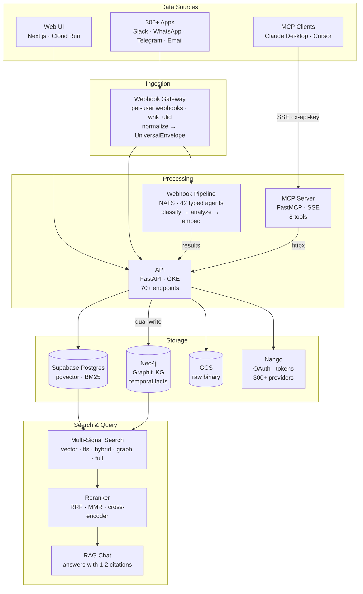

# mem-dog

[](LICENSE)

[](docker-compose.yml)

**The private AI memory platform for individuals and organizations.**

Ingest data from 300+ apps, enrich it with a 42-agent AI pipeline, store it with versioning and access control, and query it with 5 search modes powered by a temporal knowledge graph.


---

## Why mem-dog?

Most AI memory solutions solve one piece of the puzzle. **mem-dog solves the whole thing:**

| Capability | mem-dog | mem0 | Zep | Dify.ai | LangMem |
|-----------|---------|------|-----|---------|---------|
| Multi-channel ingestion (300+ apps, Nango-powered) | **Yes** | No | No | No | No |
| Per-user webhook endpoints (whk_<ulid>) | **Yes** | No | No | No | No |
| AI enrichment pipeline (42 agents) | **Yes** | No | No | Partial | No |
| Temporal knowledge graph | **Yes** (Graphiti + Neo4j) | No | **Yes** (Graphiti) | No | No |
| Multi-signal search (5 modes) | **Yes** | Vector only | Triple search | No | Vector only |
| Reranking (RRF, MMR, cross-encoder) | **Yes** | No | **Yes** | No | No |
| RAG chat with citations | **Yes** | No | No | **Yes** | No |
| Web UI with playground | **Yes** | Dashboard (paid) | No | **Yes** | No |
| 10 memory types with TTL/ACLs | **Yes** | 3 levels | Implicit | No | Partial |
| Local-first models (offline capable) | **Yes** | No | No | Partial | No |
| Automatic OAuth token refresh (Nango) | **Yes** | No | No | No | No |
| Self-hosted, free | **Yes** | Open source (limited) | Open source (Graphiti) | Open source | Open source |

**mem-dog = mem0 (memory) + Zep (knowledge graph) + Nango (integrations) + Dify (AI workflows) in one platform.**

---

## Architecture



| Component | Stack | Deployment |
|-----------|-------|------------|
| **API** | Python 3.12, FastAPI | GKE |
| **UI** | Next.js 14, TypeScript | Cloud Run |
| **MCP Server** | Python 3.12, FastMCP, SSE, 8 tools | GKE |
| **Webhook Pipeline** | Python 3.12, NATS, 42 agents | GKE |
| **Webhook Gateway** | Python 3.12, FastAPI, LiteLLM | GKE |
| **Neo4j** | Neo4j 5.26 Community + Graphiti | GKE |
| **DigiMe Agent** | Node.js, OpenClaw runtime | GKE |
| **Nango** | OAuth, token refresh, credential encryption | GKE |
| **SDKs** | Python, TypeScript, Go, Rust, Ruby | npm/pip/cargo |

---

## Quick Start

```bash
# Start the full local stack (10 services including Neo4j)
docker compose up

# UI:        http://localhost:3000
# API:       http://localhost:8080/docs
# Gateway:   http://localhost:8070/docs
# Neo4j:     http://localhost:7474
```

---

## Search: 5 Modes, 4 Rerankers

mem-dog's search combines pgvector, BM25 full-text, and Graphiti's temporal knowledge graph:

| Mode | What it does | Best for |
|------|-------------|----------|
| **vector** | Cosine similarity (pgvector) | Default, semantic meaning |
| **fts** | BM25 keyword matching (tsvector) | Exact terms, names |
| **hybrid** | Vector + BM25 merged with RRF | Best of both worlds |
| **graph** | Graphiti BFS + semantic on Neo4j | Entity relationships, facts |
| **full** | All signals in parallel, RRF merged | Maximum recall |

**Reranking:** None, RRF (rank fusion), MMR (diversity), cross-encoder (LLM-scored)

**Temporal queries:** "Who was CEO of Acme in 2024?" -- point-in-time fact retrieval via Graphiti

```bash
# Hybrid search with MMR reranking
curl -X POST http://localhost:8080/api/v1/ai/query/semantic \
  -H "Content-Type: application/json" \
  -d '{
    "query": "project updates",
    "search_mode": "hybrid",
    "rerank": {"method": "mmr"},
    "max_results": 5
  }'

# Graph search with temporal filter
curl -X POST http://localhost:8080/api/v1/ai/query/semantic \
  -H "Content-Type: application/json" \
  -d '{
    "query": "Who leads the engineering team?",
    "search_mode": "graph",
    "temporal": {"valid_at": "2025-06-01T00:00:00Z"}
  }'

# RAG chat (conversational, with citations)
curl -X POST http://localhost:8080/api/v1/ai/query/chat \
  -H "Content-Type: application/json" \
  -d '{
    "message": "What do I know about the Q3 roadmap?",
    "search_mode": "full",
    "rerank": {"method": "rrf"}
  }'
```

---

## Knowledge Graph

Dual-layer: **Postgres** (always active, zero infra) + **Graphiti/Neo4j** (optional, temporal).

- Entities extracted automatically by the webhook pipeline (person, org, product, location, concept, event)
- **Dual-write**: every entity goes to both Postgres tables and Graphiti episodes
- Graphiti adds temporal awareness -- facts have `valid_at`/`invalid_at` timestamps
- Query facts at a point in time: `GET /api/v1/graph/facts?at=2025-06-01T00:00:00Z`
- Powered by [Graphiti](https://github.com/getzep/graphiti) (Zep's open-source engine, Apache 2.0)

---

## Key Features

### Data & Storage
- Universal storage (JSON, text, binary, images, PDFs, audio, video)
- Automatic versioning on every update
- Per-item ACLs (private, shared, public, restricted) + `shared_with` user list
- 10 memory types grouped into 4 categories, with default TTLs and expiry
- Storage backends: local filesystem, GCS, Supabase (Postgres + pgvector)

### AI Pipeline
- 42 typed sub-agents for 60+ data types
- 6-layer classification (deterministic first, LLM fallback)
- 5 model tiers: small (4b) -> medium (12b) -> large (27b) -> multimodal -> omni
- Model Garden: 10+ AI providers with encrypted API keys, per-user/per-type routing
- Fallback chains: Ollama -> Ollama Cloud -> Gemini

### Integration Platform (Nango-Powered)
- 300+ providers across 15 categories, powered by Nango (self-hosted)
- OAuth2 + API key auth with automatic token refresh and AES-256-GCM encryption
- Per-user webhook endpoints (`whk_<ulid>`) with CRUD, stats, HMAC secrets
- Credential-injecting API proxy with response normalization

### Developer Experience
- **SDKs**: Python, TypeScript, Go, Rust, Ruby
- **Simple SDK**: `MemDog` with 8 methods (add, search, get, delete, entities, related, compress)
- **Agent adapters**: LangChain, CrewAI, OpenAI function calling
- **MCP server** for Claude and other MCP-compatible agents
- **70+ REST endpoints** with full OpenAPI docs

### Web UI
- Data browser with search, filter, tag faceting
- Knowledge Chat with 5 search modes and reranking controls
- 6-mode upload (text, file, URL, camera, voice, video)
- Channel webhook simulator (10+ channel types + per-user webhook endpoints)
- Model Garden, Smart Routing, Agent Config management
- Insights dashboard with token usage tracking
- OpenTelemetry waterfall trace viewer

---

## Comparisons

| | mem-dog | mem0 | Zep | Dify.ai | LangMem |
|-|---------|------|-----|---------|---------|
| **Focus** | Private AI system | Memory SDK | Context engine | LLM app builder | LangChain memory |
| **Ingestion** | 300+ apps (Nango) + webhooks + UI | API only | API only | File upload | API only |
| **AI enrichment** | 42 agents, 60+ types | Fact extraction | Fact extraction | Workflow agents | None |
| **Knowledge graph** | Postgres + Graphiti/Neo4j | None | Graphiti/Neo4j | None | None |
| **Search** | 5 modes + 4 rerankers | Vector only | Triple + rerankers | Vector | Vector only |
| **Temporal reasoning** | Graphiti temporal facts | None | Graphiti temporal facts | None | None |
| **RAG chat** | Built-in with citations | None | None | Built-in | None |
| **Web UI** | Full platform + playground | Dashboard (paid) | None | Workflow builder | None |
| **Self-hosted** | Free, Docker/GKE | Open source | Open source (Graphiti) | Open source | Open source |
| **Cost at 10K items/mo** | ~$50-100 (local models) | ~$260-280 (cloud API) | Varies | Varies | Free |

Detailed comparisons: [vs mem0](docs/comparisons/comparison-mem0.md) | [vs Zep](docs/comparisons/comparison-zep.md) | [Nango (used by mem-dog)](docs/comparisons/comparison-nango.md)

---

## Project Structure

```
mem-dog/
├── api/                  # Core API (FastAPI)
├── ui/                   # Web frontend (Next.js 14)
├── webhook/              # Data processing pipeline (NATS + 42 agents)
├── webhook-gateway/      # Multi-channel webhook gateway
├── openclaw-node/        # DigiMe AI agent
├── client/               # Python SDK
├── clients/              # TypeScript, Go, Rust, Ruby SDKs
├── mcp-server/           # MCP server
├── k8s/                  # Kubernetes manifests (GKE)
│   ├── neo4j/            #   Neo4j + Graphiti
│   ├── nango/            #   Nango integration platform
│   ├── webhook-pipeline/ #   NATS + agents
│   ├── webhook-gateway/  #   Gateway + DigiMe
│   └── supabase/         #   Self-hosted Supabase
├── config/               # Shared AI model config
├── docs/                 # Documentation
└── docker-compose.yml    # Local dev (10 services)
```

## Deployment

```bash
# API -> GKE
GKE_CLUSTER=<your-cluster> GKE_ZONE=<your-zone> \
  ./scripts/manual-deploy.sh deploy-api-gke -p <your-project> -e dev

# UI -> Cloud Run
./scripts/manual-deploy.sh deploy-ui -p <your-project> -e dev
```

See [deployment guides](docs/deployment/) for GKE, AWS, Azure, and Mac Mini.

## Documentation

Full docs in [docs/](docs/README.md) -- architecture, core concepts, features, deployment, SDKs, integrations, and comparisons.

## Contributing

We welcome contributions! See [CONTRIBUTING.md](CONTRIBUTING.md) for development setup and guidelines.

## License

Apache License 2.0. See [LICENSE](LICENSE).
