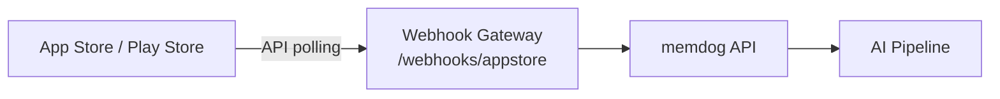

# App Store / Play Store Integration — Setup Guide

Ingest app reviews from Apple and Google.

## Architecture



## What Gets Ingested

Reviews, ratings, app version, device

## Setup

Apple: App Store Connect API
Google: Google Play Developer API
Forward reviews to `/webhooks/appstore` with `store: apple` or `store: google`

## Test

```bash
kubectl logs -n webhook-gateway deployment/webhook-gateway --since=5m | grep -i appstore
```
