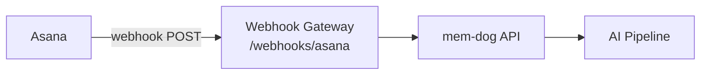

# Asana Integration — Setup Guide

Ingest Asana task, project, and comment events into mem-dog.

## Architecture



## What Gets Ingested

| Event | Content |
|-------|---------|
| Task created/updated | Name, parent project |
| Story (comment) | Text, type, author |
| Project changes | Name, status |

## Setup

Asana webhooks require an API app:

1. Create an app at [app.asana.com/0/my-apps](https://app.asana.com/0/my-apps)
2. Use the Asana API to create a webhook:
```bash
curl -X POST "https://app.asana.com/api/1.0/webhooks" \
  -H "Authorization: Bearer <your-token>" \
  -H "Content-Type: application/json" \
  -d '{
    "data": {
      "resource": "<project-gid>",
      "target": "http://34.36.80.165/webhooks/asana"
    }
  }'
```

Asana will send a handshake request — the gateway handles it automatically.

## Test

Create a task in the project, then check:
```bash
kubectl logs -n webhook-gateway deployment/webhook-gateway --since=5m | grep -i asana
```
