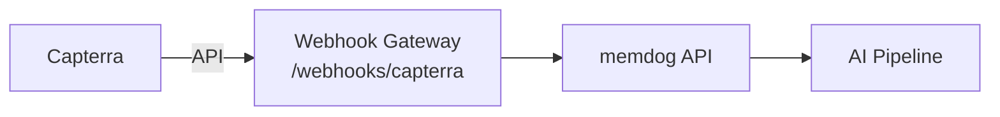

# Capterra Integration — Setup Guide

Ingest Capterra software reviews.

## Architecture



## What Gets Ingested

Reviews, ratings, pros/cons

## Setup

1. Capterra API access
2. Poll reviews
3. Forward to `/webhooks/capterra`

## Test

```bash
kubectl logs -n webhook-gateway deployment/webhook-gateway --since=5m | grep -i capterra
```
