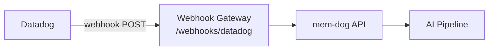

# Datadog Integration — Setup Guide

Ingest Datadog monitor alerts and events into mem-dog.

## Architecture



## What Gets Ingested

| Event | Content |
|-------|---------|
| Monitor alert | Title, status, hostname, tags, priority |
| Alert recovery | Resolution details |

## Setup

1. In Datadog → **Integrations → Webhooks**
2. **Name**: `mem-dog`
3. **URL**: `http://34.36.80.165/webhooks/datadog`
4. **Payload**: Use default (JSON with `$EVENT_TITLE`, `$ALERT_STATUS`, etc.)
5. **Save**
6. Add `@webhook-mem-dog` to any monitor's notification message

## Test

Trigger a monitor alert, then check:
```bash
kubectl logs -n webhook-gateway deployment/webhook-gateway --since=5m | grep -i datadog
```
