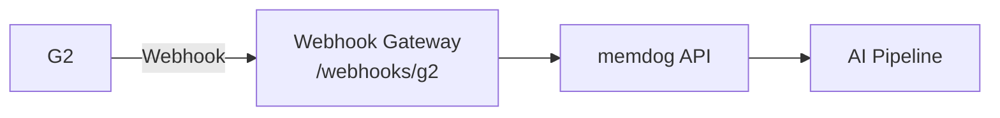

# G2 Integration — Setup Guide

Ingest G2 software reviews.

## Architecture



## What Gets Ingested

Reviews, ratings, pros/cons

## Setup

1. G2 Admin → Integrations → Webhooks
2. Set URL: `http://34.36.80.165/webhooks/g2`
3. Select: New review events

## Test

```bash
kubectl logs -n webhook-gateway deployment/webhook-gateway --since=5m | grep -i g2
```
