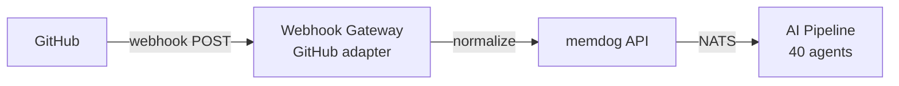

# GitHub Integration — Setup Guide

Automatically ingest GitHub events (commits, pull requests, issues, comments, releases) into memdog via webhooks.

## Architecture



## What Gets Ingested

| Event | What memdog captures |
|-------|----------------------|
| **Push** | Commits, authors, changed files, branch |
| **Pull Request** | Title, body, branch, status (opened/merged/closed) |
| **Issue** | Title, body, labels, state |
| **Comment** | Comment body, author, linked issue/PR |
| **Release** | Tag, name, release notes |

## Setup

### Option A — Per-repo webhook (simple)

1. Go to your repo → **Settings → Webhooks → Add webhook**
2. **Payload URL**: `http://34.36.80.165/webhooks/github`
   - Or use a per-user endpoint: `http://34.36.80.165/webhooks/<whk_id>`
3. **Content type**: `application/json`
4. **Secret**: (optional, for HMAC verification)
5. **Events** — select:
   - Pushes
   - Pull requests
   - Issues
   - Issue comments
   - Pull request reviews
   - Releases
6. Click **Add webhook**

### Option B — GitHub App (org-wide)

For ingesting events across all repos in an organization:

1. Go to [github.com/settings/apps/new](https://github.com/settings/apps/new)
2. Set **Webhook URL**: `http://34.36.80.165/webhooks/github`
3. **Permissions**:
   - Repository: Contents (Read), Issues (Read), Pull requests (Read), Metadata (Read)
4. **Subscribe to events**: Push, Pull request, Issues, Issue comment, Release
5. Install the app on your org/repos

### Option C — OAuth via Nango (for API access)

If you want memdog to also **pull** data from GitHub (search repos, read files):

1. Create a GitHub OAuth App at [github.com/settings/developers](https://github.com/settings/developers)
2. Set redirect URL: `https://<ngrok-url>/oauth/callback`
3. In memdog UI → **Settings → Apps → GitHub → gear icon** → enter Client ID and Secret
4. Click **Connect**

## Test

1. Push a commit or create an issue in a repo with the webhook configured
2. Check memdog:
   - **Data** tab — search for the commit message or issue title
   - **Timeline** — should show the event

```bash
kubectl logs -n webhook-gateway deployment/webhook-gateway --since=5m | grep -i github
```

## Webhook Payload Examples

### Push (commits)
```
Push to myorg/myrepo/main by user
3 commit(s):
  abc1234 Fix login bug (John)
    Files: src/auth.ts, src/login.tsx
  def5678 Add tests (John)
    Files: tests/auth.test.ts
```

### Pull Request
```
PR #42 opened: Add user dashboard
Branch: feature/dashboard → main

Implements the new user dashboard with charts and metrics.
```

### Issue
```
Issue #15 opened: Login fails on mobile
Labels: bug, priority-high
```

### Comment
```
Comment on Issue #15: Login fails on mobile
By johndoe:
I can reproduce this on iOS Safari. The OAuth redirect...
```

## Advanced: Filter Events

To reduce noise, you can select only specific events in GitHub's webhook settings. Recommended minimum:

- **Pushes** — code changes
- **Pull requests** — code reviews
- **Issues** — bug reports, feature requests
- **Issue comments** — discussions

Skip these unless needed:
- Stars, forks, watches (noise)
- Deployments, statuses (CI/CD, use a dedicated tool)
- Wiki (low volume)
