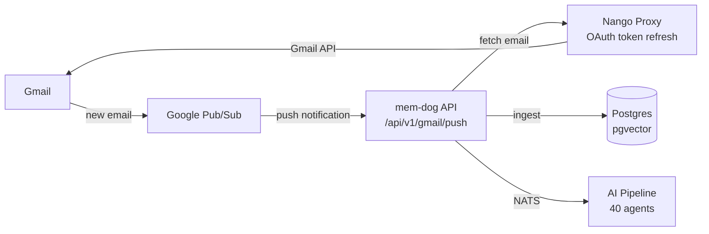

# Gmail Integration — Full Setup Guide

Automatically ingest emails into mem-dog via Gmail Push Notifications (Google Pub/Sub). New emails are fetched in real-time, enriched by the AI pipeline, and made searchable.

## Architecture



**Flow:**
1. New email arrives in Gmail
2. Gmail publishes a notification to a GCP Pub/Sub topic
3. Pub/Sub pushes to the mem-dog API (`POST /api/v1/gmail/push`)
4. API fetches the full email content via Nango proxy (auto token refresh)
5. Email is ingested, tagged `gmail, email, push-notification`
6. AI pipeline enriches with embeddings and entity extraction

## Prerequisites

- mem-dog stack running on GKE
- GCP project with Pub/Sub API enabled
- A Google OAuth Client ID (can reuse the one from Supabase auth)
- HTTPS endpoint for Pub/Sub push (ngrok for dev, TLS for production)
- Gmail API enabled in GCP Console

## Step 1 — Enable Gmail API

Go to [console.cloud.google.com/apis/library/gmail.googleapis.com](https://console.cloud.google.com/apis/library/gmail.googleapis.com) and click **Enable**.

## Step 2 — Create Pub/Sub Topic

```bash
# Create topic
gcloud pubsub topics create gmail-push-notifications \
  --project=memdog-dev

# Grant Gmail's service account publish permission
# (may require temporarily relaxing org policy — see Troubleshooting)
gcloud pubsub topics add-iam-policy-binding gmail-push-notifications \
  --project=memdog-dev \
  --member="serviceAccount:gmail-api-push@system.gserviceaccount.com" \
  --role="roles/pubsub.publisher"

# Create push subscription pointing to your API
gcloud pubsub subscriptions create gmail-push-sub \
  --project=memdog-dev \
  --topic=gmail-push-notifications \
  --push-endpoint="https://<YOUR_HTTPS_ENDPOINT>/gke-api/api/v1/gmail/push" \
  --ack-deadline=60 \
  --message-retention-duration=1h
```

### HTTPS Endpoint Options

| Environment | Endpoint |
|-------------|----------|
| **Dev (ngrok)** | `https://<subdomain>.ngrok-free.dev/gke-api/api/v1/gmail/push` |
| **Production (TLS)** | `https://yourdomain.com/gke-api/api/v1/gmail/push` |

Pub/Sub requires HTTPS — it won't push to bare HTTP.

#### ngrok setup (dev)

```bash
brew install ngrok
ngrok config add-authtoken <your-token>
ngrok http http://<gateway-ip>
# Use the https URL for the push subscription
```

## Step 3 — Configure Google OAuth in mem-dog

### Option A — Reuse existing Google OAuth credentials

If you already have Google OAuth set up for Supabase auth:

```bash
# Get existing credentials
GOOGLE_CLIENT_ID=$(kubectl get secret supabase-auth-oauth -n supabase \
  -o jsonpath='{.data.GOOGLE_CLIENT_ID}' | base64 -d)
GOOGLE_CLIENT_SECRET=$(kubectl get secret supabase-auth-oauth -n supabase \
  -o jsonpath='{.data.GOOGLE_CLIENT_SECRET}' | base64 -d)

# Set on google-mail provider in mem-dog
API_KEY=$(kubectl get secret api-auth-secret -n mem-dog \
  -o jsonpath='{.data.API_KEY}' | base64 -d)

curl -X PUT "http://<gateway-ip>/gke-api/api/v1/integrations/providers/google-mail/oauth-credentials" \
  -H "x-api-key: $API_KEY" \
  -H "Content-Type: application/json" \
  -d "{\"client_id\":\"$GOOGLE_CLIENT_ID\",\"client_secret\":\"$GOOGLE_CLIENT_SECRET\"}"
```

### Option B — Create new OAuth credentials

1. Go to [GCP Console → APIs & Credentials](https://console.cloud.google.com/apis/credentials)
2. Create **OAuth 2.0 Client ID** (Web application)
3. Add redirect URI: `https://<YOUR_HTTPS_ENDPOINT>/oauth/callback`
4. In mem-dog UI → **Settings → Apps → Google Mail** → gear icon → enter Client ID and Secret

### OAuth Consent Screen

For testing, add your email as a test user:

1. GCP Console → **APIs & Services** → **OAuth consent screen**
2. Click **Audience** (or **Test users**)
3. **Add users** → enter your Gmail address → Save

## Step 4 — Connect Gmail

1. In mem-dog UI → **Settings → Apps → Google Mail**
2. Click **Connect**
3. Authorize with your Google account
4. Gmail connection is now active in Nango

## Step 5 — Register Gmail Watch

Call the watch endpoint to start receiving push notifications:

```bash
API_KEY=$(kubectl get secret api-auth-secret -n mem-dog \
  -o jsonpath='{.data.API_KEY}' | base64 -d)

# Find your connection_id
curl -s -H "x-api-key: $API_KEY" \
  "http://<gateway-ip>/gke-api/api/v1/integrations/connections" | python3 -m json.tool

# Register watch (replace connection_id and user_id)
curl -X POST "http://<gateway-ip>/gke-api/api/v1/gmail/watch" \
  -H "x-api-key: $API_KEY" \
  -H "Content-Type: application/json" \
  -d '{
    "connection_id": "<nango-connection-id>",
    "user_id": "<your-memdog-user-id>"
  }'
```

Response:
```json
{
  "email_address": "you@gmail.com",
  "history_id": "462589",
  "expiration": "1774661190108",
  "status": "active"
}
```

The watch expires after **7 days**. Renew it with:

```bash
curl -X POST "http://<gateway-ip>/gke-api/api/v1/gmail/watch/renew" \
  -H "x-api-key: $API_KEY"
```

Set up a cron job for automatic renewal:

```bash
# Cloud Scheduler (recommended)
gcloud scheduler jobs create http gmail-watch-renewal \
  --project=memdog-dev \
  --location=us-central1 \
  --schedule="0 */6 * * *" \
  --uri="https://<YOUR_HTTPS_ENDPOINT>/gke-api/api/v1/gmail/watch/renew" \
  --http-method=POST \
  --headers="x-api-key=<API_KEY>"
```

## Step 6 — Test

1. Send an email to the connected Gmail address
2. Wait ~5-10 seconds
3. Check mem-dog:
   - **Data** tab — search for the email subject
   - **Playground → MCP** → `search` tool with the email content
   - **Timeline** — should show new entry

### CLI verification

```bash
# Check API logs for ingestion
kubectl logs -n mem-dog deployment/api --since=2m | grep -i "gmail\|Ingest"

# Expected output:
# Gmail push notification for you@gmail.com, historyId=...
# Found 1 new messages for you@gmail.com
# Ingested Gmail message ... as data_...: <subject>
```

## API Endpoints

| Method | Path | Auth | Description |
|--------|------|------|-------------|
| `POST` | `/api/v1/gmail/push` | None (Pub/Sub) | Receive push notifications |
| `POST` | `/api/v1/gmail/watch` | API key | Start watching for new emails |
| `DELETE` | `/api/v1/gmail/watch` | API key | Stop watching |
| `POST` | `/api/v1/gmail/watch/renew` | API key | Renew all active watches |

## What Gets Ingested

Each email is ingested as a `UniversalEnvelope` and forwarded through the **full webhook pipeline** (40 AI agents):

| Field | Value |
|-------|-------|
| **Name** | `Email: <subject>` |
| **Content** | `From: ...\nSubject: ...\nDate: ...\n\n<body text>` |
| **Tags** | `gmail, email, push-notification` |
| **Source Type** | `email` |
| **User** | The user_id specified in the watch registration |

### Pipeline Processing

Emails flow through the same AI pipeline as all other data:

```
Email → UniversalEnvelope → Webhook Receiver → NATS → AI Agents
                                                        ↓
                                              6-layer classification
                                              embedding generation
                                              entity extraction
                                              viewpoint creation
                                                        ↓
                                              Postgres + Neo4j
```

If the webhook pipeline is unavailable, emails fall back to direct storage (no AI enrichment).

The email body is extracted as plain text (HTML tags stripped). Structured email metadata (from, subject, date, headers, gmail_message_id) is preserved in `content_json`. Attachments are not ingested in the current implementation.

## Security Model

| Layer | Protection |
|-------|-----------|
| **Gmail OAuth** | Only the account owner can authorize access (Google consent screen + password) |
| **Nango tokens** | OAuth tokens encrypted with AES-256-GCM, auto-refreshed |
| **Watch scoping** | Each watch is tied to a specific mem-dog `user_id` |
| **Data isolation** | Ingested emails stored under the watch owner's user_id |
| **API keys** | Per-user `md_*` keys scope all queries to the authenticated user |

The system API key (admin) can access all data. For true multi-tenant isolation, each user connects their own Gmail via OAuth and registers their own watch.

## Differences from Slack

| | Gmail | Slack |
|---|---|---|
| **Push mechanism** | Google Pub/Sub (mandatory) | Direct webhook (Events API) |
| **Setup complexity** | Higher (Pub/Sub topic + subscription + IAM) | Lower (just set Request URL) |
| **Notification content** | Only `historyId` (must fetch email separately) | Full message payload |
| **Token refresh** | Automatic via Nango | Automatic via Nango |
| **Watch expiry** | 7 days (must renew) | No expiry |
| **HTTPS required** | Yes (Pub/Sub requires it) | Yes (Slack requires it) |

## Troubleshooting

### Pub/Sub IAM binding fails with "not in permitted organization"

Your GCP org policy restricts external service accounts. Temporarily allow all:

```bash
# Allow all (temporary)
gcloud resource-manager org-policies set-policy --project=memdog-dev /dev/stdin <<'EOF'
constraint: constraints/iam.allowedPolicyMemberDomains
listPolicy:
  allValues: ALLOW
EOF

# Wait 30s, then bind
sleep 30
gcloud pubsub topics add-iam-policy-binding gmail-push-notifications \
  --project=memdog-dev \
  --member="serviceAccount:gmail-api-push@system.gserviceaccount.com" \
  --role="roles/pubsub.publisher"

# Restore policy
gcloud resource-manager org-policies set-policy --project=memdog-dev /dev/stdin <<'EOF'
constraint: constraints/iam.allowedPolicyMemberDomains
listPolicy:
  allowedValues:
    - <YOUR_CUSTOMER_ID>
EOF
```

### "No watch registered" in logs

The watch state is in-memory — it's lost when the API pod restarts. Re-register:

```bash
curl -X POST "http://<gateway-ip>/gke-api/api/v1/gmail/watch" \
  -H "x-api-key: $API_KEY" \
  -H "Content-Type: application/json" \
  -d '{"connection_id": "<conn-id>", "user_id": "<user-id>"}'
```

### "historyId expired" (404 from Gmail)

If the watch lapses too long, Gmail's history window expires. The handler auto-updates to the new historyId. Send another email to trigger a fresh notification.

### Emails not appearing under my user

Make sure you pass `user_id` when registering the watch:

```bash
curl -X POST ".../api/v1/gmail/watch" \
  -d '{"connection_id": "...", "user_id": "YOUR_MEMDOG_USER_ID"}'
```

### Duplicate emails ingested

Gmail can send duplicate Pub/Sub notifications. The handler compares historyIds to avoid reprocessing, but rapid notifications may occasionally cause duplicates.

## Production Checklist

- [ ] Replace ngrok with a real domain + TLS certificate
- [ ] Update Pub/Sub subscription push endpoint to production URL
- [ ] Set up Cloud Scheduler for watch renewal (every 6 hours)
- [ ] Move watch state to Supabase table (persists across pod restarts)
- [ ] Add attachment ingestion support
- [ ] Configure Gmail label filters (e.g., only INBOX, skip SPAM/TRASH)
