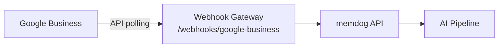

# Google Business Integration — Setup Guide

Ingest Google Business Profile reviews.

## Architecture



## What Gets Ingested

Reviews, ratings, Q&A, owner replies

## Setup

1. Enable Google My Business API
2. Poll reviews via API
3. Forward to `/webhooks/google-business`

## Test

```bash
kubectl logs -n webhook-gateway deployment/webhook-gateway --since=5m | grep -i google-business
```
