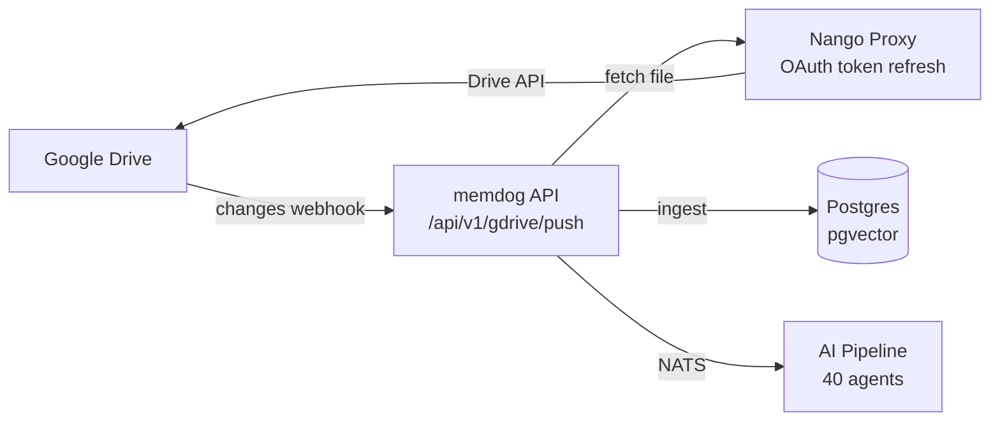

# Google Drive Integration — Full Setup Guide

Automatically ingest files from Google Drive into memdog when they are created or modified. Covers Google Docs, Sheets, Slides, and uploaded files.

## Architecture



**One connection covers everything:**

| Google App | How memdog gets it |
|-----------|-------------------|
| Google Docs | Export as plain text |
| Google Sheets | Export as CSV |
| Google Slides | Export as PDF |
| Uploaded files (PDF, PPTX, images) | Direct download |

## Prerequisites

- memdog stack running on GKE
- Google Cloud project with Drive API enabled
- Google OAuth Client ID (can reuse the one from Gmail/Supabase auth)
- HTTPS endpoint (ngrok for dev)

## Step 1 — Enable Drive API

Go to [console.cloud.google.com/apis/library/drive.googleapis.com](https://console.cloud.google.com/apis/library/drive.googleapis.com) and click **Enable**.

## Step 2 — Configure OAuth in memdog

### Option A — Reuse existing Google OAuth credentials

If you already have Google OAuth set up (Gmail or Supabase auth):

```bash
API_KEY=$(kubectl get secret api-auth-secret -n memdog -o jsonpath='{.data.API_KEY}' | base64 -d)
GOOGLE_CLIENT_ID=$(kubectl get secret supabase-auth-oauth -n supabase -o jsonpath='{.data.GOOGLE_CLIENT_ID}' | base64 -d)
GOOGLE_CLIENT_SECRET=$(kubectl get secret supabase-auth-oauth -n supabase -o jsonpath='{.data.GOOGLE_CLIENT_SECRET}' | base64 -d)

curl -X PUT "http://<gateway-ip>/gke-api/api/v1/integrations/providers/google-drive/oauth-credentials" \
  -H "x-api-key: $API_KEY" -H "Content-Type: application/json" \
  -d "{\"client_id\":\"$GOOGLE_CLIENT_ID\",\"client_secret\":\"$GOOGLE_CLIENT_SECRET\"}"
```

### Option B — Configure via UI

1. Go to **Settings → Apps → Google Drive → gear icon**
2. Enter your Client ID and Client Secret

### Add redirect URI

In [GCP Console → APIs & Credentials](https://console.cloud.google.com/apis/credentials), add to your OAuth Client:
```
https://<ngrok-subdomain>.ngrok-free.dev/oauth/callback
```

### OAuth Consent Screen

Add your email as a test user:
GCP Console → APIs & Services → OAuth consent screen → Audience → Add users

## Step 3 — Connect Google Drive

1. In memdog UI → **Settings → Apps → Google Drive**
2. Click **Connect**
3. Authorize with your Google account (grants Drive read access)

## Step 4 — Register Drive Watch

```bash
API_KEY=$(kubectl get secret api-auth-secret -n memdog -o jsonpath='{.data.API_KEY}' | base64 -d)

# Find your connection_id
curl -s -H "x-api-key: $API_KEY" \
  "http://<gateway-ip>/gke-api/api/v1/integrations/connections" | python3 -m json.tool

# Register watch
curl -X POST "http://<gateway-ip>/gke-api/api/v1/gdrive/watch" \
  -H "x-api-key: $API_KEY" -H "Content-Type: application/json" \
  -d '{
    "connection_id": "<nango-connection-id>",
    "user_id": "<your-memdog-user-id>"
  }'
```

Response:
```json
{
  "channel_id": "eb5505c9-...",
  "expiration": "1774079839000",
  "page_token": "13774",
  "status": "active"
}
```

**Watch channels expire after 24 hours.** Set up automatic renewal:

```bash
# Cloud Scheduler (recommended)
gcloud scheduler jobs create http gdrive-watch-renewal \
  --project=memdog-dev \
  --location=us-central1 \
  --schedule="0 */12 * * *" \
  --uri="https://<endpoint>/gke-api/api/v1/gdrive/watch/renew" \
  --http-method=POST \
  --headers="x-api-key=<API_KEY>"
```

## Step 5 — Test

1. Create or edit a file in Google Drive
2. Wait ~5-10 seconds
3. Check memdog:
   - **Data** tab — search for the file name
   - **Playground → MCP** → `search` tool

### CLI verification

```bash
kubectl logs -n memdog deployment/api --since=5m | grep -i "drive\|gdrive\|Ingest\|Downloaded"
```

Expected output:
```
Found 1 drive changes for user c987ef72-...
Downloaded Drive file My Document (5432 bytes, text/plain)
Ingested Drive file My Document as data_01KM... (via pipeline)
```

## API Endpoints

| Method | Path | Auth | Description |
|--------|------|------|-------------|
| `POST` | `/api/v1/gdrive/push` | None (Google webhook) | Receive change notifications |
| `POST` | `/api/v1/gdrive/watch` | API key | Start watching for changes |
| `DELETE` | `/api/v1/gdrive/watch` | API key | Stop watching |
| `POST` | `/api/v1/gdrive/watch/renew` | API key | Renew all active watches |

## Google Native File Export

Google Docs/Sheets/Slides don't have downloadable binary content. They are automatically exported:

| Google App | Export Format | Extension |
|-----------|--------------|-----------|
| Google Docs | `text/plain` | .txt |
| Google Sheets | `text/csv` | .csv |
| Google Slides | `application/pdf` | .pdf |
| Google Drawings | `application/pdf` | .pdf |

## Skipped File Types

These are ignored automatically:
- Folders
- Shortcuts
- Google Forms
- Google Maps
- Google Sites
- Files larger than 25 MB
- Trashed files

## Differences from Gmail

| | Google Drive | Gmail |
|---|---|---|
| **Push method** | Direct webhook (simpler) | Google Pub/Sub (requires topic setup) |
| **Watch expiry** | 24 hours (must renew) | 7 days |
| **Content** | Files (docs, PDFs, images) | Emails + attachments |
| **Export needed** | Yes (Google native files) | No |
| **Scopes** | `drive.readonly` | `gmail.readonly` |

## Troubleshooting

### "No watch registered" in logs

Watch state is persisted to `/data/gdrive_watches.json` on the API PVC. If the PVC was reset, re-register the watch.

### Watch expired (no notifications after 24h)

Call the renew endpoint or set up Cloud Scheduler:
```bash
curl -X POST "http://<gateway-ip>/gke-api/api/v1/gdrive/watch/renew" \
  -H "x-api-key: $API_KEY"
```

### Duplicate files ingested

Google Drive can send multiple notifications for one change. The handler processes all changes in the `changes.list` response, which may include duplicates during rapid edits.

### Google Docs showing empty content

Ensure the Drive API export is working:
```bash
kubectl logs -n memdog deployment/api --since=5m | grep "export\|Downloaded"
```

## Production Checklist

- [ ] Replace ngrok with a real domain + TLS
- [ ] Set up Cloud Scheduler for watch renewal every 12 hours
- [ ] Add file deduplication (track file_id + modifiedTime)
- [ ] Consider adding Google Workspace domain-wide delegation for org-level access
