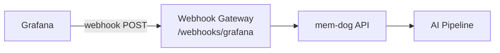

# Grafana Integration — Setup Guide

Ingest Grafana alerting events into mem-dog.

## Architecture



## What Gets Ingested

| Event | Content |
|-------|---------|
| Alert firing | Rule name, state, labels, values, annotations |
| Alert resolved | Resolution details |

## Setup

1. In Grafana → **Alerting → Contact points** → **New contact point**
2. **Type**: Webhook
3. **URL**: `http://34.36.80.165/webhooks/grafana`
4. **Save**
5. Create or update alert rules to use this contact point

## Test

Trigger an alert rule, then check:
```bash
kubectl logs -n webhook-gateway deployment/webhook-gateway --since=5m | grep -i grafana
```
