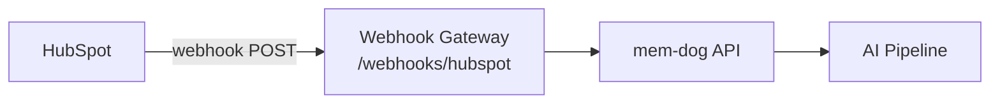

# HubSpot Integration — Setup Guide

Ingest HubSpot CRM events (contacts, deals, companies, tickets) into mem-dog.

## Architecture



## What Gets Ingested

| Event | Content |
|-------|---------|
| Contact changes | Property updates (email, name, lifecycle stage) |
| Deal changes | Stage, amount, close date |
| Company changes | Name, industry, revenue |
| Ticket changes | Status, priority, subject |

## Setup

1. In HubSpot → **Settings → Integrations → Private Apps** → Create
2. Set **Scopes**: CRM (contacts, deals, companies, tickets)
3. Under **Webhooks** → **Create subscription**
4. **Target URL**: `http://34.36.80.165/webhooks/hubspot`
5. **Object type**: Contact, Deal, Company, Ticket
6. **Event type**: Created, Updated, Deleted

## Test

Update a contact in HubSpot, then check:
```bash
kubectl logs -n webhook-gateway deployment/webhook-gateway --since=5m | grep -i hubspot
```
