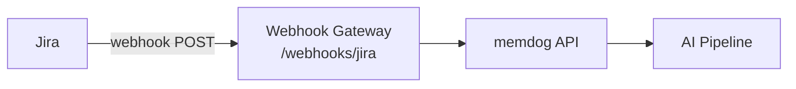

# Jira Integration — Setup Guide

Ingest Jira issue events, comments, sprint changes, and attachments into memdog.

## Architecture



## What Gets Ingested

| Event | Content |
|-------|---------|
| Issue created/updated | Key, summary, status, priority, assignee, description |
| Comments | Author, body, linked issue |
| Sprint events | Name, state, goals |
| Status changes | Changelog (from → to) |
| Attachments | Filename, MIME type, URL |

## Setup

1. In Jira → **Settings → System → Webhooks** → **Create webhook**
2. **URL**: `http://34.36.80.165/webhooks/jira`
3. **Events**: Issue created, updated, deleted; Comment created, updated; Sprint started, closed
4. **Save**

## Test

Create or update a Jira issue, then check:
```bash
kubectl logs -n webhook-gateway deployment/webhook-gateway --since=5m | grep -i jira
```

## Optional: OAuth via Nango

For pulling data (search issues, read backlog): Settings → Apps → Jira → Configure with Atlassian OAuth credentials.
