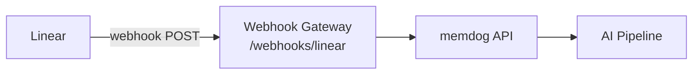

# Linear Integration — Setup Guide

Ingest Linear issue, comment, project, and cycle events into memdog.

## Architecture



## What Gets Ingested

| Event | Content |
|-------|---------|
| Issue | Identifier, title, description, status, priority, assignee, labels |
| Comment | Body, author, linked issue |
| Project | Name, state, description |
| Cycle | Number, name |

## Setup

1. In Linear → **Settings → API → Webhooks** → **New webhook**
2. **URL**: `http://34.36.80.165/webhooks/linear`
3. **Data change events**: Issue, Comment, Project, Cycle
4. **Save**

## Test

Create an issue in Linear, then check:
```bash
kubectl logs -n webhook-gateway deployment/webhook-gateway --since=5m | grep -i linear
```
