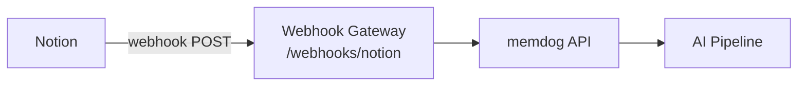

# Notion Integration — Setup Guide

Ingest Notion page and database change events into memdog.

## Architecture



## What Gets Ingested

| Event | Content |
|-------|---------|
| Page created/updated | Title, content, parent database |
| Database changes | Database title, modified properties |

## Setup

1. Create a Notion integration at [notion.so/my-integrations](https://www.notion.so/my-integrations)
2. Under **Webhooks** → **Add webhook**
3. **URL**: `http://34.36.80.165/webhooks/notion`
4. **Events**: Page created, Page content updated, Page property updated
5. Share your pages/databases with the integration (click ... → Connections → your integration)

## Test

Edit a page shared with the integration, then check:
```bash
kubectl logs -n webhook-gateway deployment/webhook-gateway --since=5m | grep -i notion
```
