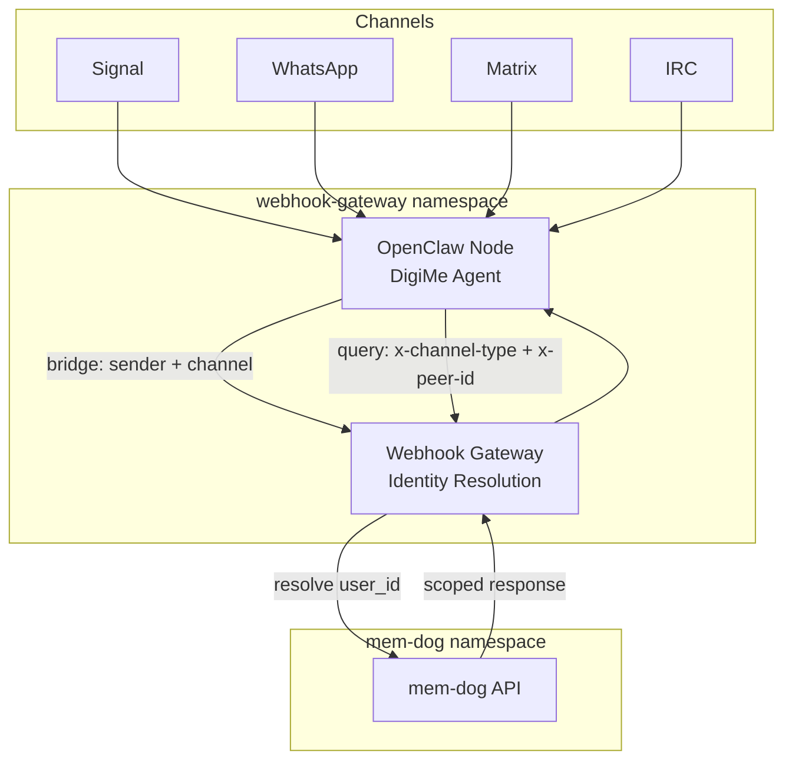

# OpenClaw Node (DigiMe) — Multi-User Setup Guide

OpenClaw Node is the DigiMe AI agent that lives in your messaging channels (Signal, WhatsApp, Matrix, IRC, etc.) and communicates with the mem-dog RAG system. A single instance can serve multiple users with data isolation via channel identity mapping.

## Architecture



## How Multi-User Works

A single OpenClaw instance handles messages from all users across all channels. Each user's data is isolated:

1. **Message arrives** from a user on Signal/WhatsApp/etc.
2. **OpenClaw forwards** to the webhook gateway with the sender's channel identity
3. **Gateway resolves** `(channel_type, peer_id)` → `user_id` via the channel identity table
4. **API scopes** all queries and storage to that user_id
5. **Response** goes back through OpenClaw to the user — containing only their data

### Identity Resolution Priority

| Source | Header/Field | When Used |
|--------|-------------|-----------|
| Explicit | `x-user-id` header | Direct user_id override |
| Body | `user_id` in request body | When skill includes it |
| Channel Identity | `x-channel-type` + `x-peer-id` headers | Auto-resolved from mapping table |
| Fallback | `DEFAULT_USER_ID` | No mapping found |

## Setup

### Step 1 — Deploy OpenClaw Node

```bash
GKE_CLUSTER=open-jaw GKE_ZONE=us-central1-a \
  ./scripts/manual-deploy.sh deploy-openclaw-node-gke -p memdog-dev -e dev
```

### Step 2 — Register Channel Identities

For each user, map their channel identity to their mem-dog user_id:

```bash
API_KEY=$(kubectl get secret api-auth-secret -n mem-dog -o jsonpath='{.data.API_KEY}' | base64 -d)

# Signal user
curl -X POST "http://<gateway-ip>/gke-api/api/v1/channel-identities" \
  -H "x-api-key: $API_KEY" \
  -H "Content-Type: application/json" \
  -d '{
    "channel_type": "signal",
    "channel_unique_id": "+1234567890",
    "user_id": "<mem-dog-user-id>"
  }'

# WhatsApp user
curl -X POST "http://<gateway-ip>/gke-api/api/v1/channel-identities" \
  -H "x-api-key: $API_KEY" \
  -H "Content-Type: application/json" \
  -d '{
    "channel_type": "whatsapp",
    "channel_unique_id": "+0987654321",
    "user_id": "<another-mem-dog-user-id>"
  }'
```

### Step 3 — Connect Channels

Configure OpenClaw to connect to your messaging channels. Each channel connects via the OpenClaw gateway:

- **Signal**: Scan QR code to link Signal account
- **WhatsApp**: Scan QR code via Baileys bridge
- **Matrix**: Enter Matrix homeserver + credentials
- **Telegram**: Enter bot token
- **IRC**: Enter server + channel config
- **Discord**: Enter bot token

Channel configuration is in the OpenClaw config file or via the OpenClaw admin API.

### Step 4 — Test

1. Send a message from a registered channel (e.g., Signal)
2. Ask: "What data do I have?"
3. OpenClaw should respond with data scoped to your user
4. Another user on a different channel should see only their data

```bash
# Check OpenClaw logs
kubectl logs -n webhook-gateway -l app=openclaw-node --tail=20

# Check gateway identity resolution
kubectl logs -n webhook-gateway -l app=webhook-gateway --since=5m | grep -i "resolve\|identity\|user_id"
```

## Skills

OpenClaw uses 4 skills to interact with mem-dog:

| Skill | Purpose | API Endpoint |
|-------|---------|-------------|
| `mem-dog-bridge` | Forward channel messages to webhook pipeline | `POST /webhooks/openclaw` |
| `mem-dog-query` | Search and retrieve data | `POST /api/v1/ai/query` |
| `mem-dog-ingest` | Store new data | `POST /api/v1/data` |
| `mem-dog-semantic-search` | Semantic search | `POST /api/v1/ai/query/semantic` |

All skills pass `x-channel-type` and `x-peer-id` headers for user resolution.

## Supported Channels

OpenClaw supports 25+ messaging channels:

| Channel | Type | Connection |
|---------|------|-----------|
| Signal | `signal` | QR code link |
| WhatsApp | `whatsapp` | QR code (Baileys) |
| Matrix | `matrix` | Homeserver + credentials |
| Telegram | `telegram` | Bot token |
| IRC | `irc` | Server config |
| Discord | `discord` | Bot token |
| Google Chat | `googlechat` | Service account |
| LINE | `line` | Channel credentials |
| Slack | `slack` | Bot token |
| Mattermost | `mattermost` | Webhook |
| Twitch | `twitch` | OAuth |
| Nostr | `nostr` | Private key |
| iMessage | `bluebubbles` | BlueBubbles bridge |
| Zalo | `zalo` | App credentials |
| Feishu | `feishu` | App credentials |

## Channel Identity API

| Method | Path | Description |
|--------|------|-------------|
| `POST` | `/api/v1/channel-identities` | Create/upsert identity binding |
| `GET` | `/api/v1/channel-identities/by-channel?channel_type=X&channel_unique_id=Y` | Look up user_id |
| `GET` | `/api/v1/channel-identities/by-user/{user_id}` | List all channels for a user |
| `DELETE` | `/api/v1/channel-identities/by-channel?...` | Remove binding |

## K8s Resources

| Resource | Namespace | Purpose |
|----------|-----------|---------|
| `openclaw-node` deployment | `webhook-gateway` | DigiMe agent pod |
| `openclaw-node-secrets` secret | `webhook-gateway` | GEMINI_API_KEY, MEM_DOG_API_KEY |
| `openclaw-node-config` configmap | `webhook-gateway` | Runtime config |
| `openclaw-node-skills` configmap | `webhook-gateway` | Skill definitions |
| `openclaw-home` PVC | `webhook-gateway` | Persistent state |

## Troubleshooting

### Messages not scoped to the right user

Check if the channel identity is registered:
```bash
curl -H "x-api-key: $API_KEY" \
  "http://<gateway-ip>/gke-api/api/v1/channel-identities/by-channel?channel_type=signal&channel_unique_id=+1234567890"
```

### OpenClaw not responding

```bash
kubectl get pods -n webhook-gateway -l app=openclaw-node
kubectl logs -n webhook-gateway -l app=openclaw-node --tail=50
```

### All data going to DEFAULT_USER_ID

Channel identity not mapped. Register the binding with `POST /api/v1/channel-identities`.
