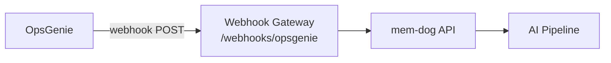

# OpsGenie Integration — Setup Guide

Ingest OpsGenie alert events into mem-dog.

## Architecture



## What Gets Ingested

| Event | Content |
|-------|---------|
| Alert created | Message, priority, source, tags, teams |
| Alert acknowledged | Who acknowledged |
| Alert closed | Resolution details |

## Setup

1. In OpsGenie → **Settings → Integrations → Add integration** → **Webhook**
2. **Webhook URL**: `http://34.36.80.165/webhooks/opsgenie`
3. **Alert actions**: Create, Acknowledge, Close, AddNote
4. **Save**

## Test

Create a test alert, then check:
```bash
kubectl logs -n webhook-gateway deployment/webhook-gateway --since=5m | grep -i opsgenie
```
