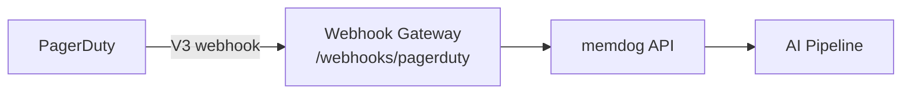

# PagerDuty Integration — Setup Guide

Ingest PagerDuty incident events into memdog for AI analysis of operational incidents.

## Architecture



## What Gets Ingested

| Event | Content |
|-------|---------|
| Incident triggered | Title, urgency, priority, service, assignees |
| Incident acknowledged | Who acknowledged, timestamp |
| Incident resolved | Who resolved, resolution notes |

## Setup

1. In PagerDuty → **Integrations → Generic Webhooks (V3)**
2. **Endpoint URL**: `http://34.36.80.165/webhooks/pagerduty`
3. **Scope**: Account or specific services
4. **Event types**: `incident.triggered`, `incident.acknowledged`, `incident.resolved`
5. **Save**

## Test

Trigger a test incident, then check:
```bash
kubectl logs -n webhook-gateway deployment/webhook-gateway --since=5m | grep -i pagerduty
```
