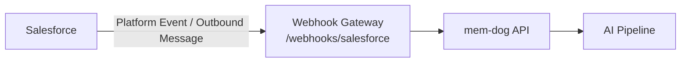

# Salesforce Integration — Setup Guide

Ingest Salesforce CRM events (leads, opportunities, cases, accounts) into mem-dog.

## Architecture



## What Gets Ingested

| Event | Content |
|-------|---------|
| Lead | Name, email, company, status |
| Opportunity | Name, stage, amount, close date |
| Case | Subject, status, priority, description |
| Account | Name, industry, revenue |

## Setup

### Option A — Outbound Messages (simplest)

1. In Salesforce → **Setup → Workflow Rules** → Create rule
2. Add action: **Outbound Message**
3. **Endpoint URL**: `http://34.36.80.165/webhooks/salesforce`
4. Select fields to send

### Option B — Platform Events

1. Create a Platform Event in Setup → Platform Events
2. Create a trigger to publish events on record changes
3. Set up a webhook subscription to `http://34.36.80.165/webhooks/salesforce`

## Test

Update a lead or opportunity, then check:
```bash
kubectl logs -n webhook-gateway deployment/webhook-gateway --since=5m | grep -i salesforce
```
