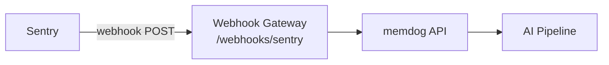

# Sentry Integration — Setup Guide

Ingest Sentry error and issue events into memdog for AI analysis of application errors.

## Architecture



## What Gets Ingested

| Event | Content |
|-------|---------|
| Issue created | Error title, stacktrace, level, platform, project |
| Issue resolved | Resolution details |
| Alert triggered | Alert rule, conditions |

## Setup

1. In Sentry → **Settings → Developer Settings → Custom Integrations** → Create
2. **Webhook URL**: `http://34.36.80.165/webhooks/sentry`
3. **Permissions**: Issue & Event (Read), Project (Read)
4. **Webhooks**: Issue (check all), Alert
5. Install on your organization

## Test

Trigger an error in your app, then check:
```bash
kubectl logs -n webhook-gateway deployment/webhook-gateway --since=5m | grep -i sentry
```
