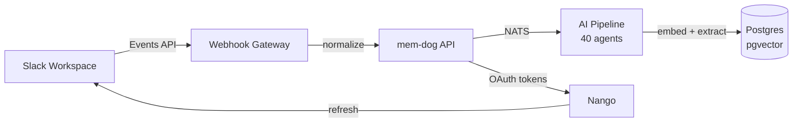

# Slack Integration — Full Setup Guide

Connect Slack to mem-dog to automatically ingest messages, files, and reactions into the AI enrichment pipeline.

## Architecture



## Prerequisites

- mem-dog stack running (local Docker Compose or GKE)
- A Slack workspace where you have admin access
- HTTPS endpoint for Slack events (ngrok for dev, or TLS on gateway for production)

## Step 1 — Create a Slack App

1. Go to [api.slack.com/apps](https://api.slack.com/apps)
2. Click **Create New App** → **From scratch**
3. Name it (e.g. `mem-dog`) and select your workspace
4. Note the **Client ID** and **Client Secret** from **Basic Information**

## Step 2 — Configure OAuth Scopes

Go to **OAuth & Permissions** → **Bot Token Scopes** and add:

| Scope | Purpose |
|-------|---------|
| `channels:history` | Read messages in public channels |
| `channels:read` | List public channels |
| `groups:read` | List private channels |
| `groups:history` | Read messages in private channels |
| `im:read` | List DMs |
| `im:history` | Read DM messages |
| `mpim:read` | List group DMs |
| `mpim:history` | Read group DM messages |
| `chat:write` | Send messages as the bot |
| `users:read` | Get user info (names, avatars) |
| `team:read` | Get workspace info |
| `files:read` | Access shared file content |
| `reactions:read` | Read emoji reactions |

## Step 3 — Set Redirect URL

In **OAuth & Permissions** → **Redirect URLs**, add:

| Environment | Redirect URL |
|-------------|-------------|
| **Local (ngrok)** | `https://<ngrok-subdomain>.ngrok-free.dev/oauth/callback` |
| **GKE (with TLS)** | `https://yourdomain.com/oauth/callback` |
| **GKE (ngrok for dev)** | `https://<ngrok-subdomain>.ngrok-free.dev/oauth/callback` |

### Setting up ngrok (dev)

```bash
brew install ngrok
ngrok config add-authtoken <your-token>  # from dashboard.ngrok.com
ngrok http http://<gateway-ip>
# Use the https URL as your redirect URL
```

Then set Nango's server URL to match:

```bash
kubectl set env deployment/nango-server -n nango \
  NANGO_SERVER_URL="https://<ngrok-subdomain>.ngrok-free.dev"
kubectl rollout restart deployment/nango-server -n nango
```

## Step 4 — Configure in mem-dog UI

1. Go to **Settings → Apps**
2. Find **Slack** in the list
3. Click the **gear icon** (Configure)
4. Enter your **Client ID** and **Client Secret** from Step 1
5. Click Save

## Step 5 — Connect Your Account

1. Click **Connect** on the Slack provider
2. You'll be redirected to Slack's OAuth page
3. Select your workspace and click **Allow**
4. You'll be redirected back — the connection is now active

## Step 6 — Set Up Event Subscriptions

Back in [api.slack.com/apps](https://api.slack.com/apps):

1. Go to **Event Subscriptions**
2. Toggle **Enable Events** ON
3. Set **Request URL** to your webhook endpoint:
   - From mem-dog UI: **Settings → Webhooks** → create a webhook for Slack
   - Or use the gateway directly: `https://<ngrok-url>/webhooks/slack`
4. Wait for the green **Verified** checkmark

### Subscribe to Bot Events

Click **Subscribe to bot events** and add:

| Event | Description |
|-------|-------------|
| `message.channels` | Messages in public channels |
| `message.groups` | Messages in private channels |
| `message.im` | Direct messages to the bot |
| `message.mpim` | Group DMs |
| `file_shared` | File uploads |
| `reaction_added` | Emoji reactions |
| `channel_created` | New channels |
| `member_joined_channel` | Members joining channels |

5. Click **Save Changes**

## Step 7 — Add Bot to Channels

In Slack:
1. Go to a channel you want to monitor
2. Click the channel name → **Integrations** → **Add apps**
3. Find and add your `mem-dog` app

The bot must be added to each channel you want it to read.

## Step 8 — Test

1. Send a message in a channel where the bot is added
2. Check mem-dog UI:
   - **Data** tab — search for the message content
   - **Timeline** — should show a new entry
   - **Playground → MCP** → use `search` tool to find it

### CLI verification

```bash
# Gateway logs
kubectl logs -n webhook-gateway deployment/webhook-gateway --tail=20 | grep slack

# API ingest logs
kubectl logs -n mem-dog deployment/api --tail=20 | grep ingest

# Pipeline processing
kubectl logs -n webhook-pipeline deployment/webhook-agent --tail=20
```

## Data Flow

```
1. User sends message in Slack channel
2. Slack Events API POSTs to your webhook URL
3. Webhook Gateway receives, normalizes to UniversalEnvelope
4. Gateway forwards to API (POST /api/v1/ingest)
5. API stores raw data, creates tracing memory
6. API publishes to NATS (webhook-pipeline)
7. Pipeline runs 6-layer classification → routes to agent
8. Agent generates embeddings, extracts entities, creates viewpoints
9. Results written back to API → Postgres + Neo4j
10. Data is now searchable via MCP, UI, or API
```

## Troubleshooting

### Slack says "Request URL: Your URL didn't respond"

- Check ngrok is running: `curl -s http://localhost:4040/api/tunnels`
- Check gateway pod is up: `kubectl get pods -n webhook-gateway`
- Verify the URL matches what Nango has: `NANGO_SERVER_URL` env var

### "Invalid client_id parameter"

- OAuth credentials not set. Click the gear icon on Slack in Settings → Apps and enter your Client ID / Secret.

### "No scopes requested"

- Scopes weren't set on the Nango integration. The deploy script should seed them, but you can verify:
  ```bash
  kubectl exec -n nango nango-db-0 -- psql -U nango -d nango \
    -c "SELECT oauth_scopes FROM _nango_configs WHERE unique_key='slack';"
  ```

### Messages not appearing in mem-dog

1. Is the bot added to the channel? (Slack → channel → Integrations → Add apps)
2. Check Slack's **Activity Logs** for delivery errors
3. Check gateway logs: `kubectl logs -n webhook-gateway deployment/webhook-gateway --tail=50`
4. Check API logs: `kubectl logs -n mem-dog deployment/api --tail=50 | grep ingest`

### OAuth token expired

Nango handles automatic token refresh. If it fails:
```bash
kubectl logs -n nango deployment/nango-server --tail=20 | grep refresh
```

## Production Checklist

- [ ] Replace ngrok with a real domain + TLS certificate
- [ ] Set `NANGO_SERVER_URL` to your production domain
- [ ] Update Slack app's Redirect URL to production domain
- [ ] Add bot to all channels you want monitored
- [ ] Set up Slack's **Interactivity** URL if you want slash commands
- [ ] Configure webhook HMAC secret for payload verification
