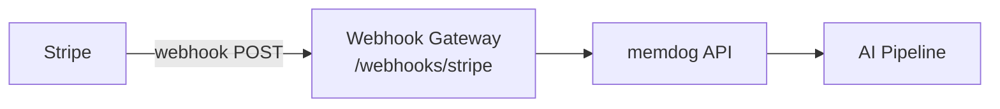

# Stripe Integration — Setup Guide

Ingest Stripe payment, invoice, subscription, and customer events into memdog.

## Architecture



## What Gets Ingested

| Event | Content |
|-------|---------|
| Payment | Amount, currency, status, customer |
| Invoice | Amount due, status, customer email |
| Subscription | Status, plan, customer |
| Customer | Name, email |

## Setup

1. In Stripe Dashboard → **Developers → Webhooks** → **Add endpoint**
2. **Endpoint URL**: `http://34.36.80.165/webhooks/stripe`
3. **Events to listen to**:
   - `payment_intent.succeeded`, `payment_intent.failed`
   - `invoice.paid`, `invoice.payment_failed`
   - `customer.subscription.created`, `customer.subscription.updated`
   - `customer.created`, `customer.updated`
4. Note the **Signing secret** for payload verification

## Test

Create a test payment in Stripe, then check:
```bash
kubectl logs -n webhook-gateway deployment/webhook-gateway --since=5m | grep -i stripe
```
