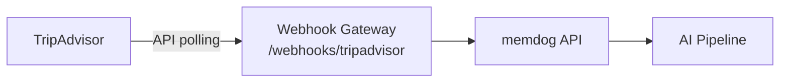

# TripAdvisor Integration — Setup Guide

Ingest TripAdvisor reviews.

## Architecture



## What Gets Ingested

Reviews, ratings, location info

## Setup

1. Apply for TripAdvisor Content API
2. Poll reviews for your locations
3. Forward to `/webhooks/tripadvisor`

## Test

```bash
kubectl logs -n webhook-gateway deployment/webhook-gateway --since=5m | grep -i tripadvisor
```
