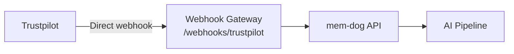

# Trustpilot Integration — Setup Guide

Ingest Trustpilot reviews via webhooks.

## Architecture



## What Gets Ingested

Reviews, ratings, consumer info

## Setup

1. Trustpilot Business → Integrations → Webhooks
2. Set URL: `http://34.36.80.165/webhooks/trustpilot`
3. Select events: review.created, review.updated

## Test

```bash
kubectl logs -n webhook-gateway deployment/webhook-gateway --since=5m | grep -i trustpilot
```
