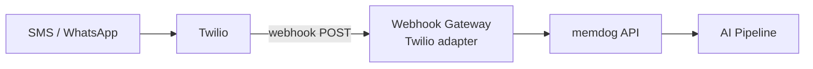

# Twilio Integration — Setup Guide

Ingest SMS and WhatsApp messages into memdog via Twilio webhooks.

## Architecture



## Prerequisites

- Twilio account ([twilio.com](https://twilio.com))
- A Twilio phone number (or WhatsApp sandbox for testing)

## Step 1 — Get a Twilio Number

1. Sign up at [twilio.com](https://twilio.com)
2. Get a phone number from **Phone Numbers → Manage → Buy a number**
3. Note your **Account SID** and **Auth Token** from the dashboard

## Step 2 — Configure SMS Webhook

In Twilio Console → **Phone Numbers** → click your number:

1. Under **Messaging** → **A MESSAGE COMES IN**
2. Set webhook URL: `http://34.36.80.165/webhooks/twilio`
3. Method: **HTTP POST**
4. Save

## Step 3 — Configure WhatsApp (optional)

For WhatsApp via Twilio:

### Sandbox (testing)
1. Go to **Messaging → Try it out → Send a WhatsApp message**
2. Join the sandbox by sending the code to the Twilio WhatsApp number
3. Set webhook URL: `http://34.36.80.165/webhooks/twilio`

### Production
1. **Messaging → Senders → WhatsApp senders**
2. Connect your WhatsApp Business number
3. Set webhook URL under the sender configuration

## Step 4 — Test

1. Send an SMS to your Twilio number
2. Or send a WhatsApp message to your Twilio WhatsApp number
3. Check memdog Data tab for the message

```bash
kubectl logs -n webhook-gateway deployment/webhook-gateway --since=5m | grep -i twilio
```

## What Gets Ingested

| Type | Content |
|------|---------|
| **SMS text** | Message body |
| **WhatsApp text** | Message body (auto-detected by `whatsapp:` prefix) |
| **Media (MMS)** | Images, videos, PDFs — URL + MIME type captured |

## Twilio Webhook Format

Twilio sends form-encoded POST:

```
From=+1234567890
To=+0987654321
Body=Hello from SMS
MessageSid=SM...
NumMedia=0
```

For WhatsApp:
```
From=whatsapp:+1234567890
To=whatsapp:+0987654321
Body=Hello from WhatsApp
```

The adapter auto-detects SMS vs WhatsApp from the `From` field prefix.
