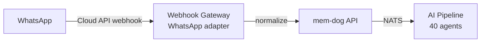

# WhatsApp Business Integration — Setup Guide

Automatically ingest WhatsApp messages, images, documents, and voice notes into mem-dog via Meta's WhatsApp Cloud API.

## Architecture



## Prerequisites

- A Meta Business Account ([business.facebook.com](https://business.facebook.com))
- A WhatsApp Business App on Meta's developer platform
- HTTPS endpoint for webhook verification (ngrok for dev)

## Step 1 — Create a Meta App

1. Go to [developers.facebook.com](https://developers.facebook.com)
2. Click **My Apps** → **Create App**
3. Choose **Business** type
4. Select your Meta Business Account
5. Add the **WhatsApp** product to your app

## Step 2 — Get API Credentials

In your Meta App → **WhatsApp** → **API Setup**:

1. Note your **Phone Number ID** (Meta provides a test number)
2. Note your **WhatsApp Business Account ID**
3. Generate a **Permanent Access Token** (under System Users in Business Settings)

## Step 3 — Configure Webhook

In your Meta App → **WhatsApp** → **Configuration**:

1. **Callback URL**: `https://<ngrok-subdomain>.ngrok-free.dev/webhooks/whatsapp`
   - Or use a per-user webhook: `https://<ngrok-subdomain>.ngrok-free.dev/webhooks/<whk_id>`
2. **Verify Token**: any string you choose (e.g. `memdog-verify-token`)
3. **Webhook fields** — subscribe to:

| Field | What it captures |
|-------|-----------------|
| `messages` | Incoming text, image, video, audio, document, location, contacts |
| `message_reactions` | Emoji reactions to messages |
| `message_template_status_update` | Template approval status |

### Webhook Verification

Meta sends a GET request with a `hub.verify_token` challenge. The webhook gateway handles this automatically. Set the verify token as an env var:

```bash
kubectl -n webhook-gateway set env deployment/webhook-gateway \
  WHATSAPP_VERIFY_TOKEN="memdog-verify-token"
```

## Step 4 — Test

1. Send a message from WhatsApp to your test number (shown in API Setup)
2. Or use the **Test** button in Meta's API Setup to send yourself a template message, then reply
3. Check mem-dog:
   - **Data** tab — search for the message
   - **Timeline** — should show new entry

### CLI verification

```bash
kubectl logs -n webhook-gateway deployment/webhook-gateway --since=5m | grep -i whatsapp
```

## What Gets Ingested

| Message Type | How it's captured |
|-------------|------------------|
| **Text** | Message body as plain text |
| **Image** | Caption + media_id (downloadable via Graph API) |
| **Document** | Caption + filename + media_id |
| **Video** | Caption + media_id |
| **Audio/Voice** | media_id (transcription via AI pipeline) |
| **Location** | Latitude, longitude coordinates |
| **Reaction** | Emoji reaction to a message |
| **Contacts** | Shared contact cards |

## Media Downloads

WhatsApp media (images, documents, audio) are referenced by `media_id` in the webhook payload. To download them, you need to call Meta's Graph API:

```
GET https://graph.facebook.com/v21.0/{media_id}
Authorization: Bearer {access_token}
```

This returns a URL, which you then download. The webhook gateway captures the `media_id` — media download can be added as a post-processing step (similar to Slack attachments).

## Webhook Payload Format

Meta's Cloud API sends webhooks in this format:

```json
{
  "object": "whatsapp_business_account",
  "entry": [{
    "id": "WHATSAPP_BUSINESS_ACCOUNT_ID",
    "changes": [{
      "value": {
        "messaging_product": "whatsapp",
        "metadata": {"phone_number_id": "..."},
        "contacts": [{"profile": {"name": "John"}, "wa_id": "1234567890"}],
        "messages": [{
          "from": "1234567890",
          "id": "wamid.xxx",
          "type": "text",
          "text": {"body": "Hello!"}
        }]
      },
      "field": "messages"
    }]
  }]
}
```

The WhatsApp adapter in the webhook gateway handles this format automatically.

## Production Checklist

- [ ] Replace ngrok with a real domain + TLS
- [ ] Update Meta webhook callback URL
- [ ] Generate a permanent access token (not temporary)
- [ ] Add media download support for images/documents
- [ ] Set up a dedicated phone number (not Meta's test number)
- [ ] Complete Meta Business Verification for full API access
