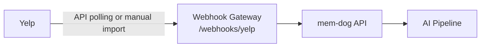

# Yelp Integration — Setup Guide

Ingest Yelp business reviews.

## Architecture



## What Gets Ingested

Reviews, ratings, business info

## Setup

1. Use Yelp Fusion API to poll reviews
2. Forward to `/webhooks/yelp`
3. Or use a polling bridge service

## Test

```bash
kubectl logs -n webhook-gateway deployment/webhook-gateway --since=5m | grep -i yelp
```
