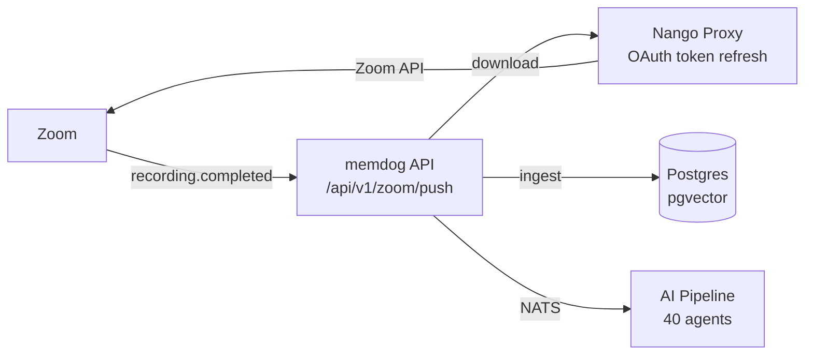

# Zoom Integration — Full Setup Guide

Automatically ingest Zoom meeting recordings, transcripts, and chat logs into memdog when a meeting ends.

## Architecture



**What gets ingested:**
- Meeting metadata (topic, host, participants, duration)
- Transcript (VTT format → text)
- Chat log
- Recording (MP4/M4A, if under 50MB)

## Prerequisites

- memdog stack running on GKE
- A Zoom account with Cloud Recording enabled (Pro/Business plan)
- HTTPS endpoint (ngrok for dev)

## Step 1 — Create a Zoom App

1. Go to [marketplace.zoom.us](https://marketplace.zoom.us)
2. Click **Develop** → **Build App**
3. Choose **General App** (OAuth)
4. Fill in app name (e.g. `memdog`)
5. Note the **Client ID** and **Client Secret**

## Step 2 — Configure OAuth

In the Zoom app settings:

**OAuth Credentials:**
- **Redirect URL**: `https://<ngrok-subdomain>.ngrok-free.dev/oauth/callback`

**Scopes** (Add these under Scopes tab):

| Scope | Purpose |
|-------|---------|
| `meeting:read` | Read meeting details |
| `recording:read` | Access recordings |
| `cloud_recording:read` | Download cloud recordings |
| `user:read` | Get user info |

## Step 3 — Configure Event Subscriptions

In the Zoom app → **Feature** → **Event Subscriptions**:

1. Toggle **Enable Event Subscriptions** ON
2. Set **Event notification endpoint URL**:
   ```
   https://<ngrok-subdomain>.ngrok-free.dev/gke-api/api/v1/zoom/push
   ```
3. Click **Add Events** and subscribe to:

| Event | When it fires |
|-------|--------------|
| `recording.completed` | Cloud recording is processed and ready |
| `recording.transcript_completed` | Transcript is ready |

4. Click **Save**

Zoom will validate the endpoint URL with a challenge-response — memdog handles this automatically.

## Step 4 — Configure in memdog UI

1. Go to **Settings → Apps → Zoom**
2. Click the **gear icon** (Configure)
3. Enter your **Client ID** and **Client Secret**
4. Click **Connect** → authorize with your Zoom account

## Step 5 — Register the Connection

After connecting, register the Nango connection so the recording handler can download files:

```bash
# Find your connection_id
API_KEY=$(kubectl get secret api-auth-secret -n memdog -o jsonpath='{.data.API_KEY}' | base64 -d)

curl -s -H "x-api-key: $API_KEY" \
  "http://<gateway-ip>/gke-api/api/v1/integrations/connections" | python3 -m json.tool

# Register (replace connection_id and user_id)
curl -X POST "http://<gateway-ip>/gke-api/api/v1/zoom/register" \
  -H "x-api-key: $API_KEY" \
  -H "Content-Type: application/json" \
  -d '{
    "connection_id": "<nango-connection-id>",
    "user_id": "<your-memdog-user-id>"
  }'
```

## Step 6 — Test

1. Start a Zoom meeting with Cloud Recording enabled
2. Record the meeting (even a short 1-min test)
3. End the meeting
4. Wait for Zoom to process the recording (~2-5 minutes)
5. Check memdog:
   - **Data** tab — search for the meeting topic
   - **Timeline** — should show meeting metadata + transcript

### CLI verification

```bash
kubectl logs -n memdog deployment/api --since=10m | grep -i "zoom\|recording\|ingest"
```

## API Endpoints

| Method | Path | Auth | Description |
|--------|------|------|-------------|
| `POST` | `/api/v1/zoom/push` | None (Zoom webhook) | Receive recording events |
| `POST` | `/api/v1/zoom/register` | API key | Register Zoom connection |

## What Gets Ingested

Each completed recording produces multiple data items:

| Item | Content | Tags |
|------|---------|------|
| **Meeting metadata** | Topic, host, participants, duration | `zoom, meeting, metadata` |
| **Transcript** | VTT transcript (converted to text) | `zoom, recording, meeting` |
| **Chat log** | In-meeting chat messages | `zoom, recording, meeting` |
| **Recording** | MP4 video or M4A audio (if < 50MB) | `zoom, recording, meeting` |

## Differences from Gmail/Drive

| | Zoom | Gmail | Google Drive |
|---|---|---|---|
| **Push method** | Direct webhook | Pub/Sub | Direct webhook |
| **Trigger** | `recording.completed` | New email | File change |
| **Watch expiry** | None (permanent) | 7 days | 24 hours |
| **Setup** | Event subscription in Zoom app | `users.watch()` API call | `changes.watch()` API call |
| **Content type** | Video/audio/transcript | Text + attachments | Documents + files |

## Troubleshooting

### "endpoint.url_validation" failing

The Zoom webhook validation requires HMAC signing. Set the `ZOOM_WEBHOOK_SECRET` env var on the API:

```bash
kubectl -n memdog set env deployment/api \
  ZOOM_WEBHOOK_SECRET="<your-zoom-webhook-secret-token>"
```

Find the secret token in your Zoom app → Feature → Event Subscriptions → Secret Token.

### Recordings not being downloaded

- Verify the Zoom connection is registered: check `/data/zoom_connections.json` in the API pod
- Check Nango has a valid Zoom connection: `kubectl exec -n nango nango-db-0 -- psql -U nango -d nango -c "SELECT * FROM _nango_connections WHERE provider_config_key='zoom';"`
- Check API logs: `kubectl logs -n memdog deployment/api --since=10m | grep zoom`

### Large recordings skipped

Recordings over 50MB are skipped by default. Transcripts and chat logs are always ingested regardless of size.

## Production Checklist

- [ ] Replace ngrok with a real domain + TLS
- [ ] Update Zoom app's redirect URL and event notification URL
- [ ] Set `ZOOM_WEBHOOK_SECRET` env var for webhook validation
- [ ] Enable Cloud Recording by default for all meetings in Zoom settings
- [ ] Consider enabling automatic transcription in Zoom for richer data
