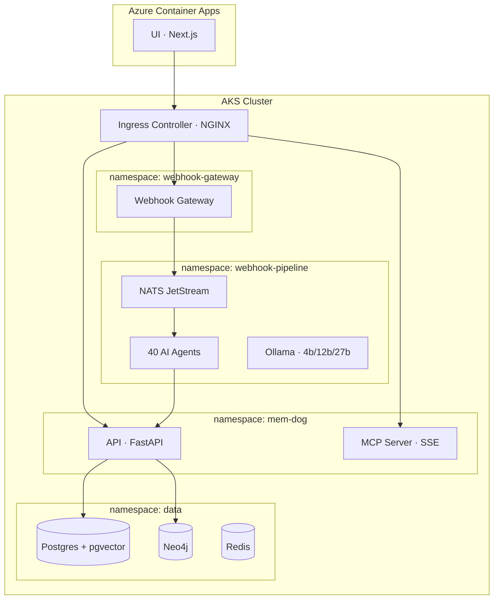

# Deploying mem-dog on Azure (AKS)

Production deployment on Azure Kubernetes Service with Azure Container Apps for the UI.



---

## Prerequisites

### Tools

```bash
# Azure CLI
brew install azure-cli         # macOS
curl -sL https://aka.ms/InstallAzureCLIDeb | sudo bash  # Linux

# Docker
brew install --cask docker     # macOS

# kubectl
az aks install-cli

# Other
curl -LsSf https://astral.sh/uv/install.sh | sh
brew install node@20 jq
```

### Authenticate

```bash
az login
az account set --subscription "<subscription-id>"
```

---

## Step 1 — Create Azure Resources

### Resource Group

```bash
RESOURCE_GROUP=mem-dog-rg
LOCATION=eastus

az group create --name $RESOURCE_GROUP --location $LOCATION
```

### Container Registry (ACR)

```bash
ACR_NAME=memdogacr  # must be globally unique, alphanumeric only

az acr create \
  --resource-group $RESOURCE_GROUP \
  --name $ACR_NAME \
  --sku Standard

az acr login --name $ACR_NAME
```

### AKS Cluster

```bash
AKS_NAME=mem-dog-aks

az aks create \
  --resource-group $RESOURCE_GROUP \
  --name $AKS_NAME \
  --node-count 3 \
  --node-vm-size Standard_D4s_v3 \
  --enable-managed-identity \
  --attach-acr $ACR_NAME \
  --network-plugin azure \
  --generate-ssh-keys

az aks get-credentials \
  --resource-group $RESOURCE_GROUP \
  --name $AKS_NAME

kubectl get nodes  # verify
```

### Install NGINX Ingress Controller

AKS doesn't include a Gateway API controller by default. Use NGINX ingress:

```bash
helm repo add ingress-nginx https://kubernetes.github.io/ingress-nginx
helm repo update

helm install ingress-nginx ingress-nginx/ingress-nginx \
  --namespace ingress-nginx \
  --create-namespace \
  --set controller.service.annotations."service\.beta\.kubernetes\.io/azure-load-balancer-health-probe-request-path"=/healthz

# Get the external IP (may take 1-2 min)
kubectl get svc -n ingress-nginx ingress-nginx-controller -w
```

Save the `EXTERNAL-IP` — this is your entry point.

---

## Step 2 — Build and Push Images

mem-dog's deploy script targets GKE. On Azure, build and push images manually:

```bash
ACR_LOGIN_SERVER=$(az acr show --name $ACR_NAME --query loginServer -o tsv)

# API
docker build --platform linux/amd64 -t $ACR_LOGIN_SERVER/mem-dog/api:latest api/
docker push $ACR_LOGIN_SERVER/mem-dog/api:latest

# MCP Server (build context is repo root)
docker build --platform linux/amd64 -t $ACR_LOGIN_SERVER/mem-dog/mcp-server:latest -f mcp-server/Dockerfile .
docker push $ACR_LOGIN_SERVER/mem-dog/mcp-server:latest

# Webhook Gateway
docker build --platform linux/amd64 -t $ACR_LOGIN_SERVER/mem-dog/webhook-gateway:latest webhook-gateway/
docker push $ACR_LOGIN_SERVER/mem-dog/webhook-gateway:latest

# Webhook Receiver
docker build --platform linux/amd64 -t $ACR_LOGIN_SERVER/mem-dog/webhook-receiver:latest -f webhook/receiver/Dockerfile webhook/receiver/
docker push $ACR_LOGIN_SERVER/mem-dog/webhook-receiver:latest

# Webhook Agent
docker build --platform linux/amd64 -t $ACR_LOGIN_SERVER/mem-dog/webhook-agent:latest -f webhook/processor/Dockerfile webhook/processor/
docker push $ACR_LOGIN_SERVER/mem-dog/webhook-agent:latest

# UI
docker build --platform linux/amd64 \
  --build-arg NEXT_PUBLIC_API_URL="" \
  --build-arg API_URL="http://<INGRESS_IP>/api" \
  -t $ACR_LOGIN_SERVER/mem-dog/ui:latest ui/
docker push $ACR_LOGIN_SERVER/mem-dog/ui:latest
```

---

## Step 3 — Deploy Data Layer

### PostgreSQL + pgvector

Option A — **Azure Database for PostgreSQL Flexible Server** (managed):

```bash
PG_SERVER=mem-dog-pg
PG_ADMIN=memdog
PG_PASSWORD=$(openssl rand -base64 24)

az postgres flexible-server create \
  --resource-group $RESOURCE_GROUP \
  --name $PG_SERVER \
  --admin-user $PG_ADMIN \
  --admin-password "$PG_PASSWORD" \
  --sku-name Standard_B2ms \
  --tier Burstable \
  --storage-size 32 \
  --version 16

# Enable pgvector extension
az postgres flexible-server parameter set \
  --resource-group $RESOURCE_GROUP \
  --server-name $PG_SERVER \
  --name azure.extensions \
  --value vector

# Allow AKS access
az postgres flexible-server firewall-rule create \
  --resource-group $RESOURCE_GROUP \
  --name $PG_SERVER \
  --rule-name aks-access \
  --start-ip-address 0.0.0.0 \
  --end-ip-address 255.255.255.255

POSTGRES_URL="postgresql://$PG_ADMIN:$PG_PASSWORD@$PG_SERVER.postgres.database.azure.com:5432/memdog?sslmode=require"
```

Option B — **In-cluster PostgreSQL** (use the same pgvector Docker image as local dev):

```bash
kubectl create namespace data

kubectl apply -f - <<EOF
apiVersion: apps/v1
kind: Deployment
metadata:
  name: postgres
  namespace: data
spec:
  replicas: 1
  selector:
    matchLabels:
      app: postgres
  template:
    metadata:
      labels:
        app: postgres
    spec:
      containers:
        - name: postgres
          image: pgvector/pgvector:pg16
          ports:
            - containerPort: 5432
          env:
            - name: POSTGRES_USER
              value: memdog
            - name: POSTGRES_PASSWORD
              value: memdog
            - name: POSTGRES_DB
              value: memdog
          volumeMounts:
            - name: pgdata
              mountPath: /var/lib/postgresql/data
      volumes:
        - name: pgdata
          persistentVolumeClaim:
            claimName: pgdata
---
apiVersion: v1
kind: PersistentVolumeClaim
metadata:
  name: pgdata
  namespace: data
spec:
  accessModes: [ReadWriteOnce]
  resources:
    requests:
      storage: 20Gi
---
apiVersion: v1
kind: Service
metadata:
  name: postgres
  namespace: data
spec:
  selector:
    app: postgres
  ports:
    - port: 5432
EOF
```

### Neo4j (in-cluster)

```bash
kubectl apply -f - <<EOF
apiVersion: apps/v1
kind: Deployment
metadata:
  name: neo4j
  namespace: data
spec:
  replicas: 1
  selector:
    matchLabels:
      app: neo4j
  template:
    metadata:
      labels:
        app: neo4j
    spec:
      containers:
        - name: neo4j
          image: neo4j:5.26-community
          ports:
            - containerPort: 7687
            - containerPort: 7474
          env:
            - name: NEO4J_AUTH
              value: neo4j/memdog_neo4j
            - name: NEO4J_PLUGINS
              value: '["apoc"]'
          volumeMounts:
            - name: neo4j-data
              mountPath: /data
      volumes:
        - name: neo4j-data
          persistentVolumeClaim:
            claimName: neo4j-data
---
apiVersion: v1
kind: PersistentVolumeClaim
metadata:
  name: neo4j-data
  namespace: data
spec:
  accessModes: [ReadWriteOnce]
  resources:
    requests:
      storage: 10Gi
---
apiVersion: v1
kind: Service
metadata:
  name: neo4j
  namespace: data
spec:
  selector:
    app: neo4j
  ports:
    - name: bolt
      port: 7687
    - name: http
      port: 7474
EOF
```

---

## Step 4 — Deploy Application

### Create namespaces and config

```bash
kubectl create namespace mem-dog
kubectl create namespace webhook-pipeline
kubectl create namespace webhook-gateway
```

### API

```bash
ACR_LOGIN_SERVER=$(az acr show --name $ACR_NAME --query loginServer -o tsv)

kubectl -n mem-dog create configmap api-config \
  --from-literal=STORAGE_BACKEND=local \
  --from-literal=POSTGRES_URL="$POSTGRES_URL" \
  --from-literal=NEO4J_URI="bolt://neo4j.data.svc.cluster.local:7687" \
  --from-literal=NEO4J_USER=neo4j \
  --from-literal=NEO4J_PASSWORD=memdog_neo4j \
  --from-literal=ENVIRONMENT=dev

# Patch the k8s manifest image and apply
sed "s|image: mem-dog-api|image: $ACR_LOGIN_SERVER/mem-dog/api:latest|" \
  k8s/api-deployment.yaml | kubectl apply -f -
kubectl apply -f k8s/api-service.yaml 2>/dev/null || \
  kubectl expose deployment api -n mem-dog --port=8080 --type=ClusterIP
```

### MCP Server

```bash
kubectl -n mem-dog create configmap mcp-server-config \
  --from-literal=MEM_DOG_API_URL="http://api.mem-dog.svc.cluster.local:8080" \
  --from-literal=LOG_LEVEL=INFO \
  --from-literal=PORT=8080

sed "s|image: mcp-server:latest|image: $ACR_LOGIN_SERVER/mem-dog/mcp-server:latest|" \
  k8s/mcp-server-deployment.yaml | kubectl apply -f -
kubectl apply -f k8s/mcp-server-service.yaml
```

### Webhook Gateway

```bash
kubectl -n webhook-gateway create configmap webhook-gateway-config \
  --from-literal=MEM_DOG_API_URL="http://api.mem-dog.svc.cluster.local:8080" \
  --from-literal=LLM_PROVIDER=gemini \
  --from-literal=LOG_LEVEL=INFO

kubectl -n webhook-gateway create secret generic webhook-gateway-secrets \
  --from-literal=GEMINI_API_KEY="<your-key>"

sed "s|image: webhook-gateway:latest|image: $ACR_LOGIN_SERVER/mem-dog/webhook-gateway:latest|" \
  k8s/webhook-gateway/deployment.yaml | kubectl apply -f -
kubectl apply -f k8s/webhook-gateway/service.yaml
```

### Ingress

```bash
INGRESS_IP=$(kubectl get svc -n ingress-nginx ingress-nginx-controller -o jsonpath='{.status.loadBalancer.ingress[0].ip}')

kubectl apply -f - <<EOF
apiVersion: networking.k8s.io/v1
kind: Ingress
metadata:
  name: mem-dog-ingress
  namespace: mem-dog
  annotations:
    nginx.ingress.kubernetes.io/rewrite-target: /\$2
spec:
  ingressClassName: nginx
  rules:
    - http:
        paths:
          - path: /api(/|$)(.*)
            pathType: ImplementationSpecific
            backend:
              service:
                name: api
                port:
                  number: 8080
          - path: /mcp(/|$)(.*)
            pathType: ImplementationSpecific
            backend:
              service:
                name: mcp-server
                port:
                  number: 8080
---
apiVersion: networking.k8s.io/v1
kind: Ingress
metadata:
  name: webhook-ingress
  namespace: webhook-gateway
  annotations:
    nginx.ingress.kubernetes.io/rewrite-target: /\$2
spec:
  ingressClassName: nginx
  rules:
    - http:
        paths:
          - path: /webhooks(/|$)(.*)
            pathType: ImplementationSpecific
            backend:
              service:
                name: webhook-gateway
                port:
                  number: 8080
EOF
```

---

## Step 5 — Deploy UI

### Option A — Azure Container Apps

```bash
az containerapp env create \
  --name mem-dog-env \
  --resource-group $RESOURCE_GROUP \
  --location $LOCATION

az containerapp create \
  --name mem-dog-ui \
  --resource-group $RESOURCE_GROUP \
  --environment mem-dog-env \
  --image $ACR_LOGIN_SERVER/mem-dog/ui:latest \
  --registry-server $ACR_LOGIN_SERVER \
  --target-port 8080 \
  --ingress external \
  --min-replicas 1 \
  --max-replicas 3 \
  --env-vars \
    API_URL="http://$INGRESS_IP/api" \
    PORT=8080
```

### Option B — Deploy in AKS

```bash
sed "s|image: mem-dog-ui|image: $ACR_LOGIN_SERVER/mem-dog/ui:latest|" \
  k8s/ui-deployment.yaml | kubectl apply -f -
```

---

## Step 6 — Verify

```bash
INGRESS_IP=$(kubectl get svc -n ingress-nginx ingress-nginx-controller \
  -o jsonpath='{.status.loadBalancer.ingress[0].ip}')

curl http://$INGRESS_IP/api/health        # API
curl http://$INGRESS_IP/mcp/health        # MCP Server
curl http://$INGRESS_IP/webhooks/health   # Gateway

kubectl get pods -n mem-dog
kubectl get pods -n webhook-pipeline
kubectl get pods -n webhook-gateway
kubectl get pods -n data
```

### Connect Claude Desktop

```json
{
  "mcpServers": {
    "mem-dog": {
      "url": "http://<INGRESS_IP>/mcp/sse",
      "headers": { "x-api-key": "md_your_key" }
    }
  }
}
```

---

## TLS (optional)

```bash
# Install cert-manager
helm repo add jetstack https://charts.jetstack.io
helm install cert-manager jetstack/cert-manager \
  --namespace cert-manager --create-namespace \
  --set crds.enabled=true

# Add TLS to ingress annotations:
#   cert-manager.io/cluster-issuer: letsencrypt-prod
#   spec.tls[0].secretName: mem-dog-tls
#   spec.tls[0].hosts: [mem-dog.yourdomain.com]
```

---

## Cost Estimate

| Resource | Monthly Cost |
|----------|-------------|
| AKS cluster (3x Standard_D4s_v3) | ~$180-250 |
| Azure DB for PostgreSQL (B2ms) | ~$50-70 |
| Container Apps (UI) | ~$5-15 |
| Load Balancer | ~$20 |
| **Total** | **~$255-355/mo** |

Use in-cluster Postgres instead of managed to save ~$50-70/mo.
