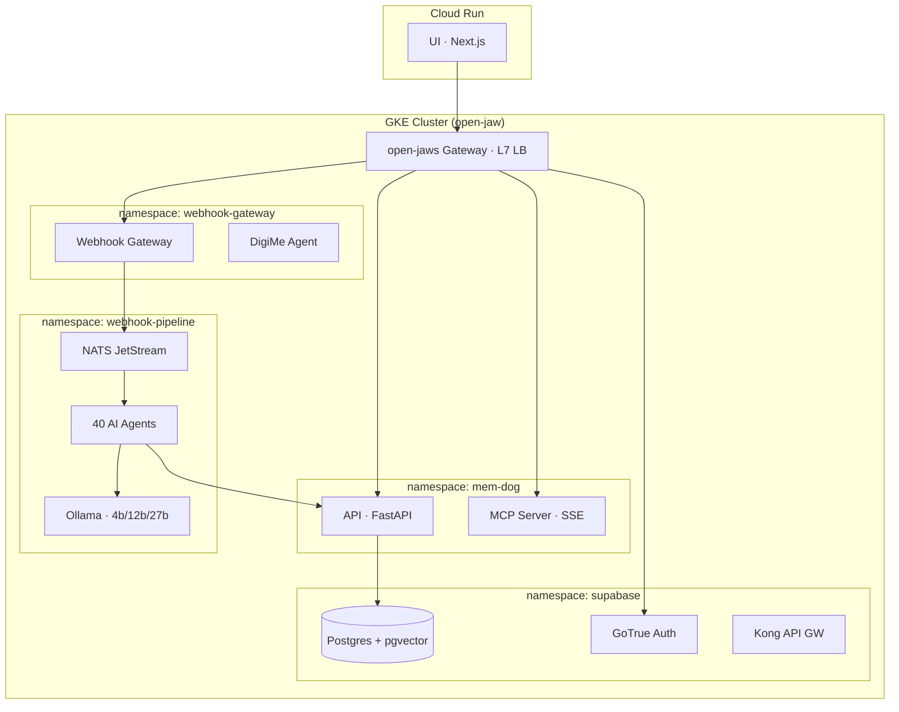

# Deploying mem-dog on Google Cloud (GKE + Cloud Run)

Production deployment on GKE with Cloud Run for the UI.



---

## Prerequisites

### Tools

```bash
# macOS
brew install --cask google-cloud-sdk docker
gcloud components install kubectl gke-gcloud-auth-plugin
curl -LsSf https://astral.sh/uv/install.sh | sh
brew install node@20 jq

# Linux
curl https://sdk.cloud.google.com | bash
sudo apt-get install docker.io kubectl jq
curl -LsSf https://astral.sh/uv/install.sh | sh
```

### Authenticate

```bash
gcloud auth login
gcloud auth application-default login
gcloud config set project memdog-dev
gcloud auth configure-docker us-central1-docker.pkg.dev
```

### Enable APIs

```bash
gcloud services enable \
  container.googleapis.com \
  artifactregistry.googleapis.com \
  run.googleapis.com \
  secretmanager.googleapis.com \
  iam.googleapis.com \
  --project=memdog-dev
```

### Create Artifact Registry

```bash
gcloud artifacts repositories create mem-dog \
  --repository-format=docker \
  --location=us-central1 \
  --project=memdog-dev
```

---

## Step 1 — Create GKE Cluster

```bash
gcloud container clusters create open-jaw \
  --zone=us-central1-a \
  --num-nodes=3 \
  --machine-type=e2-standard-4 \
  --disk-size=50 \
  --enable-ip-alias \
  --workload-pool=memdog-dev.svc.id.goog \
  --gateway-api=standard \
  --project=memdog-dev

gcloud container clusters get-credentials open-jaw \
  --zone=us-central1-a --project=memdog-dev

kubectl get nodes  # verify
```

Key flags:
- `--workload-pool` — Workload Identity for GCS access (no service account keys)
- `--gateway-api=standard` — Gateway API CRDs + GKE Gateway Controller for the `open-jaws` L7 LB

### Recommended Node Sizing

| Workload | Machine Type | Nodes | Notes |
|----------|-------------|-------|-------|
| Dev/test | e2-standard-4 (4 vCPU, 16 GB) | 3 | Sufficient for all services |
| Production | e2-standard-8 (8 vCPU, 32 GB) | 3-5 | Headroom for Ollama models |
| GPU (optional) | n1-standard-4 + T4 GPU | 1 | Fast inference, add via node pool |

---

## Step 2 — Deploy Stack

Run in order. Each command builds, pushes, and deploys:

```bash
export GKE_CLUSTER=open-jaw GKE_ZONE=us-central1-a

# 1. Supabase (Postgres + pgvector + GoTrue + Kong)
./scripts/manual-deploy.sh deploy-supabase-gke -p memdog-dev -e dev

# 2. API
./scripts/manual-deploy.sh deploy-api-gke -p memdog-dev -e dev

# 3. Webhook Pipeline (NATS + 40 agents + Ollama)
./scripts/manual-deploy.sh deploy-webhook-pipeline-gke -p memdog-dev -e dev

# 4. Webhook Gateway (creates open-jaws L7 LB)
./scripts/manual-deploy.sh deploy-webhook-gateway-gke -p memdog-dev -e dev

# 5. MCP Server
./scripts/manual-deploy.sh deploy-mcp-server-gke -p memdog-dev -e dev

# 6. DigiMe Agent (optional)
./scripts/manual-deploy.sh deploy-openclaw-node-gke -p memdog-dev -e dev

# 7. UI (Cloud Run)
GATEWAY_IP=$(kubectl get gateway open-jaws -n webhook-gateway \
  -o jsonpath='{.status.addresses[0].value}')
ANON_KEY=$(kubectl get secret supabase-secrets -n supabase \
  -o jsonpath='{.data.ANON_KEY}' | base64 -d)

MEM_DOG_WEBHOOK_GATEWAY_URL="http://$GATEWAY_IP" \
NEXT_PUBLIC_SUPABASE_ANON_KEY="$ANON_KEY" \
SUPABASE_AUTH_URL="http://$GATEWAY_IP" \
./scripts/manual-deploy.sh deploy-ui -p memdog-dev -e dev
```

---

## Step 3 — Verify

```bash
GATEWAY_IP=$(kubectl get gateway open-jaws -n webhook-gateway \
  -o jsonpath='{.status.addresses[0].value}')

# Pods
kubectl get pods -A | grep -E 'mem-dog|webhook|supabase'

# Health
curl http://$GATEWAY_IP/gke-api/health     # API
curl http://$GATEWAY_IP/health             # Gateway
curl http://$GATEWAY_IP/mcp/health         # MCP Server
curl http://$GATEWAY_IP/auth/v1/health     # GoTrue
```

---

## Google OAuth (optional)

1. Go to [GCP Console → APIs & Credentials](https://console.cloud.google.com/apis/credentials)
2. Create **OAuth 2.0 Client ID** (Web application)
3. Redirect URI: `https://<CLOUD_RUN_URL>/auth/v1/callback`
4. JavaScript origin: `https://<CLOUD_RUN_URL>`

```bash
kubectl create secret generic supabase-auth-oauth -n supabase \
  --from-literal=GOOGLE_CLIENT_ID="<client-id>" \
  --from-literal=GOOGLE_CLIENT_SECRET="<client-secret>"
kubectl rollout restart deployment/supabase-auth -n supabase
```

---

## Gateway Routing

All external traffic enters through the `open-jaws` Gateway (L7 Global External Managed LB):

| Path | Backend | Namespace |
|------|---------|-----------|
| `/gke-api/*` | API | mem-dog |
| `/mcp/*` | MCP Server | mem-dog |
| `/webhooks/*`, `/channels/*` | Webhook Gateway | webhook-gateway |
| `/oc/*` | DigiMe Agent | webhook-gateway |
| `/auth/v1/*` | GoTrue | supabase |

---

## Operations

### Redeploy a component

```bash
export GKE_CLUSTER=open-jaw GKE_ZONE=us-central1-a
./scripts/manual-deploy.sh deploy-api-gke -p memdog-dev -e dev
./scripts/manual-deploy.sh deploy-mcp-server-gke -p memdog-dev -e dev
```

### Logs

```bash
kubectl logs -n mem-dog deployment/api -f --tail=50
kubectl logs -n mem-dog deployment/mcp-server -f --tail=50
kubectl logs -n webhook-pipeline deployment/webhook-agent -f --tail=50
```

### Restart all

```bash
GKE_CLUSTER=open-jaw GKE_ZONE=us-central1-a \
  ./scripts/manual-deploy.sh restart-gke -p memdog-dev -e dev
```

### Supabase Studio

```bash
kubectl port-forward -n supabase svc/supabase-studio 3001:3000
# Open http://localhost:3001
```

---

## Cost Estimate

| Resource | Monthly Cost |
|----------|-------------|
| GKE cluster (3x e2-standard-4) | ~$150-200 |
| Cloud Run (UI, low traffic) | ~$5-10 |
| GCS storage | ~$1-5 |
| Static IP | ~$7 |
| **Total** | **~$165-225/mo** |

LLM inference is free (local Ollama). Add ~$5-20/mo if using Gemini API instead.
