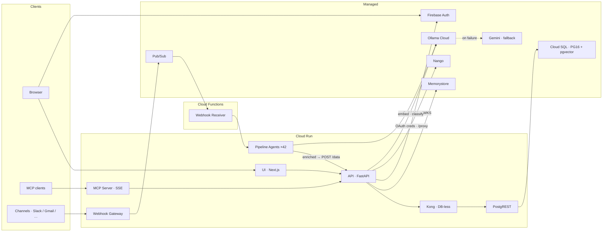
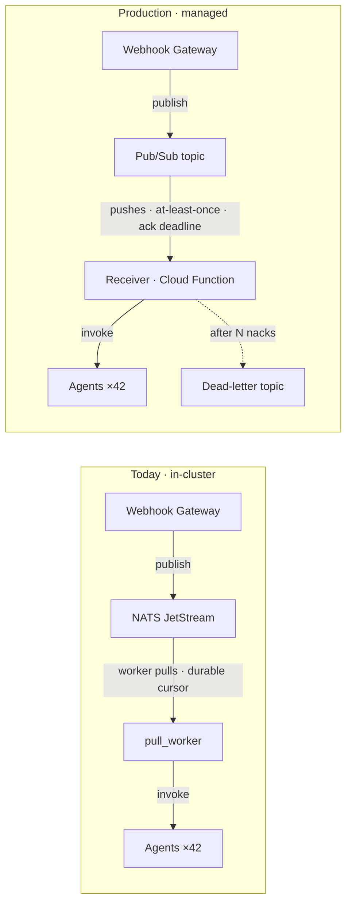

# GCP Production Implementation

Plan for a production estate on Google Cloud with **no Kubernetes cluster**.

> Status: **plan**. Nothing in this document has been implemented yet.
>
> This is **one of two maintained deployment paths**, not a migration away from the other.
> The GKE path stays supported — see [GKE Implementation](../../gke/implementation.md).
> The rule governing both, and the seams that keep them from colliding, are in
> [Deployment Paths](../../deployment/paths.md). **Read that first**: every item below is
> additive, and nothing here deletes an asset the GKE path uses.

---

## Decisions

| Decision | Choice | Rationale |
|----------|--------|-----------|
| **Platform** | Cloud Run, no cluster | Nothing in this path's scope requires Kubernetes |
| **Scope** | openclaw / DigiMe cut | Out of scope for this path; stays on GKE |
| **Inference** | Ollama Cloud, Gemini fallback | Open weights to Ollama Cloud; already the code default |
| **Tenancy** | Single-tenant, SaaS-ready | Host SaaS is Phase A; scale-1k is unstarted |
| **Auth** | Firebase, GoTrue retained | Selected by `AUTH_PROVIDER`; no RS256/JWKS code in the repo yet |
| **Integrations** | Nango (Cloud preferred) | 56 providers; `NANGO_API_URL` makes Cloud a config change |

---

## Architecture

Two lanes converge on the API: **ingest** (channels → gateway → Pub/Sub → receiver → agents →
back into the API) and **query** (browser / MCP → API → Kong → PostgREST → Cloud SQL).

## How this path avoids a cluster

Each row is something this path **does not deploy**. The manifests stay in `k8s/` and the GKE
path keeps using them.

| Component | Why it needed GKE | Cloud path | GKE path |
|-----------|-------------------|------------|----------|
| openclaw-node | PVC `openclaw-home` | Not deployed | **Unchanged** |
| Nango | Assumed background sync workers | Nango Cloud — request-scoped only, see below | Self-hosted, unchanged |
| Ollama ×3 | GPU pool + ~120Gi model PVCs | Ollama Cloud | **Manifests retained**, unchanged |
| NATS JetStream | Durable pull consumers | Pub/Sub via `receiver/main.py` | NATS via `receiver/gke_app.py` |
| Supabase Postgres | StatefulSet + PVC | Cloud SQL | In-cluster, unchanged |
| Kong + PostgREST | — | Cloud Run, DB-less | In-cluster, unchanged |
| API | `/data` gmail watches | Blob store — **shared fix, benefits both** | Blob store |
| Neo4j | PVC | Deferred; AuraDB if it returns | In-cluster, unchanged |

### The Nango finding

Nango looked like the last blocker. The entire usage surface is four request-scoped endpoints —
`/config`, `/connect/sessions`, `/connection`, `/proxy/{path}`. There is no `/sync`, no `/records`,
and nothing scheduled in `api/app/nango_client.py`, `api/app/routers/integrations.py`, or
`webhook-gateway/app/credentials.py`. Token refresh happens on demand when credentials are fetched,
so there are no background workers to keep alive.

Its manifest declares two ports — `3003` (api) and `3009` (connect-ui) — which would collide with
Cloud Run's one-port-per-service limit. Port 3009 is never routed in `k8s/nango/httproute.yaml`
and never referenced by the UI or API.

**Preferred form is Nango Cloud.** `NANGO_API_URL` (`nango_client.py:17`) is a plain env var, so
switching is configuration with no code change. That removes the last self-run service, drops a
database from Cloud SQL, and eliminates the `NANGO_ENCRYPTION_KEY` rotation blocker.
Confirm first that Nango Cloud permits the runtime `/config` calls `integrations.py` makes; if it
does not, or if OAuth token residency must stay in your own infrastructure, self-host on Cloud Run.

---

## Launch blockers

None of these may meet production traffic.

### 1. Secrets committed to git

`k8s/nango/nango-secrets.yaml` carries a real-looking `NANGO_ENCRYPTION_KEY` and `NANGO_SECRET_KEY`.
`k8s/lean/supabase-secrets.yaml` and `k8s/lean/api-supabase-secrets.yaml` ship well-known demo JWTs.
`k8s/lean/*` uses `dev-local-key`. All are in history — **rotate**, do not merely delete.

### 2. Gmail watches persist to local disk only

`api/app/routers/gmail_push.py` defines `_WATCH_BLOB_KEY` (L37) but never uses it —
`_load_watches` and `_save_watches` read and write `/data/gmail_watches.json` exclusively.
Serverless promotes this from cleanup to hard blocker: Cloud Run has no persistent disk, so
watches vanish on every instance recycle, silently.

### 3. No warm floor anywhere

Every scaler in `k8s/autoscaling/*.yaml` sits at `minReplicaCount: 0`. On Cloud Run this becomes a
`--min-instances` flag, but it still has to be set deliberately on API, Kong, PostgREST, and Nango.

---

## Phase 0 — prepare in dev

**Gate: nothing in Phase 1 starts until the auth seam is verified in dev — with the GKE path
still logging in.** Migrating user IDs on live production data is strictly worse.

Every item is additive. The **GKE impact** column is the acceptance criterion: anything other
than "none" needs a migration step, not just a code change.

| Work item | Location | Change | GKE impact | Effort | Risk |
|-----------|----------|--------|------------|--------|------|
| `AUTH_PROVIDER` seam | `api/main.py` L263–278, L296–311 | **Add** an RS256/JWKS verifier with key caching alongside the existing HS256 path; select by env. Do not replace — GKE's GoTrue issues HS256, and there is no RS256 code in the API today. Two sites. | None if additive; **dev login outage** if replaced | L | High |
| User-ID mapping | profiles + all owned rows | Firebase UIDs are 28-char strings; existing IDs are UUIDs. Mapping table serves both paths. **The sharp edge.** | Shared table; dev rows must map cleanly | M | High |
| Profile bootstrap | `api/app/auth.py:32` | `ensure_jwt_user_profile()` normalizes both claim shapes | None if branched on provider | S | Med |
| UI auth | `ui/src/lib/supabase.ts`, `auth-context.tsx`, `project-context.tsx`, `app/page.tsx` | Add Firebase SDK; **keep** `@supabase/supabase-js` for the GKE path | None if both retained | M | Med |
| GoTrue | `k8s/supabase/gotrue-*.yaml` | **Retained.** Cloud path skips the `/auth/v1/*` rewrite, `SUPABASE_AUTH_URL`, and the `NEXT_PUBLIC_SUPABASE_ANON_KEY` build-time trap by not setting them | None — not deleted | S | Low |
| Gmail watch → blob store | `api/app/routers/gmail_push.py` | Route both functions through `_WATCH_BLOB_KEY`. **Hard prerequisite.** Shared fix — no seam | Removes a PVC dependency; **needs one-time migration** of `/data/gmail_watches.json` off the API PVC or live watches drop | S | Med |
| `config/ai.env` split | `config/ai.env` | Shared base + per-path overlays. Single file today, pinned to the in-cluster Ollama address | **Blocker** — without it, a prod edit silently repoints dev | S | Med |
| openclaw flag | `ui/src/components/OpenClaw*.tsx` | Follow the `NEXT_PUBLIC_READ_ONLY` pattern. Both components are **unimported in `ui/src` today**, so the Cloud path already excludes them. Manifests and `deploy-openclaw-node-gke` retained. Gateway needs no change — its `openclaw` strings are legacy naming only | None | S | Low |
| Secret rotation | `k8s/nango/`, `k8s/lean/` | New values into Secret Manager **and** the k8s Secrets. Required for both paths — the old values are in git history | **Coordinated rotation**; dev breaks if only one side rotates | M | High |

## Phase 1 — provision the estate

| Resource | Choice | How |
|----------|--------|-----|
| GCP project | `memdog-prod` | New project — separate IAM, quota, blast radius |
| Compute | Cloud Run services | `gcloud run deploy`; set `--min-instances` |
| Networking | Direct VPC egress | Required for Cloud Run → Cloud SQL / Memorystore on private IP |
| Postgres | Cloud SQL PG16 + pgvector | `setup-postgres` (`manual-deploy.sh:256`) |
| Redis | Memorystore | `deploy-redis` |
| Queue | Pub/Sub | Topics + subscriptions. **Mandatory** — no cluster to host NATS |
| Secrets | Secret Manager | Referenced at deploy; no External Secrets operator needed |
| Identity | Firebase project | Google provider + authorized domains |
| Images | Artifact Registry | Pin real tags — several manifests ride `:latest` |

## Inference routing

Open weights run on Ollama Cloud; Gemini is fallback only. **This is already the code default** —
`api/app/smart_routing.py` L291–297 sets every tier's primary to `OLLAMA_CLOUD_MODEL_*`, with
`DEFAULT_FALLBACK_MODEL` (L306) as the only Gemini path. The work is configuration and deletion.

| Tier | Primary · Ollama Cloud | Fallback | Set by |
|------|------------------------|----------|--------|
| Small | `ollama/gemma3:4b` | Gemini | `OLLAMA_CLOUD_MODEL_SMALL` |
| Medium | `ollama/gemma3:12b` | Gemini | `OLLAMA_CLOUD_MODEL_MEDIUM` |
| Large | `ollama/gemma3:27b` | Gemini | `OLLAMA_CLOUD_MODEL_LARGE` |
| Multimodal | `ollama/qwen3-vl:235b-cloud` | Gemini | `OLLAMA_CLOUD_MODEL_MULTIMODAL` |
| Omni | `ollama/qwen3.5:cloud` | Gemini | `OLLAMA_CLOUD_MODEL_OMNI` |
| Embeddings | `embeddinggemma` | `gemini-embedding-001` | `OLLAMA_CLOUD_MODEL_EMBEDDING` |

| Action | Detail | Risk |
|--------|--------|------|
| `OLLAMA_TIER=false` | **The trap.** `api/app/storage.py:3760–3776` prefers local Ollama whenever `OLLAMA_LOCAL_API_BASE` is set *and* `OLLAMA_TIER` is on. `config/ai.env` ships that base URL pointing at `ollama.webhook-pipeline.svc` — an address that will not exist on Cloud Run. Note `OLLAMA_TIER` is **not in `ai.env`** at all; it defaults from `config.py`, which is what makes the trap invisible. Fixed by the `config/ai.env` split in Phase 0. | High |
| Do **not** deploy in-cluster Ollama | Cloud path skips `k8s/webhook-pipeline/ollama-deployment.yaml`, `ollama-chat-deployment.yaml`, both services, and `k8s/autoscaling/ollama-chat.yaml` / `ollama-embedding.yaml`. **Manifests are retained** — the GKE path still runs them | Low |
| Both keys required | `OLLAMA_CLOUD_API_KEY` **and** `SYSTEM_GEMINI_API_KEY`. Without the Gemini key the fallback chain is a single point of failure. | Med |
| Embedding dimensions | `embeddinggemma` and `gemini-embedding-001` emit different dimensions. `api/supabase/mem_dog_embeddings.sql` stores variable-width vectors so both coexist, but each needs its own partial index (noted at L55), and a fallback event silently writes vectors of the other width. Treat an embedding fallback as an alert. | High |
| Egress posture | All open-model inference and embeddings leave the VPC to `api.ollama.com`. Fine for single-tenant; revisit before the first external host with data-residency terms. | Med |

## Phase 2 — data tier

| Component | Action | Detail |
|-----------|--------|--------|
| SQL migrations | Apply **all 15** files in `api/supabase/` | Not just the vector set. `profiles.sql`, `api_keys.sql`, `organizations.sql`, `webhooks.sql`, `integration_tables.sql`, `store_kv.sql`, `agent_configs.sql` + `seed_agent_configs.sql`, `list_data_paginated.sql`, and `migrate_default_org_project.sql` are all required. Applying only the vector files yields a database with no profiles, no `md_*` API keys, and no orgs — auth and host-SaaS fail at runtime, not at migration time. **Schema is an invariant: identical on both paths.** |
| PostgREST + Kong | **Keep**, on Cloud Run, pointed at Cloud SQL | Non-negotiable: `api/app/blob_store.py:317–332` drives all data access through `supabase-py` → PostgREST, and `api/app/storage.py` is ~8,300 lines. Cloud SQL replaces the Supabase *Postgres*, not the Supabase *stack*. |
| Nango | Nango Cloud, or Cloud Run + Cloud SQL | Port 3003 only; `--min-instances 1` if self-hosted |
| Neo4j / Graphiti | Deferred | `is_graphiti_enabled()` makes it optional. If it returns, use AuraDB — self-hosting reintroduces a cluster. |

## Phase 3 — services

Most serverless tooling already exists in `scripts/manual-deploy.sh`.

| Service | Runs on | Deploy path | Notes |
|---------|---------|-------------|-------|
| UI · Next.js | Cloud Run | **Ready** — `deploy-ui` | Supabase env-var wiring disappears with GoTrue |
| API · FastAPI | Cloud Run | **Ready** — `deploy-api` | Needs gmail fix + Direct VPC egress; `--min-instances 2` |
| Webhook gateway | Cloud Run | **Ready** — `deploy-webhook-gateway` | Already a `gcloud run deploy` path |
| Pipeline agent | Cloud Run | **Ready** — `deploy-agent` | Already a `gcloud run deploy` path |
| Webhook receiver | Cloud Function | **Ready** — `deploy-webhook` | Pub/Sub trigger |
| MCP server · SSE | Cloud Run | **New** | Only a GKE path exists; SSE fits the 60-min cap; needs a warm floor |
| Kong | Cloud Run | **New** | DB-less; render declarative config at build instead of via configMap |
| PostgREST | Cloud Run | **New** | Hot path — warm floor required |
| Nango | Cloud Run | **New** | Unnecessary if Nango Cloud is used |
| Postgres · Redis · Queue · Auth · LLM | Managed | — | Cloud SQL, Memorystore, Pub/Sub, Firebase, Ollama Cloud + Gemini |

## Phase 4 — cutover

| Step | Tool | Gate |
|------|------|------|
| Environment preflight | `scripts/preflight-check.sh` | Clean before anything deploys |
| Domain + managed TLS | Cloud Run domain mapping / GCLB | Real hostname — Firebase authorized domains need it |
| API surface | `scripts/test-api.sh` | All green |
| Workspace + search path | `scripts/smoke-host-saas.sh` | Provision → tagged ingest → project-scoped semantic |
| Model routing | `scripts/smoke-api-model-garden.sh` | Ollama Cloud serving every tier; Gemini reachable but unused |
| End-to-end chain | Manual | UI → API → gateway → Pub/Sub → agents → storage |
| Cold-start check | Load test after idle | p95 acceptable with the chosen min-instances |
| Alerting | Cloud Monitoring | 5xx, Pub/Sub backlog, Cloud SQL connections, embedding fallback events |

---

## The queue migration

The largest conceptual item — but **not a code migration**. Both transports already exist as
separate entrypoints: `webhook/receiver/main.py` (Pub/Sub, `functions_framework`) and
`webhook/receiver/gke_app.py` (NATS), which explicitly does not import `main.py` so it stays free
of the cloud dependencies. `pull_worker.py` is NATS-only and simply goes unused on this path.
Nothing here changes GKE code. What follows is a *semantics* gap to close in the Pub/Sub path.

Today a worker **pulls** and controls its own rate behind a durable cursor. In production Pub/Sub
**pushes** under an ack deadline. Backpressure, ordering, and retry all have to be re-established
rather than ported, and the dead-letter path is new behavior. Scope this before Phase 3 begins.

## Open items

| Item | Detail |
|------|--------|
| NATS → Pub/Sub | On the critical path, but GKE-neutral — the two receivers are already separate files. `pull_worker.py` semantics do not map cleanly onto push delivery. Keep the envelope contract and agent-invocation logic identical across both receivers. |
| Nango Cloud `/config` | Confirm the admin API permits the runtime provider-config creation `integrations.py` performs. |
| Cold-start budget | Warm floors on API, Kong, PostgREST, and Nango erode the scale-to-zero saving. Price against the GKE baseline before committing. |
| Host SaaS timing | Phases B–F unbuilt, scale-1k unstarted. Ship Phase F quotas before the first external host. |

## What stays a human task

Creating `memdog-prod`, the Firebase project and OAuth client, rotating actual secret values into
Secret Manager, DNS and TLS, and running the deploys.
