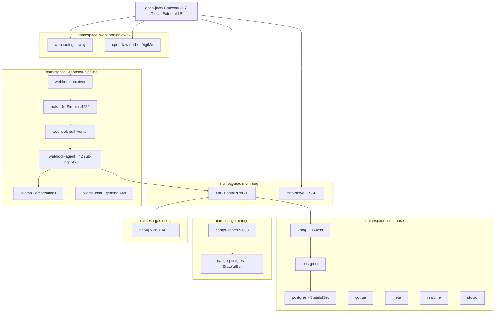

# GKE Implementation

Reference for the Kubernetes estate: what runs on GKE today, how it is deployed, and the
known issues that must not be carried into a production environment.

> **Production does not use GKE.** The production plan is serverless — see
> [GCP Production Implementation](../gcp/prod/implementation.md). This document remains the
> reference for the development cluster and for the cases where Kubernetes is still required.

---

## Cluster

| Property | Value |
|----------|-------|
| Cluster | `open-jaw` |
| Zone | `us-central1-a` |
| Project | `memdog-dev` |
| Environment | `dev` |

```bash
export GKE_CLUSTER=open-jaw GKE_ZONE=us-central1-a
gcloud container clusters get-credentials open-jaw --zone us-central1-a --project memdog-dev
```

## Namespaces



### `mem-dog` — API and MCP

| Resource | Manifest |
|----------|----------|
| `api` Deployment (1 replica, PVC at `/data`) | `k8s/api-deployment.yaml` |
| `api` Service (ClusterIP :8080) | `k8s/api-service.yaml` |
| `api-sa` ServiceAccount (Workload Identity → GCS) | `k8s/api-sa.yaml` |
| `api-config` ConfigMap | `k8s/api-configmap.yaml` |
| `api-supabase-secrets` Secret | created by the deploy script |
| `api` PVC | `k8s/api-pvc.yaml` |
| `mcp-server` Deployment + Service + HTTPRoute | `k8s/mcp-server-*.yaml` |

Graphiti requires `NEO4J_URI`, `NEO4J_USER`, `NEO4J_PASSWORD` on the API deployment.

### `webhook-pipeline` — data processing

`webhook-receiver`, `webhook-pull-worker`, `webhook-agent`, `nats` (2.10, :4222 + :8222),
`ollama` (embeddings), `ollama-chat` (gemma3:4b). Manifests in `k8s/webhook-pipeline/`.

### `webhook-gateway` — channel ingestion

`webhook-gateway` and `openclaw-node` (DigiMe) share this namespace. The `open-jaws` Gateway
resource lives here (`k8s/webhook-gateway/gateway.yaml`).

> openclaw-node requires PVC `openclaw-home`, secret `openclaw-node-secrets`, and configmaps
> `openclaw-node-config`, `openclaw-node-config-file`, `openclaw-node-skills`. Never delete this
> namespace without inventorying it first — it holds two applications, not one.

### `supabase` — database stack

Postgres 16 + pgvector (StatefulSet), PostgREST, GoTrue, Kong, Realtime, Meta, Studio.

The API reaches Postgres **through Kong and PostgREST**, not directly —
`api/app/blob_store.py` builds a `supabase-py` client and patches its PostgREST session.
Kong and PostgREST are therefore not optional infrastructure; they are in the path of every
read and write.

### `nango` — integration credentials

`nango-server` (:3003 api, :3009 connect-ui) plus its own Postgres StatefulSet.
Port 3009 is declared in the manifest but is not routed and not referenced by the UI or API.

### `neo4j` — knowledge graph

Neo4j 5.26 Community + APOC, ClusterIP :7687 (bolt) / :7474 (http), 10Gi PVC.
Optional — the API gates all Graphiti calls behind `is_graphiti_enabled()`.

---

## Deploy commands

```bash
# API
GKE_CLUSTER=open-jaw GKE_ZONE=us-central1-a \
  ./scripts/manual-deploy.sh deploy-api-gke -p memdog-dev -e dev

# Webhook pipeline
GKE_CLUSTER=open-jaw GKE_ZONE=us-central1-a \
  ./scripts/manual-deploy.sh deploy-webhook-pipeline-gke -p memdog-dev -e dev

# Webhook gateway
GKE_CLUSTER=open-jaw GKE_ZONE=us-central1-a \
  ./scripts/manual-deploy.sh deploy-webhook-gateway-gke -p memdog-dev -e dev

# MCP server
./scripts/manual-deploy.sh deploy-mcp-server-gke -p memdog-dev -e dev

# openclaw-node
./scripts/manual-deploy.sh deploy-openclaw-node-gke -p memdog-dev -e dev

# Supabase stack
./scripts/manual-deploy.sh deploy-supabase-gke -p memdog-dev -e dev

# Neo4j and Nango — apply manifests directly
kubectl apply -f k8s/neo4j/
kubectl apply -f k8s/nango/
```

The UI is **not** a GKE workload — it deploys to Cloud Run via `deploy-ui`.

## Gateway routing (`open-jaws`)

| Path | Destination | Timeout |
|------|-------------|---------|
| `/gke-api/*` | `api` service (prefix stripped) | 120s |
| `/oc/*` | `openclaw-node` (prefix stripped) | 30s |
| `/webhooks`, `/channels`, `/query`, `/chat`, `/api`, `/health` | `webhook-gateway` | 30s |

## Autoscaling (KEDA)

Manifests in `k8s/autoscaling/`.

| Scaler | Min | Max |
|--------|-----|-----|
| `api-scaler` | 0 | 3 |
| `mcp-server-scaler` | 0 | 2 |
| `webhook-gateway-scaler` | 0 | 2 |
| `webhook-agent-scaler` | 0 | 2 |
| `ollama-chat-scaler` | 0 | 1 |
| `ollama-scaler` (embedding) | 0 | 1 |

These are demo-scale values. `docs/plans/scale-1k-workspaces.md` calls them out by name as
insufficient for real load.

## Resource requirements

| Component | CPU req | Mem req | Mem limit | Storage |
|-----------|---------|---------|-----------|---------|
| API | 500m | 512Mi | 1Gi | 10Gi PVC |
| UI | 100m | 128Mi | 256Mi | — |
| Webhook Gateway | 250m | 256Mi | 512Mi | — |
| Webhook Pipeline | 500m | 512Mi | 1Gi | — |
| openclaw-node | 250m | 256Mi | 512Mi | 5Gi PVC |
| Postgres + pgvector | 500m | 1Gi | 2Gi | 20Gi PVC |
| Neo4j | 500m | 1Gi | 2Gi | 10Gi PVC |
| Redis | 100m | 128Mi | 256Mi | 1Gi PVC |
| NATS | 100m | 64Mi | 128Mi | — |
| Ollama small | 2000m | 4Gi | 8Gi | 20Gi PVC |
| Ollama medium | 4000m | 8Gi | 16Gi | 40Gi PVC |
| Ollama large | 4000m | 16Gi | 32Gi | 60Gi PVC |

See [resource-requirements](../deployment/resource-requirements.mdx) for profiles and model sizes.

---

## Known issues

These are development-cluster conditions. **None of them may be carried into production.**

| # | Issue | Location |
|---|-------|----------|
| 1 | Plaintext secrets committed to git | `k8s/nango/nango-secrets.yaml` (`NANGO_ENCRYPTION_KEY`, `NANGO_SECRET_KEY`), `k8s/lean/supabase-secrets.yaml` and `api-supabase-secrets.yaml` (demo JWTs), `k8s/lean/*` (`dev-local-key`). They are in history — rotate, do not merely delete. |
| 2 | Every workload scales to zero | all of `k8s/autoscaling/*.yaml` — cold start on a user request |
| 3 | Unpinned image tags | `mcp-server:latest`, `webhook-gateway:latest`, `ollama/ollama:latest`, `ghcr.io/openclaw/openclaw:latest` |
| 4 | API state on a PVC | `api/app/routers/gmail_push.py` writes Gmail watch state only to `/data/gmail_watches.json`. It defines `_WATCH_BLOB_KEY` (L37) for blob persistence but never uses it. |

## When Kubernetes is actually required

Production runs without a cluster. GKE becomes necessary again only for:

- **Self-hosted Ollama** — GPU node pools and ~120Gi of model PVCs. Avoided by using Ollama Cloud.
- **Self-hosted Neo4j** — a PVC-backed StatefulSet. Neo4j AuraDB avoids this.
- **openclaw-node** — PVC `openclaw-home`. Cut from the first production version.
- **Self-hosted Nango** — only if OAuth token residency must stay in your own infrastructure.
  Nango Cloud, or Nango on Cloud Run with Cloud SQL, both avoid it.

Everything else in the stack is stateless and runs on Cloud Run.
