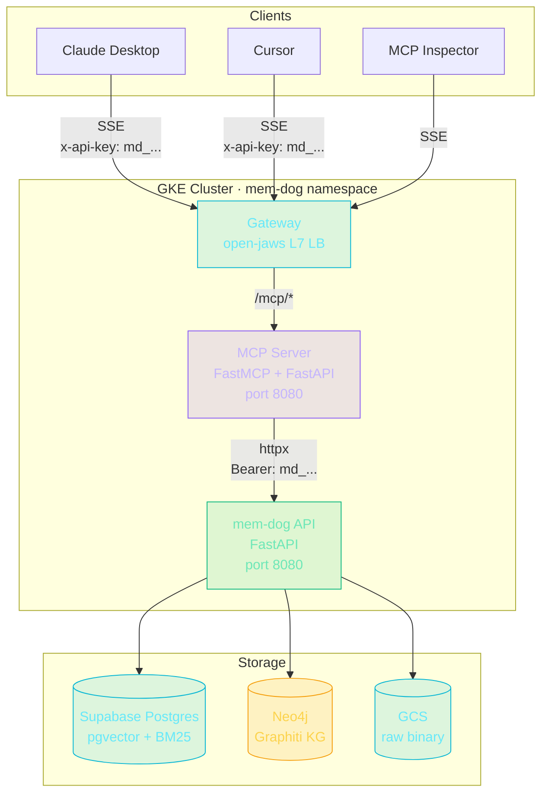

# MCP Server

The mem-dog MCP (Model Context Protocol) server exposes 8 tools over SSE transport, enabling Claude Desktop, Cursor, and other MCP-compatible agents to interact with the mem-dog API.

## Quick Start

### Claude Desktop

Add to `~/.claude/claude_desktop_config.json`:

```json
{
  "mcpServers": {
    "mem-dog": {
      "url": "http://<gateway-ip>/mcp/sse",
      "headers": { "x-api-key": "md_your_key" }
    }
  }
}
```

### Local Development

```bash
docker compose up
# MCP endpoint: http://localhost:8091/mcp/sse
```

### GKE Deployment

```bash
GKE_CLUSTER=open-jaw GKE_ZONE=us-central1-a \
  ./scripts/manual-deploy.sh deploy-mcp-server-gke -p memdog-dev -e dev
```

## Tools

| Tool | Description |
|------|-------------|
| `search` | Semantic/hybrid search across stored data |
| `add` | Store text content with tags/memory association |
| `get` | Retrieve data item by ID |
| `delete` | Delete data item |
| `entities` | Search knowledge graph entities |
| `chat` | RAG conversational query with citations |
| `memories` | List or create memories |
| `list_data` | List stored data items |

## Architecture



- **Namespace**: `mem-dog` (same as API for in-cluster HTTP)
- **Gateway path**: `/mcp/*` via `open-jaws` HTTPRoute
- **Auth**: `md_*` API keys forwarded to API on every tool call

## Docs

- [Setup & Deployment](setup.md)
- [Usage & Tool Reference](usage.md)
