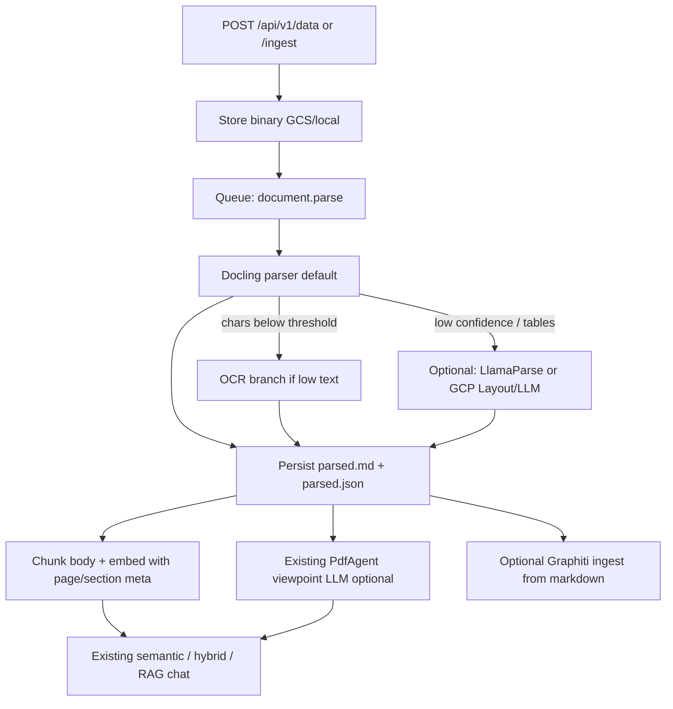

# Plan: Best-in-class document parsing for mem-dog

**Status:** In progress (Phases 0–2 done for lean path; next = Phase 3 OCR / hard-parser)  
**Owner:** mem-dog platform  
**Related:** [`webhook/.../llm_utils.py`](../../webhook/processor/webhook_agent/sub_agents/llm_utils.py) (`_extract_document_text`, `analyse_document_payload`), [`api/app/storage.py`](../../api/app/storage.py) (`create_embedding`), [`docs/features/rag-chat.mdx`](../features/rag-chat.mdx), [`docs/core-concepts/ai-pipeline.mdx`](../core-concepts/ai-pipeline.mdx), [Host SaaS embedding](host-saas-embedding.md) (G7), [Scale to ~1k workspaces](scale-1k-workspaces.md) (parse pool ceilings)

---

## Problem

mem-dog accepts PDFs/Office binaries and markets “full text extraction,” but the enrichment path is **demo-grade**:

| Behavior today | Location | Limit |
|----------------|----------|-------|
| PDF extract via `pypdf` | `_extract_document_text` | First **20 pages** |
| LLM sees truncated text | `analyse_document_payload` | ~**4k chars** (`_MAX_CONTENT_CHARS`) |
| Scanned PDF fallback | vision / PyMuPDF | **≤3 pages** @ 150 DPI; no real OCR |
| Embeddings for non-text MIME | `create_embedding` | Mostly **viewpoint/summary**, not body text |
| Chunking | `_chunk_text` | Fixed 1000/200 windows; no page/section metadata |
| Scale | KEDA webhook-agent | `maxReplicas: 2` |

RAG over brand decks, contracts, and scans therefore cites summaries—not passages—and loses tables/layout.

**Goal:** Make document ingest competitive with Docling-class self-hosted parsers (and optionally route hard pages to LlamaParse / GCP Layout), while keeping mem-dog the memory SoR (pgvector + optional Graphiti, ACLs, viewpoints).

---

## Non-goals

- Replacing Nango / connector OAuth (orthogonal).
- Replacing RAG chat / search modes (consume better chunks; don’t rewrite search).
- Becoming a hosted Document AI SaaS competitor on day one.
- Sending all customer PDFs to third-party clouds by default (privacy-first; optional paid fallback only).

---

## Target architecture



**Principle:** Parse and index are mandatory for retrieval quality. LLM viewpoint remains enrichment, not the retrieval corpus.

---

## Chosen defaults

| Decision | Choice | Why |
|----------|--------|-----|
| Default parser | **Docling** (MIT) | Self-hosted, layout DOM, tables, hierarchy; free of per-page SaaS fees |
| Hard-doc fallback | Feature-flagged **LlamaParse** and/or **GCP Document AI Layout / LLM parser** | Best-in-class on scans/nested tables; opt-in cost + data egress |
| Chunk strategy | Section / hybrid from Docling elements; fallback sliding window | Citation-friendly RAG |
| Embed source for PDFs | **Parsed body chunks** (+ optional separate viewpoint embedding) | Fix today’s summary-only gap |
| OCR | Docling OCR / Tesseract / PaddleOCR when extract &lt; threshold | Replace 3-page vision-as-OCR |
| Queue split | `document.parse` (CPU/GPU) vs existing agent enrich | Scale independently of LLM agents |

---

## Implementation phases

### Phase 0 — Baseline & harness (1–3 days) — **DONE**

- Snapshot current behavior with a **gold set** of ~50 docs: clean PDF, multi-column, table-heavy, scanned, DOCX, PPTX, long (50+ pages).
- Metrics: extract coverage (% pages with text), table TEDS/simple accuracy spot-check, retrieval@k on fixed Q&A, latency p50/p95, cost/page.
- Document current caps in code comments / ADR so regressions are visible.

**Exit:** Benchmark harness runnable in CI (subset) and locally (full).  
**Harness:** [`testing/document-parse/`](../../testing/document-parse/) + [ADR 0001](../adr/0001-document-parsing-baseline.md).  
**Shipped:** ADR + harness + local smoke; gold set is still small (~2 PDFs) — expand + CI subset remains follow-up (does not block Phase 2).

### Phase 1 — Docling parse service (core) — **DONE** (lean PDF path)

**Code touchpoints**

1. New package, e.g. `webhook/processor/webhook_agent/document_parse/` or sibling service `document-parser/`:
   - `parse(bytes, mime) -> ParsedDocument` (markdown + element JSON + page map + confidence).
2. Replace `_extract_document_text` call sites in `analyse_document_payload` with Docling (keep `pypdf` as emergency fallback behind flag).
3. Persist artifacts next to binary, e.g.:
   - `{user_id}/{data_id}/{version}/parsed/document.md`
   - `{user_id}/{data_id}/{version}/parsed/document.json`
4. Config env:
   - `DOCUMENT_PARSER=docling|pypdf` (default **`pypdf`**; Docling is **opt-in**, PDF-only via `docling-slim[format-pdf]`, falls back to pypdf on error; Office stays on python-docx/openpyxl/pptx)
   - `DOCUMENT_PARSE_MAX_PAGES` (default high or unlimited for indexing)
   - `DOCUMENT_OCR_ENABLED` / `DOCUMENT_HARD_PARSER` — **env stubs only until Phase 3** (accepted in lean compose; not wired)

**Deps:** `docling-slim[format-pdf]` is **optional** (`requirements-docling.txt`, Docker `INSTALL_DOCLING=true`); RAM notes in [`docs/deployment/resource-requirements.mdx`](../deployment/resource-requirements.mdx) + lean overlay. Default GKE/processor images use pypdf only.

**Exit:** Upload PDF with `forward_to_webhook=true` writes `parsed.md`; extract no longer capped at 20 pages for indexing when `DOCUMENT_PARSER=docling`.  
**Shipped:** `document_parse` package, API `POST/GET /data/{id}/parsed`, lean default stays `pypdf` (Docling opt-in).

### Phase 2 — Embeddings from parsed body (retrieval fix) — **DONE** (lean / local)

**Code touchpoints:** `BaseStorage.create_embedding` in `api/app/storage.py`.

1. If `parsed/document.md` (or JSON chunks) exists for `data_id`, embed **that**, not viewpoint-only.
2. Chunk with metadata: `page`, `section_path`, `element_type`, `data_id`, `chunk_index`.
3. Store chunk metadata in embedding records / sidecar JSON so RAG citations can show page numbers.
4. Keep viewpoint: prepend to first chunk **or** store as `embedding_kind=viewpoint` separately.
5. Raise/remove indexing truncation; keep LLM analysis truncation for cost.

**Exit:** Semantic search returns chunks from PDF body text; citation metadata includes page when available.  
**Shipped:** `create_embedding` prefers parsed JSON chunks → markdown → legacy fallbacks; prepends viewpoint to chunk 0; write-new-then-delete-old rewrite; coalesces same-page micro-chunks; `page` on `Embedding` / search / `SemanticMatchChunk` / `ChatCitation`; Supabase migration [`mem_dog_embeddings_page.sql`](../../api/supabase/mem_dog_embeddings_page.sql) (GKE seed `07-…`).

### Phase 3 — OCR & hard-doc router — **NEXT**

Env flags already exist (`DOCUMENT_OCR_ENABLED`, `DOCUMENT_HARD_PARSER`) as **stubs** — implement routing here, not sooner.

1. If Docling text density &lt; N chars/page or confidence low → OCR pipeline.
2. Optional router:
   - `tables dense` or `scan` → LlamaParse Agentic / GCP Layout or LLM parser.
   - Persist vendor raw response for audit; normalize into same `ParsedDocument` schema.
3. Never block default path on third-party availability (fallback to Docling OCR).

**Exit:** Scanned 10-page PDF retrieves key phrases; feature flag off = fully offline.

### Phase 4 — Scale, quotas, product surface

1. Dedicated parse worker Deployment + KEDA (CPU/GPU); raise replica limits separately from LLM agents — prod ceilings in [scale-1k-workspaces.md](scale-1k-workspaces.md) Phase S1.
2. Upload quotas: max bytes, max pages, MIME allowlist option, virus scan hook (align with Host G14 / capacity S0).
3. API: `GET /api/v1/data/{id}/parsed` (markdown/JSON); parse status on metadata (`parse_status`: pending|ready|failed).
4. UI Playground: show parse status + “Re-parse” button.
5. Docs: replace marketing overclaim with accurate pipeline diagram in `ai-pipeline` / `rag-chat`.

**Exit:** Local compose **lean** overlay; k8s manifests; docs updated.

### Phase 5 — Optional Graphiti & eval gate

- Ingest section summaries / entities from parsed markdown into Graphiti (char budget already exists).
- CI gate: gold-set retrieval@k must not regress below Phase 0 Docling baseline.

---

## API / data contract (sketch)

```json
{
  "parser": "docling",
  "parser_version": "x.y.z",
  "page_count": 42,
  "ocr_used": false,
  "confidence": 0.91,
  "markdown_uri": ".../parsed/document.md",
  "elements": [
    {
      "type": "section_header",
      "text": "Pricing",
      "page": 3,
      "section_path": ["Pricing"]
    },
    {
      "type": "table",
      "page": 3,
      "markdown": "| Plan | Price |"
    }
  ],
  "chunks": [
    {
      "text": "...",
      "page": 3,
      "section_path": ["Pricing"],
      "element_type": "narrative"
    }
  ]
}
```

Backward compatible: existing clients ignore new blobs; embeddings improve automatically after re-parse.

---

## Local testing / components

Align with host profiles in [host-saas-embedding.md](host-saas-embedding.md) (**L1**).

### Machine note — Mac mini M2 Pro (16 GB)

Verified sizing for this repo’s authoring machine:

| Resource | Value |
|----------|--------|
| Chip | Apple M2 Pro (10 CPU / 16 GPU) |
| Host RAM | **16 GB** unified |
| Docker Desktop (recommended) | **10–12 GB** RAM, 6 CPUs (esp. when opting into `DOCUMENT_PARSER=docling`) |
| Disk headroom | keep ≥20 GB free for images + gold PDFs |

**Do not** run `docker compose up` (full stack + 3× Ollama) on 16 GB — that path is the **32GB Standard** profile in [resource-requirements](../deployment/resource-requirements.mdx).

Use the **lean** overlay instead (host profile **L1**):

```bash
cp api/.env.example api/.env
# set OLLAMA_CLOUD_API_KEY=...  (or SYSTEM_GEMINI_API_KEY=...)
./scripts/dev-lean.sh up -d
```

Files: [`docker-compose.lean.yml`](../../docker-compose.lean.yml), [`scripts/dev-lean.sh`](../../scripts/dev-lean.sh).  
Parser default on lean: **`DOCUMENT_PARSER=pypdf`**. Opt in with `DOCUMENT_PARSER=docling`.

| Component | Required? | Notes |
|-----------|-----------|-------|
| `db`, `redis`, `neo4j`, `api`, `ui`, `mcp-server` | Yes | Store + Graphiti + embed + playground UI + MCP SSE |
| `webhook-gateway`, `webhook-processor` | Yes | Parse/enrich path today |
| Future `document-parse` worker | Yes (when split) | Docling CPU/GPU; keep off LLM agent pods |
| Cloud embedding/LLM keys | **Required on 16GB** | Avoid 3× Ollama on laptops |
| `ollama-*` | Optional | Only if validating local-only AI on ≥32GB |
| Nango | No | Not needed for parse/RAG body-chunk proof |

```bash
./scripts/dev-lean.sh up -d
# or:
# docker compose -f docker-compose.yml -f docker-compose.lean.yml \
#   up -d db redis neo4j api ui mcp-server webhook-gateway webhook-processor
# + document-parse worker when split out
```

Checklist:

1. Upload small digital PDF → `parsed.md` present, search hits body quote.
2. Upload table PDF → table markdown in parse JSON.
3. Upload scan → OCR path; search hits.
4. Toggle `DOCUMENT_HARD_PARSER` on one hard doc; compare quality.
5. Re-parse after parser upgrade; embeddings refreshed.
6. Run gold-set harness; record metrics in `docs/plans/document-parsing-benchmarks.md` (generated).

Compare against LlamaCloud / GCP only in Phase 3 eval (optional), not as required prod dependency.

---

## Comparison posture (product)

| Stack | Parse quality | Fit for mem-dog |
|-------|---------------|-----------------|
| mem-dog today | Poor | Current |
| **mem-dog + Docling** | Strong self-hosted | **Default target** |
| + LlamaParse/GCP on hard pages | Best-in-class hybrid | Opt-in |
| Replace memory with GCP RAG Engine / LlamaCloud Index | Excellent managed RAG | Reject as SoR; optional parse-only |

mem-dog remains the memory platform; cloud parsers are **adapters**, not the corpus.

---

## Risks & mitigations

| Risk | Mitigation |
|------|------------|
| Docling image size / cold start | Dedicated worker image; warm pool; CPU path documented for Mac Mini |
| Memory blow-ups on huge PDFs | Page batching; streaming write of chunks; max pages quota |
| Double LLM cost (parse + viewpoint) | Make viewpoint optional for `document` types; parse-only mode |
| Embedding explosion on long docs | Section chunking; max chunks/doc with spill to “summary chunk” |
| License/compliance of fallback APIs | Default offline; hard parser requires explicit org setting |

---

## Success criteria

- [ ] Digital PDF ≤50 pages: body text searchable end-to-end (not summary-only).
- [ ] Tables: majority of cells recoverable as markdown in gold set.
- [ ] Scans: OCR path recovers readable text for ≥80% of gold scan pages.
- [ ] RAG chat citations include page (when parse has page map).
- [ ] Default path works with **zero** third-party parse API keys.
- [ ] Benchmark harness in CI (smoke) + documented full suite.
- [ ] Docs/marketing aligned with real pipeline.

---

## Suggested ticket breakdown

1. `docs`: ADR + gold-set harness scaffold  
2. `parser`: Docling integration + artifact storage  
3. `api`: `create_embedding` reads parsed body + chunk metadata  
4. `ocr`: low-text branch  
5. `router`: optional LlamaParse/GCP adapters  
6. `ops`: parse worker + KEDA + lean compose overlay  
7. `product`: parse status API + playground UX  
8. `docs`: ai-pipeline / rag-chat accuracy pass  

---

## References (internal)

- Extract/analyse: `webhook/processor/webhook_agent/sub_agents/llm_utils.py`
- PdfAgent: `webhook/processor/webhook_agent/sub_agents/documents/pdf.py`
- Embeddings: `api/app/storage.py` (`create_embedding`, `_chunk_text`)
- KEDA: `k8s/autoscaling/webhook-pipeline.yaml`
- External: [Docling](https://github.com/docling-project/docling) (MIT), LlamaParse / Vertex RAG Engine as optional hard-doc backends only
