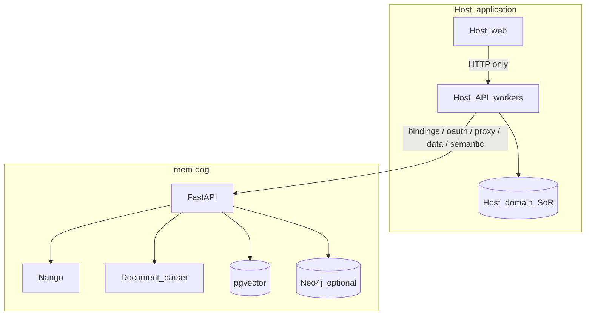

# Plan: Host SaaS embedding contracts

**Status:** Proposed  
**Owner:** mem-dog platform  
**Companions:** [Document parsing upgrade](document-parsing-upgrade.md), [Scale to ~1k workspaces](scale-1k-workspaces.md) (capacity / SRE)

---

## Problem

Third-party products will embed mem-dog as a **private memory backend** behind their own API (auth, billing, domain UI). mem-dog already has orgs/projects, Nango, ingest, search, and RAG chat—but several **host-facing contracts** are incomplete or underspecified:

- Mapping host tenants → mem-dog org/project/user + API keys
- Stable connector Connect / proxy flows driven by the host (not only mem-dog UI)
- Idempotent re-sync and tagging conventions
- Guaranteed project-scoped retrieval with citations
- Soft-fail behavior when the host treats memory as optional
- Document parse quality for RAG (see companion plan)

This plan makes mem-dog a reliable **multi-host memory platform**, not a single-product sidecar.

---

## Ownership boundary

| Concern | Owner |
|---------|--------|
| End-user auth, billing, entitlements, product UI | **Host application** |
| Domain systems of record (CRM rows, scores, tickets, CMS) | **Host application** |
| Connector Connect UX, sync schedule, lineage UI | **Host application** (calls mem-dog APIs) |
| OAuth token vault + provider HTTP proxy | **mem-dog (Nango)** |
| Long-lived corpus, embeddings, knowledge graph, RAG retrieve | **mem-dog** |
| Document parse → chunk → embed quality | **mem-dog** ([Docling plan](document-parsing-upgrade.md)) |

**Rule:** Host backends call mem-dog with `md_*` (or service) keys. End-user browsers must not hold mem-dog secrets. Host JWTs are not accepted as mem-dog auth; tenancy is established via bindings + scoped keys.

---

## Gap register

| ID | Gap | mem-dog deliverable |
|----|-----|---------------------|
| G1 | Host tenant → memory workspace mapping | **Host binding** API or documented provision flow: external ids → `org_*` / `proj_*` / `user_id` + one-time `md_*` |
| G2 | Host-driven OAuth without rebuilding Nango | Stable **integrations** APIs: authorize URL, list/delete connections, credential proxy |
| G3 | No shared ingest conventions | **Canonical tags + metadata** for connectors and host domain events |
| G4 | Re-sync creates duplicates | **`external_id` upsert** per project (preserve `data_id` when possible) |
| G5 | Downstream features need cited retrieval | **Project-scoped** semantic / hybrid / chat with stable citation payload |
| G6 | Hosts append domain events (sessions, runs, notes) | Documented **episodic / factual ingest** recipes (tags only; host keeps raw SoR) |
| G7 | PDF/Office RAG quality | [document-parsing-upgrade.md](document-parsing-upgrade.md) |
| G8 | Memory optional for host SKUs | Health endpoints + empty-corpus 200s; timeout-friendly errors |
| G9 | No “embed mem-dog” guide | **`docs/integrations/host-saas.md`** (reference architecture) |
| G10 | Conversation / community corpora | Inbound webhooks + file ingest recipes (Slack, Discord, CSV, exports) |
| G11 | Downstream reporting needs provenance | Stable `data_id` + parse/chunk artifacts for host composers |
| G12 | Temporal / entity reasoning | Project-scoped Graphiti queries (optional later) |
| G13 | Workspace offboard / compliance erase | **Project (and optional org) delete + export** — wipe blobs, embeddings, viewpoints, connections refs; async job + status |
| G14 | Noisy / abusive host traffic | **Per-org (and per-project) quotas**: ingest rate, parse concurrency, storage bytes, max pages/upload |
| G15 | Hard to debug cross-service calls | **Host observability**: honor/propagate `X-Request-Id` / `traceparent`; stable error envelope (`code`, `message`, `details`) |
| G16 | Hosts fear breaking API changes | **Versioned host contract** (`/api/v1` stability policy) + TS/Python client helpers for bind / upsert / retrieve |
| G17 | Leaked or aged service keys | **`md_*` key rotation** without recreating org/project; list/revoke; grace period for dual keys |

---

## Target architecture



**Suggested tenancy map** (hosts choose granularity):

| Host concept | mem-dog |
|--------------|---------|
| Billing / customer account | `org_*` |
| Workspace / site / client brand / team space | `proj_*` (typically 1:1) |
| Service identity for that workspace | `user_id` + `md_*` key |
| End-user RBAC inside the host | Enforced by **host**; mem-dog keys stay server-side |

---

## Canonical contracts

### Tagging (G3)

Host-written items SHOULD use:

| Tag / field | Example | Purpose |
|-------------|---------|---------|
| `source:{provider}` | `source:notion` | Connector filters |
| `tenant:{external_id}` | Host workspace id | Defense in depth |
| `connection:{id}` | Host connection row id | Lineage |
| `external_id` | Upstream object id | Upsert (G4) |
| `event:{type}` | `event:session` / `event:run` | Domain event write-back |
| `memory_type` | `factual` / `episodic` / `organizational` | Retrieval shaping |

Hosts may add product-specific tags; document reserved prefixes in `host-saas.md`.

### External ID upsert (G4)

- Unique key: `(owner_user_id | project_id, external_id)`
- On conflict: update payload, re-enqueue parse/embed, prefer same `data_id`
- Response: `{ data_id, created, updated }`

### Retrieval (G5–G6)

- Semantic / hybrid / chat honor `project_id` (or key-scoped default project)
- Citations: `data_id`, snippet, score; optional `page` / `section_path` after Docling work
- Empty project → `200` with empty hits (soft dependency)

### Host binding (G1)

```
POST /api/v1/host/bindings
Authorization: Bearer <platform API_KEY>

{
  "external_org_id": "<host-account-id>",
  "external_workspace_id": "<host-workspace-id>",
  "display_name": "Acme Workspace"
}

→ { org_id, project_id, user_id, api_key }  // api_key shown once
```

If a dedicated route ships later, ship an official SDK/script that performs the same steps with existing org/project/api-key APIs—**one documented happy path**.

---

## Phased delivery

### Phase A — Host contract & tenancy

1. Author `docs/integrations/host-saas.md` (Connect via Nango → proxy → `/data`|/ingest` → search).
2. Publish tagging conventions + OpenAPI examples.
3. Host binding endpoint **or** official provision helper (TS + Python).
4. Project isolation tests on semantic/chat.
5. Document health/readiness for host circuit breakers.

**Exit:** A sample host backend provisions a workspace, ingests tagged text, and searches only that project.

### Phase B — Connector reliability

1. Implement `external_id` upsert on `/data` and `/ingest`.
2. Audit integrations/oauth/proxy/webhook routes for `md_*` service-key auth.
3. Reference recipes: Notion (outbound), Slack (inbound `whk_*` + outbound), CSV/file (no Nango).
4. Surface `parse_status` on metadata when the Docling plan lands.

**Exit:** Re-syncing the same upstream object twice yields one logical `data_id`; host drives Connect without mem-dog UI.

### Phase C — Document quality (parallel)

Execute [document-parsing-upgrade.md](document-parsing-upgrade.md) Phases 0–2 (Docling + body-chunk embeddings) so host RAG over PDFs/Office is trustworthy.

### Phase D — Retrieval consumers

1. Stabilize citation schema for host “grounded generation” use cases.
2. Optional batch semantic API for multi-query host jobs.
3. Recipe: ingest **summaries / structured facts** of host domain events (`event:*` tags)—raw blobs stay in the host SoR.
4. Document soft-fail semantics for feature-flagged host modules.

**Exit:** Host can retrieve cited context for assistants, briefs, or analytics enrichment.

### Phase E — Corpora, provenance, graph (later)

1. Recipes for community/chat exports and note dumps.
2. Provenance: data + parse artifacts for host evidence/report composers.
3. Optional project-scoped Graphiti timelines.

### Phase F — Multi-host production hardening (G13–G17)

Ship **before** meaningful multi-tenant volume (do not wait for a second host). Required gating for [~1k workspaces](scale-1k-workspaces.md). Can proceed in parallel with E.

#### F1 — Workspace lifecycle (G13)

- `DELETE /api/v1/host/workspaces/{project_id}` (or project delete under org) → async purge: data, embeddings, viewpoints, parsed artifacts, optional Nango connections for bound `user_id`.
- `POST .../export` → archive (manifest + markdown/JSON) for host offboarding.
- Status: `purge_status` / job id; idempotent re-delete.
- Document retention: default hard-delete vs configurable soft-delete TTL.

**Local:** L0 + scripted create → ingest → delete → confirm semantic empty.

#### F2 — Quotas & abuse (G14)

- Configurable limits (env or org settings): requests/min ingest, max body bytes, max pages/doc, max storage/project, max concurrent parses.
- Responses: `429` with `Retry-After` and structured `code=rate_limited|quota_exceeded`.
- Metrics counters per `org_id` / `project_id` for host dashboards (export Prometheus or log fields).

**Local:** L0 unit/integration tests with artificially low limits.

#### F3 — Observability (G15)

- Accept `X-Request-Id`; generate if missing; echo on response; include in logs and webhook pipeline context.
- Optional W3C `traceparent` passthrough.
- Error JSON shape (all host-facing 4xx/5xx):

```json
{
  "error": {
    "code": "project_not_found",
    "message": "Human readable",
    "details": {},
    "request_id": "..."
  }
}
```

#### F4 — API stability & clients (G16)

- Publish **host compatibility policy** in `host-saas.md` (what may change in `/api/v1` vs requires `/api/v2`).
- Extend TS + Python SDKs: `createHostBinding`, `upsertData`, `semanticSearch`, `rotateApiKey`, `deleteWorkspace` (names indicative).
- OpenAPI examples tagged `host-saas` for codegen.

#### F5 — Key rotation (G17)

- `POST /api/v1/.../api-keys` create additional key; `DELETE` revoke.
- Rotation helper: create new → host switches → revoke old (optional overlap window).
- Never return full key material on list; show prefix + created_at + last_used_at if available.

**Exit (Phase F):** A host can offboard a workspace, survive rate limits cleanly, correlate logs via request id, pin a documented client, and rotate keys without rebinding tenancy.

---

## Explicit non-goals

- Building host product UIs, billing, or RBAC inside mem-dog
- Becoming the system of record for host domain entities
- One-click memory sync for all 300 Nango providers (hosts maintain allowlists + sync jobs)
- Accepting arbitrary host JWTs without a binding/key model
- Requiring DigiMe / mem-dog UI for embedded deployments

---

## Local components (required to develop & verify)

Host embedding work must be runnable without the full marketing stack. Use **profiles** so laptops (especially ≤16GB) are not forced into 3× Ollama + UI + MCP.

### Compose inventory today

From [`docker-compose.yml`](../../docker-compose.yml) / [`docs/deployment/local-dev.md`](../deployment/local-dev.md):

| Service | Port | Role for host embedding |
|---------|------|-------------------------|
| `db` (pgvector) | 5432 | Metadata, embeddings — **required** |
| `redis` | 6379 | Store/cache — **required** for default API |
| `api` | 8080 | Bindings, data, ingest, semantic, integrations — **required** |
| `webhook-gateway` | 8070 | Channel adapters + `/proxy` — required for connector proxy / inbound webhooks |
| `webhook-processor` | 8090 | Enrichment / parse pipeline (local HTTP, not NATS) — required when `forward_to_webhook` or Docling path runs |
| `neo4j` | 7474 / 7687 | Graphiti — optional (Phase E); note: current compose marks API `depends_on: neo4j` healthy — may need a **compose profile** or override to drop it for minimal |
| `ui` | 3000 | Optional (manual smoke only; hosts should not depend on it) |
| `mcp-server` | 8091 | Optional (IDE agents) |
| `ollama-small/medium/large` | 8081–8083 | Optional local LLMs; heavy RAM |

**Not in default compose:** self-hosted **Nango** (lives under `k8s/nango/` in prod). Local OAuth Connect needs a separate Nango process or a documented compose overlay added by this plan.

### Recommended local profiles

#### Profile L0 — Host API smoke (Phases A, D text-only)

**Goal:** provision binding, ingest text/CSV, project-scoped semantic search.

| Include | Skip |
|---------|------|
| `db`, `redis`, `api` | UI, MCP, Ollama tiers, gateway, processor, Neo4j* |

\*If API hard-depends on Neo4j in compose, either start `neo4j` anyway or add a `minimal` profile that clears that dependency (ticket under this plan).

**AI keys:** set cloud embedding/chat (e.g. `SYSTEM_GEMINI_API_KEY`) so search works without Ollama.

```bash
# Target shape (adjust once minimal profile exists)
docker compose up db redis api
# Host points at:
#   MEMDOG_BASE_URL=http://localhost:8080
```

**Env (host + mem-dog):**

| Variable | Where | Purpose |
|----------|--------|---------|
| `POSTGRES_URL` | api | Already set in compose |
| `REDIS_URL` | api | Already set in compose |
| `STORAGE_BACKEND=local` | api | Filesystem blobs |
| `API_KEY` / bootstrap `md_*` | api + host | Service auth |
| `SYSTEM_GEMINI_API_KEY` (or equiv) | api | Embeddings / chat without Ollama |
| `MEMDOG_BASE_URL` | host app | `http://localhost:8080` |

#### Profile L1 — Enrichment + documents (Phases B/C with files)

**Goal:** `forward_to_webhook`, PDF/Office parse, viewpoints, body embeddings (after Docling).

| Include | Skip |
|---------|------|
| L0 + `webhook-gateway` + `webhook-processor` | Full Ollama matrix if using cloud LLM; UI optional |

When Docling lands, prefer a dedicated **`document-parse` worker** (or heavier processor image) documented here—do not require `ollama-large` by default.

```bash
./scripts/dev-lean.sh up -d
# or: docker compose -f docker-compose.yml -f docker-compose.lean.yml \
#       up -d db redis api webhook-gateway webhook-processor
```

| Extra env | Purpose |
|-----------|---------|
| `WEBHOOK_GATEWAY_URL` | api → gateway |
| `WEBHOOK_API_KEY` / `WGW_API_KEY` | Gateway auth |
| `DOCUMENT_PARSER` | After Phase 1 — `pypdf` (default) or `docling` |
| `LOCAL_DEV=true` | Processor HTTP path (compose default) |

#### Profile L2 — Connector OAuth (Phase B Connect)

**Goal:** Host-driven authorize URL → Nango → list connections → `/proxy` → ingest.

| Include | Extra |
|---------|--------|
| L1 | **Nango** (compose overlay or `docker compose -f docker-compose.yml -f docker-compose.nango.yml`) |

Deliverables of this plan for L2:

1. `docker-compose.nango.yml` (or `profiles: [nango]`) running `nango-server` + `nango-db`
2. Documented env: `NANGO_API_URL`, `NANGO_SECRET_KEY`, `NANGO_SERVER_URL`, `NANGO_PUBLIC_KEY`, `NANGO_ENCRYPTION_KEY`
3. Local OAuth: provider callback via **tunnel** (ngrok / Cloudflare) to Nango public URL
4. One scripted smoke: Notion or a mock provider

Without L2, hosts can still validate upsert/search using **file ingest + personal API tokens** (no Nango).

#### Profile L3 — Knowledge graph (Phase E)

| Include |
|---------|
| L1 + `neo4j` |

Verify Graphiti ingest + project-scoped fact queries. Not required for Phases A–D exit criteria.

#### Profile L4 — Full local stack

`docker compose up` (all services). Use only for demos / Mac Mini with enough RAM. See [`docs/deployment/mac-mini.md`](../deployment/mac-mini.md). Prefer cloud LLM keys over three Ollama tiers when validating host contracts.

### Host application alongside mem-dog

| Component | Local expectation |
|-----------|-------------------|
| Host API / workers | Separate process; `MEMDOG_BASE_URL=http://localhost:8080` |
| Host DB | Host’s own Postgres/Redis — **not** mem-dog’s `db` |
| Host web | Calls **host** API only |
| Shared Docker network | Optional; localhost ports are enough on one machine |

Do not run two products against the same Postgres instance.

### Verification matrix by profile

| Check | L0 | L1 | L2 | L3 |
|-------|----|----|----|----|
| Health `GET /health` | ✓ | ✓ | ✓ | ✓ |
| Binding + tagged text ingest | ✓ | ✓ | ✓ | ✓ |
| Project isolation search | ✓ | ✓ | ✓ | ✓ |
| `external_id` upsert | ✓ | ✓ | ✓ | ✓ |
| PDF → parse → body search | | ✓ | ✓ | ✓ |
| OAuth Connect + proxy | | | ✓ | |
| Inbound `whk_*` webhook | | ✓ | ✓ | |
| Graphiti timeline | | | | ✓ |

### Plan tickets for local DX

Add to delivery (not optional fluff):

1. Compose **`minimal`** profile: `db` + `redis` + `api` without requiring Neo4j/Ollama/UI  
2. Compose **`nango`** overlay + env sample for L2  
3. `scripts/smoke-host-saas.sh` (or pytest) covering L0 verification matrix  
4. Update [`docs/deployment/local-dev.md`](../deployment/local-dev.md) with L0–L3 profiles  
5. Document RAM guidance: L0 ~2–4GB; L1 + parser higher; avoid L4 on 16GB with all Ollama tiers  

---

## Testing (local)

| Layer | Profile | How |
|-------|---------|-----|
| Isolation | L0 | Two projects; ingest in A; query B → empty |
| Upsert | L0 | Same `external_id` twice → one logical document |
| Connector smoke | L2 | OAuth authorize → proxy pull → ingest → semantic hit |
| Soft fail | L0 | Stop `api`; host timeout/empty behavior |
| Documents | L1 | Gold set from Docling plan |
| Domain events | L0 | Tag `event:run`; retrieve within project |
| Graph | L3 | Project-scoped facts query |
| Lifecycle purge | L0 | Create → ingest → delete workspace → search empty |
| Quotas | L0 | Hit low limit → `429` + structured error |
| Request id | L0 | Send `X-Request-Id`; see echo + logs |
| Key rotation | L0 | Create second `md_*`; revoke first; calls still work |

---

## Success criteria

- [ ] `host-saas.md` + binding happy path in-repo
- [ ] Cross-project retrieval isolation covered by tests
- [ ] `external_id` upsert on `/data` and `/ingest`
- [ ] Host can complete file or Notion path → search without mem-dog UI
- [ ] Docling Phases 0–2 done or explicitly scheduled
- [ ] Citation payload documented for host grounded generation
- [ ] G1–G9 closed or deferred with owners; G10–G12 on a dated backlog
- [ ] **Compose `minimal` (+ optional `nango`) profiles documented and smoke-scripted**
- [ ] **L0 verification matrix passes on a laptop without full `docker compose up`**
- [ ] **G13–G17 (Phase F) scheduled or done before multi-host production** — lifecycle, quotas, request ids / error envelope, SDK helpers, key rotation
- [ ] Capacity path for ~1k workspaces tracked in [scale-1k-workspaces.md](scale-1k-workspaces.md) (quotas before raising KEDA max)

---

## Suggested tickets

1. `docs`: Host SaaS guide + tagging contract  
2. `api`: Host binding helper (endpoint or SDK script)  
3. `api`: Project enforcement on semantic/chat + isolation tests  
4. `api`: `external_id` upsert  
5. `integrations`: Service-key auth audit (oauth / proxy / webhooks)  
6. `docs`: Recipes — connector sync, domain-event ingest, grounded retrieve  
7. Execute Docling plan Phases 0–2  
8. `compose`: `minimal` profile (no Neo4j/Ollama required for API)  
9. `compose`: `nango` overlay + `.env.nango.example`  
10. `scripts`: `smoke-host-saas.sh` for L0 (extend L1/L2 later)  
11. `docs`: local-dev L0–L3 profile table  
12. `backlog`: Community corpus recipes, provenance export, Graphiti timelines  
13. `api`: Project/org purge + export job (G13)  
14. `api`: Per-org/project quotas + `429` envelope (G14)  
15. `api`: `X-Request-Id` / structured errors (G15)  
16. `docs`+`clients`: Host compatibility policy + SDK bind/upsert/retrieve/rotate (G16)  
17. `api`: API key rotate / revoke without rebind (G17)  

---

## References

- Orgs/projects: [`docs/architecture/organizations.md`](../architecture/organizations.md)
- Nango: [`docs/integrations/integrations.md`](../integrations/integrations.md)
- RAG: [`docs/features/rag-chat.mdx`](../features/rag-chat.mdx)
- Parsing: [`docs/plans/document-parsing-upgrade.md`](document-parsing-upgrade.md)
- Capacity: [`docs/plans/scale-1k-workspaces.md`](scale-1k-workspaces.md)
- Local: [`docs/deployment/local-dev.md`](../deployment/local-dev.md), [`docs/deployment/mac-mini.md`](../deployment/mac-mini.md), [`docker-compose.yml`](../../docker-compose.yml)
