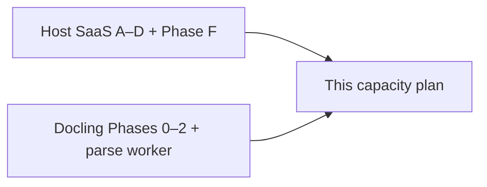
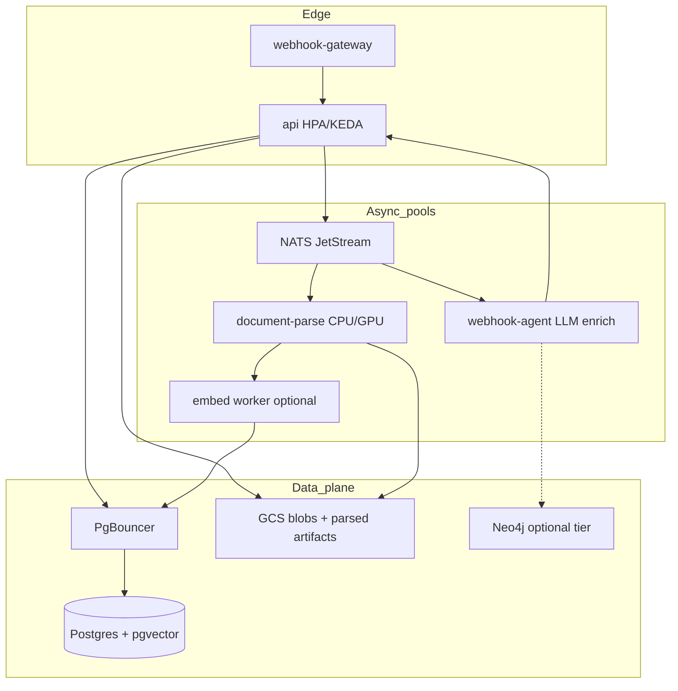

# Plan: Scale to ~1,000 workspaces (capacity addendum)

**Status:** Proposed  
**Owner:** mem-dog platform  
**Companions:** [Host SaaS embedding](host-saas-embedding.md), [Document parsing upgrade](document-parsing-upgrade.md)  
**Scope:** Capacity, isolation, cost, and SRE controls so multi-host mem-dog can sustain **~1,000 active `proj_*` workspaces** (not a full multi-region SaaS redesign).

---

## Problem

[Host SaaS](host-saas-embedding.md) and [Docling](document-parsing-upgrade.md) close **product contracts** (bindings, upsert, parse quality, Phase F quotas). They do **not** specify how the stack behaves when:

- Tens of host apps map to hundreds–thousands of `proj_*` workspaces
- Connector re-syncs and PDF parse jobs arrive concurrently
- Embedding / LLM spend and pgvector query load grow linearly with corpus size
- KEDA ceilings stay at demo levels (`api` max 3, webhook-agent max 2)

Without an explicit capacity plan, “ready for hosts” ≠ “ready for 1k workspaces.”

---

## Definition of done (target load)

Assume **steady-state** production (not black-friday peaks):

| Dimension | Target |
|-----------|--------|
| Active workspaces | **~1,000** `proj_*` with traffic in the last 30 days |
| Hosts | ~10–50 host applications (billing accounts → `org_*`) |
| Ingest | Sustained **50–100 docs/min** cluster-wide; bursts to **300/min** for ≤5 min |
| Corpus | Median workspace **≤50k** embedding rows; p95 **≤500k**; cluster **≤50M** rows |
| Search | p95 semantic/hybrid **&lt; 800 ms** (excludes host LLM generation) |
| Parse | p95 digital PDF ≤20 pages **&lt; 60 s** queue+parse; scans best-effort under OCR pool |
| Availability | API 99.5% monthly; memory soft-fail (empty / timeout) preferred over cascade |
| Cost guardrail | Per-org monthly budget soft-cap (embeddings + hard-parser + LLM viewpoint) with 429/`quota_exceeded` |

**Non-goals for this addendum:** multi-region active-active, cell sharding across continents, replacing Postgres as SoR, or guaranteeing Graphiti for every workspace at 1k (Graphiti stays **opt-in / tiered**).

---

## Dependency order

Ship **Host Phase F (G13–G17) before or with** the first production host at meaningful volume. Do not wait for “more than one host.”

---

## Gap register (capacity)

| ID | Gap | Deliverable |
|----|-----|-------------|
| C1 | Demo KEDA ceilings | **Prod scale profiles**: raise `maxReplicaCount` by tier; separate parse vs enrich pools |
| C2 | Shared Postgres becomes bottleneck | PgBouncer / pooler; connection budgets; statement timeouts; vacuum/analyze playbook |
| C3 | pgvector latency at tens of millions rows | HNSW (or IVFFlat) tune; **partial / per-project** index strategy where feasible; `project_id` always in filter path |
| C4 | Noisy neighbor parse/LLM | Per-org **parse concurrency** + ingest RPS (extends Host G14); separate `document-parse` Deployment |
| C5 | Embedding API rate limits / cost | Async embed queue; batch; provider fallback; per-org embedding budget |
| C6 | Dual-write Neo4j optional but heavy | Graphiti **off by default** for host workspaces; enable per org/tier |
| C7 | Scale-to-zero fights SLA | Business-hours cron OK for lab; prod **minReplicas ≥ 1** for API + gateway + pooler |
| C8 | No load proof | k6/Locust suite + nightly soak against staging with synthetic 1k projects |
| C9 | Metering invisible | Prometheus metrics: ingest RPS, parse queue lag, embed lag, search p95, storage bytes **by org_id/project_id** |
| C10 | Hot workspace skew | Backpressure + optional priority queues; document “enterprise isolation” as later cell |
| C11 | Blob growth | GCS lifecycle / retention hooks; align with Host G13 purge |
| C12 | Runbooks missing | On-call: queue backup, DB CPU, embed provider 429, parse OOM |

---

## Architecture adjustments

**Principles**

1. **Parse ≠ enrich ≠ serve** — three autoscaling groups with independent ceilings.
2. **Quotas before replicas** — raising `maxReplicas` without G14 invites cost blowups.
3. **Postgres is the shared fate** — protect it with pooling, timeouts, and project-scoped query plans.
4. **Graphiti is a product tier**, not default path for every host workspace at 1k.

---

## Capacity model (planning numbers)

Use these as **starting assumptions**; replace with measured gold-set + soak data.

| Resource | Rule of thumb |
|----------|----------------|
| API pods | ~1 pod per 30–50 sustained ingest RPS + search; start **min 2 / max 10** in prod |
| Parse workers | ~1 CPU-bound worker per 2–4 concurrent mid-size PDFs; start **min 1 / max 8** (GPU pool separate if OCR) |
| Enrich agents | Keep **lower** max than parse; viewpoint optional for `document` (Docling plan risk mitigation) |
| Postgres | 4–8 vCPU / 16–32 Gi for ≤50M embedding rows with HNSW; plan disk for 2× corpus growth |
| Connections | `(api_replicas × SQLAlchemy pool) + workers ≪ max_connections`; route via PgBouncer transaction pooling |
| Redis | Keep for cache/sessions; size for key cardinality with org prefixes |
| NATS | Single cluster OK at this scale if consumers keep lag &lt; 1–2 min; alert on stream depth |

**Workspace math example:** 1,000 projects × 10k chunks median ≈ 10M rows — comfortable for one well-tuned Postgres + HNSW if queries always filter `project_id`. 1,000 × 500k p95 everywhere is **not** this plan’s target (that needs sharding/cells).

---

## Phased delivery

### Phase S0 — Instrumentation & budgets (3–5 days)

1. Emit metrics labeled `org_id`, `project_id` (cardinality: prefer org on high-volume series; sample project).
2. Dashboards: ingest RPS, NATS lag, parse latency, embed lag, search p95, error rate, storage bytes.
3. Define **default quotas** (env → later org settings):  
   - ingest: e.g. 60 req/min/org  
   - parse concurrency: e.g. 2/org  
   - max pages/doc, max storage/project  
   - embed tokens or docs/day soft cap  
4. Alert: NATS lag, API 5xx, DB CPU, provider 429 rate.

**Exit:** Staging dashboard + alert rules; Host G14 defaults wired even if limits are generous.

### Phase S1 — Prod scale profile (KEDA / HPA)

Replace lab scale-to-zero posture for production namespaces:

| Service | Lab (today) | Prod profile (1k target) |
|---------|-------------|---------------------------|
| API | min 0 / max 3 | **min 2 / max 10**; HTTP or CPU+RPS trigger (not cron-only) |
| webhook-gateway | min 0 / max 2 | **min 2 / max 6** |
| webhook-agent (enrich) | min 0 / max 2 | **min 1 / max 6** |
| document-parse (new) | — | **min 1 / max 8** (CPU); OCR/GPU pool optional max 2–4 |
| NATS | min 1 | min 1 (keep) |
| Postgres / Supabase | min 1 | min 1 + **pooler**; no scale-to-zero |

Document two overlays: `k8s/autoscaling/` (lab) vs `k8s/autoscaling/prod-1k/` (or kustomize).

**Exit:** Prod overlay applied on staging; soak shows replicas move with lag/RPS.

### Phase S2 — Data plane hardening

1. Deploy **PgBouncer** (or Supabase pooler) in front of Postgres; tune API/worker pools down.
2. Set statement timeouts on search/ingest paths; cancel runaway hybrid queries.
3. Confirm embedding ANN index type and build params; ensure `project_id` (+ org) predicates are selective.
4. Autovacuum / bloat checklist for `mem_dog_embeddings` and blob metadata tables.
5. GCS: lifecycle for orphaned multipart; verify purge job deletes embeddings + parsed artifacts (Host G13).

**Exit:** Connection count stable under 2× API max replicas; search p95 meeting target on staging corpus ≥5M rows.

### Phase S3 — Async backpressure & cost

1. Dedicated `document.parse` subject/queue (already in Docling plan); reject or delay when org parse slots full (`429` + `Retry-After`).
2. Optional **embed worker** so HTTP ingest returns after store + enqueue (not after all chunks embedded).
3. Default **viewpoint LLM off** for host document ingest; parse+embed only unless `enrich=true`.
4. Hard-parser (LlamaParse/GCP) strictly opt-in + per-org daily page budget.
5. Circuit breakers for embedding providers; degrade to “stored, embed pending” with `parse_status` / `embed_status`.

**Exit:** Killing embed provider does not take down ingest; hosts see status fields; cost dashboards show per-org spend proxies.

### Phase S4 — Load proof & runbooks

1. Synthetic harness: provision N projects (100 → 1,000), ingest tagged text + sample PDFs, run semantic search mix.
2. Chaos: stop parse workers, saturate one org against quotas, rotate API keys under load.
3. Runbooks in `docs/deployment/` (or ops): queue backup, DB CPU, OOM parse pods, provider outage, emergency quota tighten.
4. Publish **capacity scorecard** (measured numbers replace the planning table above).

**Exit:** Written sign-off that staging sustained target ingest/search for ≥2 hours with quotas enforced.

### Phase S5 — Tiering & escape hatches (later)

Only if measured need:

- Graphiti / Neo4j as **paid tier** or “graph-enabled orgs”
- Read replica for heavy semantic-only hosts
- “Cell” isolation: dedicated Postgres for whale orgs (&gt;X rows or &gt;Y RPS)
- Batch semantic API rate limits separate from interactive chat

---

## Mapping to existing plans

| Host / Docling item | Capacity action |
|---------------------|-----------------|
| G14 quotas | **Mandatory before** raising KEDA max; defaults in S0 |
| G13 purge/export | Must delete embeddings + parsed blobs at 1k or disk never shrinks |
| G15 request ids | Correlate lag spikes to host/org in S0 dashboards |
| Docling Phase 4 worker | Becomes **parse pool** in S1; do not colocate with LLM agent |
| Docling embedding explosion risk | Enforce max chunks/doc + S3 embed queue |
| Host soft-fail G8 | Align timeouts: host circuit breaker &lt; API DB statement timeout |

---

## Local / staging verification

| Check | Where |
|-------|--------|
| Quotas return 429 + structured error | Host L0 + unit tests |
| Parse pool scales on queue lag | Staging with prod-1k overlay |
| Search p95 with large synthetic corpus | Staging soak (S4) |
| Pooler connection ceiling | Staging: max API replicas × pool size |
| Purge reclaims embeddings | Host G13 script after S2 |
| Embed provider outage | Ingest still 202/200 with pending status |

Do **not** attempt full 1k soak on a 16GB laptop; use staging GKE (or equivalent) sized to S2.

---

## Success criteria

- [ ] Prod KEDA/HPA overlay documented and used on staging (C1, C7)
- [ ] PgBouncer/pooler + connection budget documented (C2)
- [ ] Search p95 &lt; 800 ms on staging corpus ≥5M rows with project filter (C3)
- [ ] Per-org ingest + parse concurrency enforced (C4 / G14)
- [ ] Embed/parse status + backpressure under provider failure (C5)
- [ ] Graphiti default-off for host-provisioned workspaces unless tier enabled (C6)
- [ ] Metrics + alerts + runbooks (C9, C12)
- [ ] Soak report for target ingest/search mix ≥2 hours (C8)
- [ ] Host Phase F (G13–G17) marked done or blocking release

---

## Suggested tickets

1. `ops`: `prod-1k` Kustomize/overlay for API, gateway, enrich, document-parse ceilings  
2. `ops`: PgBouncer (or Supabase pooler) + pool size audit  
3. `api`: Default org quotas + metrics labels (finish Host G14)  
4. `api`: `embed_status` / async embed path  
5. `db`: ANN index review + `project_id` query plans  
6. `ops`: Grafana dashboards + alert rules  
7. `test`: k6 soak harness (100 → 1000 projects)  
8. `docs`: Runbooks + capacity scorecard template  
9. `product`: Graphiti default-off for host-provisioned workspaces  
10. `backlog`: Read replica / cell isolation triggers (Phase S5)

---

## References

- KEDA lab ceilings: [`k8s/autoscaling/`](../../k8s/autoscaling/), [`k8s/autoscaling/README.md`](../../k8s/autoscaling/README.md)
- Resources: [`docs/deployment/resource-requirements.mdx`](../deployment/resource-requirements.mdx)
- Orgs/projects: [`docs/architecture/organizations.md`](../architecture/organizations.md)
- Host contracts: [`docs/plans/host-saas-embedding.md`](host-saas-embedding.md)
- Parsing: [`docs/plans/document-parsing-upgrade.md`](document-parsing-upgrade.md)
