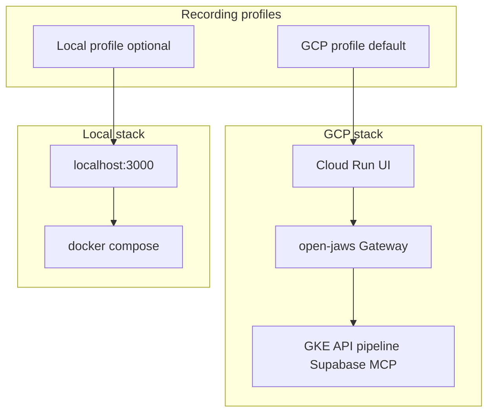
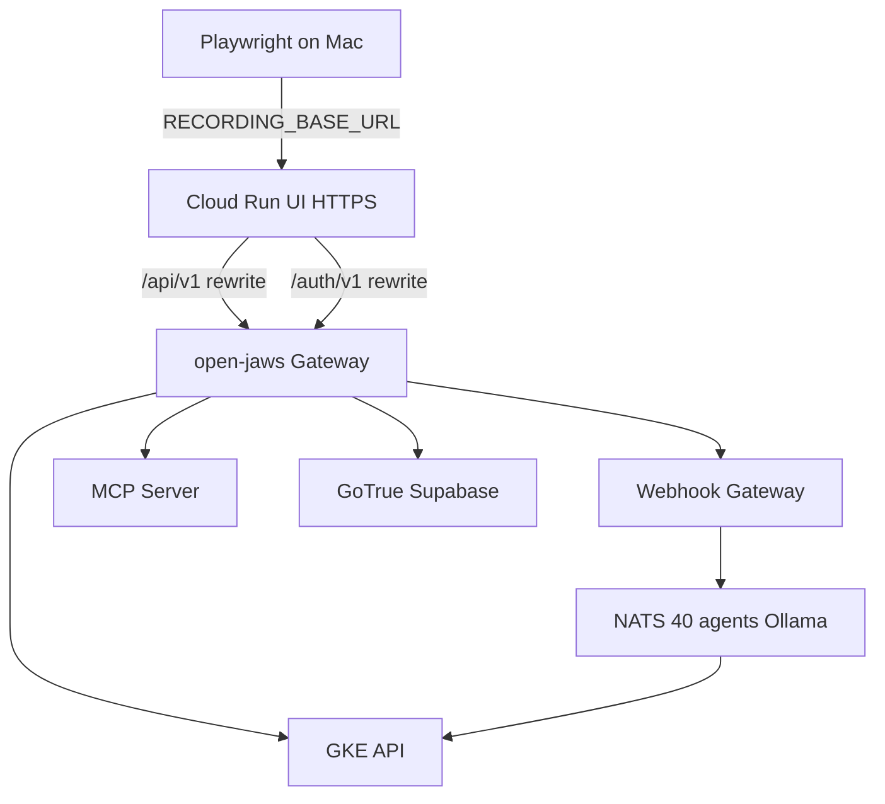

# Mem-Dog Playwright Demo Recording (Unified)

Single plan covering **what to record** (scene catalog), **how to automate it** (HomeApp pattern), and **where to run it** (GCP default, local optional).

---

## 1. Recording profiles

| | **GCP (default)** | **Local (optional)** |
|---|-------------------|----------------------|
| **Use for** | Production demo videos, stakeholder recordings | Selector dev, fast iteration |
| **UI URL** | `https://mem-dog-ui-<env>-….run.app` (Cloud Run) | `http://localhost:3000` |
| **API** | `/api/v1/*` → GKE gateway `/gke-api` | `localhost:8080` or UI rewrite |
| **Auth** | Supabase login required (**A0**) | Anonymous `demo` user if no `NEXT_PUBLIC_SUPABASE_ANON_KEY` |
| **Playwright** | No `webServer`; env `RECORDING_BASE_URL` | `webServer: npm run dev` in [`testing/ui/playwright.config.ts`](../testing/ui/playwright.config.ts) |
| **Deploy** | [`deploy-ui`](../scripts/manual-deploy.sh) with Supabase + webhook env | `docker compose up` (see [`local-dev.md`](deployment/local-dev.md)) |
| **Must avoid** | [`deploy-ui-read`](../scripts/manual-deploy.sh) / `NEXT_PUBLIC_READ_ONLY=true` (blocks writes) | N/A |
| **Seeding** | `seed-gcp.ts` via authenticated API | `seed-local.ts`, [`test-api.sh`](../scripts/test-api.sh), Playground upload |
| **Timing** | GCP values below (network + GKE Ollama) | ~70% of GCP durations; **extend** D1/D4/E1 on cold Ollama |
| **slowMo** | 300–400ms | 250ms |
| **Playwright target** | Cloud Run HTTPS URL | **Container UI** at `http://localhost:3000` (not only `npm run dev`) |



### GCP architecture



**GCP prerequisites** ([deployment/gke-setup-mac.md](deployment/gke-setup-mac.md)):

1. Deploy: `deploy-supabase-gke` → `deploy-api-gke` → `deploy-webhook-pipeline-gke` → `deploy-webhook-gateway-gke` → `deploy-mcp-server-gke` (optional) → **`deploy-ui`** (writable).
2. Preflight: `curl` gateway `/gke-api/health`, `/health`, `/auth/v1/health`; `./scripts/manual-deploy.sh status`.
3. Recording account in gitignored `.env.recording`.
4. Seed via `seed-gcp.ts`.

```bash
NEXT_PUBLIC_SUPABASE_ANON_KEY="<anon-key>" \
SUPABASE_AUTH_URL="http://<GATEWAY_IP>" \
MEM_DOG_WEBHOOK_GATEWAY_URL="http://<GATEWAY_IP>" \
./scripts/manual-deploy.sh deploy-ui -p memdog-dev -e dev
```

**Local prerequisites:** see [Local Docker recording](#1b-local-docker-recording) below.

---

## 1b. Local Docker recording

Use this for **selector development**, **script dry-runs**, and **resource-constrained Mac** recording before GCP. Stack setup: [`deployment/local-dev.md`](deployment/local-dev.md).

### Start the stack

```bash
docker compose up
```

Default compose brings up the full local stack (API, UI, webhook pipeline, Ollama tiers, Redis, Postgres, Neo4j, etc.). See [`docker-compose.yml`](../docker-compose.yml) and [`CLAUDE.md`](../CLAUDE.md) for service list and ports.

**RAM:** Recording with AI scenes (D1, D4, E1) needs Ollama models pulled on first use; allow extra time on cold start.

### Local URLs (compose)

| URL | Service |
|-----|---------|
| http://localhost:3000 | UI (`demo` user — no Supabase in compose build) |
| http://localhost:8080 | API + Swagger (G2) |
| http://localhost:8070 | Webhook gateway (E1; pre-filled in UI via `NEXT_PUBLIC_WEBHOOK_GATEWAY_URL`) |
| http://localhost:8091/mcp/sse | MCP SSE (G1 tab uses API routes) |

### Local preflight

Before recording (`RECORDING_PROFILE=local`):

```bash
curl -sf http://localhost:8080/health
curl -sf http://localhost:8070/health
# Pull models on ollama-small (8081) before D1/D4/E1
curl -sf http://localhost:8081/api/tags
./scripts/test-api.sh
# Optional pipeline smoke before E2:
# ./scripts/test-webhook.sh -w http://localhost:8070/webhook -k <WGW_API_KEY> -a http://localhost:8080
```

Implement [`preflight-local.ts`](../testing/ui/recording/preflight-local.ts) alongside `preflight-gcp.ts`.

### Scene coverage on local Docker

Not all 35 scenes run on every profile. Compose UI has **no** `NEXT_PUBLIC_SUPABASE_ANON_KEY` → skip **A0**, **A3** unless you rebuild UI with Supabase.

| Coverage | Scene IDs | Notes |
|----------|-----------|--------|
| **Yes (typical local)** | A1, A2, A4, B1–B3, B5–B9, C1–C4, E1–E3, F1–F2, F4–F5, G1, G2 | Default `docker compose up` |
| **Skip (default compose UI)** | A0, A3 | No login flow |
| **Optional / manual** | A5, B4, G2 | |
| **Slow — extend timeouts** | D1, D3, D4, E1 | First Ollama load; warmup query recommended |
| **Heavy / flaky** | D6, D9 | Model Garden / infra — extend waits or skip |
| **Optional** | D2 | Graph search — needs Neo4j + Graphiti healthy |
| **Not in compose** | F3 | No Nango — skip or stand up Nango separately |

**~28+ scenes** recordable with default compose; mark D2/F3 optional in the orchestrator for `local` profile.

### Local composite bundles (suggested)

| Video | Scenes | Notes |
|-------|--------|--------|
| **Local quickstart** | A1 → B1 → D1 → B5 | No auth |
| **Local pipeline** | B1 → E1 → E2 → B5 | Webhook + telemetry |
| **Local data deep dive** | B1 → B5 → B6 → B8 → C1 → C4 | No A0 |
| **Full local tour** | A1 → B1 → B8 → D1 → E1 → E2 → F5 → G1 | Default compose |

### Recording automation adaptations (local profile)

When implementing Playwright scripts:

1. `RECORDING_BASE_URL=http://localhost:3000` — target **compose UI**, not Cloud Run.
2. Omit **A0** / **A3** from default local scene picker (or gate on `RECORDING_PROFILE`).
3. Use [`test-api.sh`](../scripts/test-api.sh) / future `seed-local.ts` instead of GCS `seed-demo-user.sh`.
4. Bump `knowledgeChat`, `dataAiGenerate`, `channelWebhook` timeouts on first run (or run warmup in `beforeAll`).
5. Mark **F3**, **D2** optional in orchestrator for `local` profile.
6. E1: confirm gateway key matches `WGW_API_KEY` in [`.env` / compose](../docker-compose.yml).

---

## 2. Main branch sync (verified)

| Area | Status | Impact |
|------|--------|--------|
| Tabs | `insights`, `data`, `memories`, `ai`, `telemetry`, `testing`, `docs`, `settings`; audit `?tab=timeline` (not sidebar) | Unchanged |
| Playground | Channel to Webhook, Data Insert, Knowledge Chat, MCP | Unchanged |
| AI Studio | Search & Chat, Models, Routing, Agents, Infrastructure | Unchanged |
| Settings | Profile, Organizations, Integrations, Webhooks, API Keys | Unchanged |
| `READ_ONLY` mode | [`ui/src/lib/read-only.ts`](../ui/src/lib/read-only.ts) — blocks mutations except AI query | GCP: use `deploy-ui` only |
| Logged-out GCP UI | [`LoginPage`](../ui/src/components/LoginPage.tsx) (A3); `MarketingSite` only when `READ_ONLY=true` | A3 = scroll LoginPage |
| Recording scaffold | Not in repo yet | To implement |
| Local Docker stack | `docker compose up` — see [§1b](#1b-local-docker-recording) | See [`local-dev.md`](deployment/local-dev.md) |
| E2E | [`data-crud.spec.ts`](../testing/ui/e2e/data-crud.spec.ts), [`timeline.spec.ts`](../testing/ui/e2e/timeline.spec.ts) stale | Follow-up todo |

**Selectors:** No `data-testid` today — text/role selectors; add test IDs on login, tabs, upload for stability.

---

## 3. UI navigation model

```mermaid
flowchart TB
  subgraph entry [Entry]
    Login["LoginPage or demo user"]
    App["/?tab=insights default"]
  end
  subgraph sidebar [Sidebar]
    Insights insights
    Data data
    Memories memories
    AI ai
    Telemetry telemetry
    Playground testing
    Docs docs
    Settings settings
  end
  subgraph hidden [URL only]
    Audit["timeline Audit"]
  end
  Login --> App --> sidebar
  Data --> DataDetail["/data/id"]
  Playground --> PGfour["4 sub-tabs"]
  AI --> AIfive["5 sub-tabs"]
  Settings --> Setfive["5 sub-tabs"]
```

---

## 4. HomeApp reference pattern

HomeApp repo, branch **`demo-recording`** (`apps/webapp/scripts/recording/`):

| Piece | HomeApp | mem-dog (proposed) |
|-------|---------|-------------------|
| Orchestrator | `record-webapp.ts` | [`testing/ui/recording/record-webapp.ts`](../testing/ui/recording/record-webapp.ts) |
| Config | `config.ts` | [`testing/ui/recording/config.ts`](../testing/ui/recording/config.ts) — `profile: 'gcp' \| 'local'` |
| Scenes | `scenes/*.ts` | [`testing/ui/recording/scenes/`](../testing/ui/recording/scenes/) |
| Helpers | auth, session, delays | [`helpers.ts`](../testing/ui/recording/helpers.ts) + `preflight-gcp.ts` + `preflight-local.ts` |
| Post-process | zoom + wait-cut | Port from HomeApp for D1, D4, E1 |
| Guide | README.md | [README.md](README.md) |

Features: interactive scene picker, `chromium.launch({ headless: false })`, `recordVideo` 1920×1080, narration JSON export, session reuse at `recordings/.session`.

---

## 5. Configuration

**`.env.recording.example`:**

```bash
RECORDING_PROFILE=gcp          # gcp | local
RECORDING_BASE_URL=https://mem-dog-ui-dev-xxxxx.run.app
RECORDING_EMAIL=demo-recorder@yourdomain.com
RECORDING_PASSWORD=...
RECORDING_GATEWAY_URL=http://34.x.x.x   # gcp preflight only
GCP_PROJECT=memdog-dev
ENVIRONMENT=dev
```

**Local profile:** `RECORDING_PROFILE=local`, `RECORDING_BASE_URL=http://localhost:3000`, omit email/password if no Supabase.

**`config.timing` (GCP milliseconds; local ≈ 70%):**

```typescript
timing: {
  login: 20000, insights: 25000, orgProject: 20000, marketingLanding: 30000,
  inAppDocs: 40000, standaloneDocs: 25000,
  dataInsertText: 40000, dataInsertFile: 35000, dataInsertUrl: 35000, dataInsertMedia: 50000,
  dataList: 30000, dataDetail: 25000, dataEdit: 35000, dataVersions: 40000, dataDelete: 25000,
  memoryOverview: 30000, memoryCreate: 40000, memoryLinked: 25000, auditTimeline: 40000,
  knowledgeChat: 90000, graphSearch: 60000, dataAiQuery: 50000, dataAiGenerate: 120000,
  aiStudioSearch: 30000, aiStudioModels: 45000, aiStudioRouting: 35000,
  aiStudioAgents: 35000, aiStudioInfra: 25000,
  channelWebhook: 75000, telemetry: 35000, insightsDelta: 15000,
  settingsProfile: 25000, settingsOrgs: 40000, settingsIntegrations: 45000,
  settingsWebhooks: 35000, settingsApiKeys: 30000,
  mcpPlayground: 50000, swagger: 25000,
  defaultDelay: 1000, navigationWait: 4000,
}
```

AI/pipeline raw max before wait-cut: D1 ~120s, D4 ~180s, E1 ~120s.

---

## 6. Scene catalog (unified)

Each scene = one Playwright module in `scenes/`. **Duration** = target on-screen time (GCP); local ≈ 70%.

### A. Platform intro

| ID | Scene | Route / nav | Duration | Key actions | Seed / prereqs | Profile |
|----|-------|-------------|----------|-------------|----------------|---------|
| A0 | Login | `/` sign in | **20s** | Email/password, redirect to app | Recording account | GCP only (skip local if no Supabase) |
| A1 | Insights overview | `/?tab=insights` | **25s** | Stat cards, charts, refresh, sidebar tour | Data + memories in project | Both |
| A2 | Org/project | Header dropdown | **20s** | Switch org/project | 2 orgs/projects seeded | Both |
| A3 | Marketing landing | `/` logged out | **30s** | Scroll hero, capabilities, CTA | — | GCP (LoginPage); local skip if no auth |
| A4 | In-app docs | `/?tab=docs` | **40s** | Architecture, API groups, FAQ | — | Both |
| A5 | Standalone docs | `/docs` | **25s** | Get started, SDK links | — | Optional both |

### B. Data lifecycle

| ID | Scene | Route / nav | Duration | Key actions | Seed / prereqs | Profile |
|----|-------|-------------|----------|-------------|----------------|---------|
| B1 | Text ingest | Playground → Data Insert | **40s** | JSON/text, tags, memory picker | — | Both |
| B2 | File ingest | Same | **35s** | Upload + preview | `fixtures/sample.pdf` | Both |
| B3 | URL ingest | Same | **35s** | URL + download-now | Stable public URL | Both |
| B4 | Camera/voice | Same | **50s** | Capture / record | Mic/camera perms | Optional |
| B5 | Browse list | `/?tab=data` | **30s** | Search, pagination, tags, bulk | 5+ items | Both |
| B6 | Data detail | `/data/[id]` | **25s** | Viewer, copy ID | Known `data_*` | Both |
| B7 | Edit → v2 | `/data/[id]` | **35s** | Edit, Save | Writable item | Both |
| B8 | Version history | `/data/[id]` | **40s** | Switch v1/v2/v3, read-only old | 3-version item ([`versioning.spec.ts`](../testing/ui/e2e/versioning.spec.ts)) | Both |
| B9 | Delete | List or detail | **25s** | Confirm dialog | Disposable item | Both |

**Story:** B1 → B5 → B6 → B8 → B7 — *Ingest to governed data* (~3m 35s GCP).

### C. Memories and audit

| ID | Scene | Route / nav | Duration | Key actions | Seed / prereqs | Profile |
|----|-------|-------------|----------|-------------|----------------|---------|
| C1 | Memory overview | `/?tab=memories` | **30s** | Filter by type | Mixed types | Both |
| C2 | Create memory | Same | **40s** | Type, TTL, access level | — | Both |
| C3 | Linked data | Same | **25s** | Open memory → items | Memory with data | Both |
| C4 | Audit timeline | `/?tab=timeline` | **40s** | Audit memory, entries, refresh | Audit events from B7/B9 | Both |

**Story:** B1 (audit memory) → C4 — *Ingest with audit trail* (~1m 20s GCP).

### D. AI / RAG

| ID | Scene | Route / nav | Duration | Key actions | Seed / prereqs | Profile |
|----|-------|-------------|----------|-------------|----------------|---------|
| D1 | Knowledge Chat | Playground → Knowledge Chat | **90s** | Hybrid/full, citations `[1][2]` | Embedded content; **wait-cut** | Both |
| D2 | Graph search | Same, graph mode | **60s** | Entity/ relation query | Neo4j (GCP or compose `full`) | Optional |
| D3 | Per-item query | `/data/[id]` → DataAI | **50s** | Query sub-tab | Item with content | Both |
| D4 | Generate enrichment | `/data/[id]` → DataAI | **120s** | Viewpoints/embeddings; **wait-cut** | LLM up | Both |
| D5 | AI Studio Search | `/?tab=ai` | **30s** | List viewpoints/embeddings | Post D4 or pipeline | Both |
| D6 | Model Garden | `/?tab=ai` → Models | **45s** | Providers, catalog, test | Models configured | Both |
| D7 | Smart routing | `/?tab=ai` → Routing | **35s** | Primary/fallback per type | — | Both |
| D8 | Agents | `/?tab=ai` → Agents | **35s** | Processing flags, configs | — | Both |
| D9 | Infrastructure | `/?tab=ai` → Infrastructure | **25s** | Server health | Ollama up | Both |

**Story:** B1 → D1 — *Upload and ask* (~2m 10s GCP).

### E. Webhook pipeline

| ID | Scene | Route / nav | Duration | Key actions | Seed / prereqs | Profile |
|----|-------|-------------|----------|-------------|----------------|---------|
| E1 | Channel to Webhook | Playground → Channel | **75s** | Send message + attachment; **wait-cut** | Gateway :8070 local / GKE gateway GCP | Both |
| E2 | Telemetry | `/?tab=telemetry` | **35s** | Expand trace | After E1 | Both |
| E3 | Insights delta | `/?tab=insights` | **15s** | Counter refresh | After E1 | Both |

**Story:** E1 → E2 → B5 — *Channel ingest to observability* (~2m 20s GCP). Flagship differentiator.

### F. Settings

| ID | Scene | Route / nav | Duration | Key actions | Seed / prereqs | Profile |
|----|-------|-------------|----------|-------------|----------------|---------|
| F1 | Profile | Settings → Profile | **25s** | Edit display name | — | Both |
| F2 | Organizations | Settings → Organizations | **40s** | Org/project CRUD | — | Both |
| F3 | Integrations | Settings → Apps | **45s** | Nango connect | Test OAuth | GCP only (no Nango in compose) |
| F4 | Webhooks | Settings → Webhooks | **35s** | Create `whk_*` | — | Both |
| F5 | API keys | Settings → API Keys | **30s** | Create `md_*` | — | Both |

**Story:** F4 → E1 — *Webhook URL to first message* (~1m 50s GCP).

### G. Developer

| ID | Scene | Route / nav | Duration | Key actions | Seed / prereqs | Profile |
|----|-------|-------------|----------|-------------|----------------|---------|
| G1 | MCP Playground | Playground → MCP | **50s** | Chat + tools (via API) | MCP :8091 local / GKE GCP | Both |
| G2 | Swagger | API docs | **25s** | Browse endpoints | `localhost:8080/docs` local; gateway `/gke-api/docs` GCP | Optional |

**Non-UI (separate screencasts):** Python SDK ([quickstart.mdx](quickstart.mdx)), DigiMe / openclaw-node.

---

## 7. Composite videos

Target duration = sum of scenes (GCP, post wait-cut) + ~1s gaps.

| Video | Scenes | GCP duration | Local notes |
|-------|--------|--------------|-------------|
| **Product trailer** | A3 → A0 → A1 → B1 → D1 → E1 → E2 | **~5m 40s** | Drop A3/A0 if no auth |
| **Data platform** | A0 → B1 → B5 → B6 → B8 → B7 | **~3m 35s** | A0 optional locally |
| **AI and RAG** | A0 → B1 → D1 → D4 → D5 | **~5m 25s** | |
| **Pipeline and integrations** | A0 → F5 → E1 → E2 → F4 | **~3m 40s** | |
| **Day-one quickstart** | A0 → A1 → B1 → D1 → B5 | **~3m 45s** | Matches quickstart doc |
| **Data deep dive** | B1–B9 + C1–C4 | **~7m 0s** | Engineer/PM audience |
| **Full platform tour** | A0 → A1 → B1 → B8 → C1 → D1 → E1 → E2 → F5 → G1 | **~8m 30s** | |

---

## 8. Seeding

| Script | Profile | Purpose |
|--------|---------|---------|
| [`testing/ui/recording/seed-gcp.ts`](../testing/ui/recording/seed-gcp.ts) | GCP | Auth'd API: org/project, versioned item, memories, RAG text, tags `recording-seed-*` |
| [`testing/ui/recording/seed-local.ts`](../testing/ui/recording/seed-local.ts) | Local | Same via `localhost:8080` or UI proxy |
| [`scripts/test-api.sh`](../scripts/test-api.sh) | Local (+ GCP) | Seed-like API smoke before recording |
| [`scripts/test-webhook.sh`](../scripts/test-webhook.sh) | Local (+ GCP) | Pipeline smoke before E2 (`-w http://localhost:8070/webhook`) |
| [`scripts/seed-demo-user.sh`](../scripts/seed-demo-user.sh) | GCP | GCS demo user bucket (not needed for `STORAGE_BACKEND=local`) |

---

## 9. Implementation layout

```
testing/ui/
├── playwright.config.ts              # e2e (local webServer)
├── e2e/
└── recording/                        # demo video harness (single folder)
    ├── playwright.config.ts          # recording profile-aware (optional)
    ├── config.ts
    ├── helpers.ts
    ├── preflight-gcp.ts
    ├── preflight-local.ts
    ├── seed-gcp.ts
    ├── seed-local.ts
    ├── record-webapp.ts
    ├── scenes/
    ├── recordings/                   # gitignored
    ├── .env.recording.example
    ├── README.md
    └── PLAN.md
```

**npm scripts:** `record:webapp`, `record:preflight`, `record:seed`

---

## 10. E2E alignment

| Spec | Scenes | Gap |
|------|--------|-----|
| [`data-crud.spec.ts`](../testing/ui/e2e/data-crud.spec.ts) | B6, B7, B9 | Upload on `/` → Playground Data Insert (B1) |
| [`versioning.spec.ts`](../testing/ui/e2e/versioning.spec.ts) | B8 | Good reference |
| [`timeline.spec.ts`](../testing/ui/e2e/timeline.spec.ts) | C4 | Rewrite for `?tab=timeline` + audit memory |

---

## 11. HomeApp mapping

| HomeApp | mem-dog | Duration |
|---------|---------|----------|
| Landing + Login | A3 + A0 | 50s |
| Dashboard | A1 | 25s |
| Property onboarding | B1 | 40s |
| Diagnosis chat | D1 | 90s |
| Timeline | C4 + E2 | 75s |
| Documents | B2 + B5 | 65s |

---

## 12. CI and security

- GCP recordings: manual / release-only (secrets, live cluster).
- Local recordings: optional dev workflow only.
- Never commit `.env.recording`, gateway keys, or Supabase service keys.

---

## Implementation checklist

- [x] Add `testing/ui/recording/` with dual-profile config (gcp + local), helpers, `record-webapp.ts`, `playwright.config.ts`
- [x] Add `.env.recording.example`, `preflight-gcp.ts`, `preflight-local.ts`, `seed-gcp.ts`, and `seed-local.ts` (fixtures + idempotent API seed)
- [ ] Implement A0–A5, B1–B9 scenes with profile-aware auth and navigation
- [ ] Implement C1–C4, D1–D9, E1–E3 with wait-cut support for AI/pipeline scenes
- [ ] Implement F1–F5, G1–G2; mark F3/D2/B4/A5 optional in orchestrator
- [x] Add [README.md](README.md) (GCP deploy, local profile, durations, narration, composites)
- [ ] Update `data-crud.spec.ts` and `timeline.spec.ts`; share selectors with recording scenes
