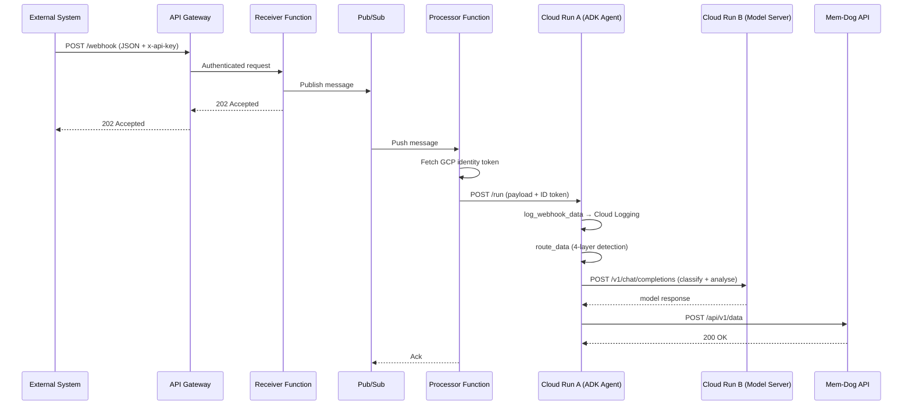

# Webhook Pipeline

Ingest external data into the mem-dog private AI memory platform via a serverless webhook pipeline on Google Cloud.  All model inference uses open-source Gemma 3 GGUF models — no external AI API keys required.

---

## Architecture



### Components

| Component | Description |
|-----------|-------------|
| **API Gateway** | HTTPS endpoint with API key authentication (`x-api-key` header) |
| **Receiver Function** | HTTP-triggered Cloud Function that validates JSON and publishes to Pub/Sub |
| **Pub/Sub Topic** | `mem-dog-webhook-{env}` — decouples ingestion from processing |
| **Processor Function** | Pub/Sub-triggered Cloud Function that calls Cloud Run A via authenticated HTTP |
| **Cloud Run A — ADK Agent** | `adk api_server`; orchestrates the log → route → stats tool-call loop; no in-process LLM |
| **Cloud Run B — Model Server** | Ollama; OpenAI-compatible API |
| **Sub-Agent Router** | Four-layer routing pipeline dispatching to one of 26 typed sub-agents |
| **LightLLMClassifier** | Calls the model server for single-word data-type classification (Layer 2) |

---

## Directory Structure

```
webhook/
  receiver/
    main.py                      # Cloud Function: receives webhook, publishes to Pub/Sub
    requirements.txt
  processor/
    main.py                      # Cloud Function: Pub/Sub trigger, calls Cloud Run A
    Dockerfile                   # Cloud Run A image (lean — no model server)
    entrypoint.sh                # Starts adk api_server
    Makefile                     # Local dev: make agent, make processor (model server: deploy or run Ollama)
    requirements.txt
    webhook_agent/
      __init__.py
      agent.py                   # ADK agent + LiteLLM openai/ pointing at model server
      classifier.py              # LightLLMClassifier — calls model_client.chat()
      model_client.py            # HTTP client for Cloud Run B (/v1/chat/completions)
      router.py                  # Routing: Layer 0b (download) + type detection + dispatch
      url_context.py             # URL context tool: resolve URL to direct file or page links (download agent)
      group_context.py           # GroupContext: user/group identity + shared memories
      requirements.txt           # google-adk, litellm, google-auth, requests
      .env                       # MODEL_SERVER_URL, ADK_MODEL, MEM_DOG_API_URL
      api_client/
        __init__.py              # Module-level singletons
        config.py                # Shared URL + timeout constants
        data.py                  # DataClient
        memories.py              # MemoryClient
        stats.py                 # StatsClient
      sub_agents/
        __init__.py              # AGENT_REGISTRY + MIME_REGISTRY
        base.py                  # BaseSubAgent ABC
        registry.py              # MimeRegistry (best-match MIME lookup)
        media/                   # VideoStreamAgent, VideoUrlAgent, AudioStreamAgent, ...
        documents/               # PdfAgent, OfficeDocAgent, MarkdownAgent, HtmlDocAgent
        structured/              # JsonAgent, XmlAgent, CsvAgent, YamlAgent
        code_logs/               # CodeAgent, LogStreamAgent, LogFileAgent
        sensor/                  # SensorAgent, GpsAgent, BiometricAgent
        spatial/                 # LidarAgent, GeospatialAgent, Model3dAgent
        communication/           # EmailAgent, ChatAgent, CalendarAgent, WebPageAgent, FeedAgent
        download/                # UrlDownloadAgent (Layer 0b — url not yet downloaded)
        binary/                  # ArchiveAgent, TimeSeriesAgent, MedicalImagingAgent, BinaryBlobAgent
  openapi-spec.yaml              # API Gateway OpenAPI 2.0 spec with API key auth
  README.md                      # This file
```

---

## Sub-Agent Routing

The ADK agent automatically detects the data type of every incoming payload and routes it to the appropriate sub-agent (including the download sub-agent when a URL must be fetched first).

| Category | Sub-agents |
|----------|-----------|
| Media | `video_stream`, `video_url`, `audio_stream`, `audio_url`, `image`, `image_batch` |
| Documents | `pdf`, `office_doc`, `markdown`, `html_doc` |
| Structured | `json`, `xml`, `csv`, `yaml` |
| Code & Logs | `code`, `log_stream`, `log_file` |
| Sensor / IoT | `sensor`, `gps`, `biometric` |
| Spatial / 3D | `lidar`, `geospatial`, `model_3d` |
| Communication | `email`, `chat`, `calendar`, `web_page`, `feed` |
| Download | `url_download` — URL present but content not yet downloaded; see below |
| Binary | `archive`, `time_series`, `medical_imaging`, `binary_blob` (catch-all) |

### Detection layers

0. **URL not downloaded (Layer 0b)** — When `url` is present in metadata but `data_id` / `is_downloaded` are not set, the payload is first sent to the **download sub-agent** (`url_download`). Once content is downloaded and stored, the pipeline is re-invoked with `data_id` and `is_downloaded=true`, so the router then dispatches to the typed sub-agent (e.g. `pdf`, `video_url`) for processing. Any request from the download subagent to the webhook includes `data_id` and `is_downloaded=true`, meaning **process only, do not download** in that iteration.
1. **Explicit field** — `data_type` or `source_type` field in the payload
2. **LLM classifier** — Gemma 3 via model server (`model_client.chat()`), `max_tokens=15`
3. **MIME registry** — matches `content_type` / `media_type` to agent `MIME_PATTERNS`
4. **URL extension** — sniffs the `url` field for known extensions (`.pdf`, `.mp4`, `.csv`, …)
5. **Fallback** — `BinaryBlobAgent` catches everything else

### Download sub-agent and url_context

When the router sends a payload to the **download sub-agent** (`url_download`), that agent uses the **url_context** tool to resolve the given `url` to either a single direct resource or a list of URLs extracted from a page (HTML). An optional `prompt` in message metadata (e.g. “download all document files”) can filter links (e.g. by extension). After downloading each URL, the agent uploads the content to the mem-dog API and re-sends the request to the webhook pipeline with `data_id` and `is_downloaded=true`, so the router dispatches to the appropriate typed sub-agent for processing.

### Grouping payloads

Use `memory_prefix` to route related payloads into shared timeline and session memories:

```json
{"memory_prefix": "ord-42", "data_type": "pdf", "url": "...invoice.pdf"}
{"memory_prefix": "ord-42", "content_type": "image/jpeg", "url": "...photo.jpg"}
```

**Memory creation policy:** On the API/webhook path only **data-processing** memories (stored data items) and **telemetry** memories (tracing, pipeline telemetry) are created. Agents do not create group timeline or session memories. When the UI client sends a message, the UI may create its own memory (recorded in the session); that is separate from the API receiving data.

Both land in `timeline-ord-42` and `session-ord-42`.

---

## Prerequisites

- Google Cloud project with billing enabled
- `gcloud` CLI installed and authenticated (`gcloud auth login`)
- Docker installed (for building Cloud Run images)
- `uv` installed (`curl -LsSf https://astral.sh/uv/install.sh | sh`)
- A GCS bucket with the GGUF model file (see **Model Upload** below)
- The mem-dog API deployed to Cloud Run (the processor function calls it)

---

## Model Upload

Upload the Gemma 3 GGUF file to GCS before deploying the model server:

```bash
PROJECT_ID=your-project-id
ENV=dev
MODELS_BUCKET="${PROJECT_ID}-mem-dog-models-${ENV}"

# Create the bucket (once)
gcloud storage buckets create "gs://$MODELS_BUCKET" \
  --location=us-central1 --project="$PROJECT_ID" \
  --uniform-bucket-level-access

# Download and upload Gemma 3 4B IT Q4_K_M GGUF (~2.5 GB)
# Get it from https://huggingface.co/google/gemma-3-4b-it-GGUF
gsutil cp gemma-3-4b-it-Q4_K_M.gguf "gs://$MODELS_BUCKET/"
```

---

## Setup

### Option 1: Manual Script (recommended)

```bash
# 1. Setup infrastructure (APIs, Pub/Sub topic, service account, IAM)
./scripts/manual-deploy.sh setup-webhook -p YOUR_PROJECT_ID -e dev

# 2. Deploy the Ollama model server to Cloud Run B
./scripts/manual-deploy.sh deploy-model-server -p YOUR_PROJECT_ID -e dev

# 3. Deploy the ADK agent to Cloud Run A
#    MODEL_SERVER_URL is detected automatically from the model server deployment
./scripts/manual-deploy.sh deploy-agent -p YOUR_PROJECT_ID -e dev

# 4. Deploy Cloud Functions and API Gateway
./scripts/manual-deploy.sh deploy-webhook -p YOUR_PROJECT_ID -e dev
```

### Option 2: Local Development

```bash
cd webhook/processor

# Install dependencies (uv required)
make install

# Terminal 1: start a local model server (e.g. Ollama on port 11434) or use a deployed one
# make model-server  # if your Makefile has a target for local Ollama

# Terminal 2: start the ADK agent on port 8080
# MODEL_SERVER_URL=http://localhost:8081 is set automatically
make agent

# Terminal 3: start the Cloud Function locally on port 8082
make processor

# Send a test payload
make test
```

---

## Testing

### Send a Test Webhook

```bash
GATEWAY_URL="https://mem-dog-webhook-gw-dev.apigateway.YOUR_PROJECT.cloud.goog"
API_KEY="your-gcp-api-key"

curl -X POST "$GATEWAY_URL/webhook" \
  -H "x-api-key: $API_KEY" \
  -H "Content-Type: application/json" \
  -d '{
    "event": "test",
    "source": "manual",
    "data_type": "json",
    "data": {"message": "Hello from webhook"}
  }'
```

Expected response:

```json
{
  "status": "accepted",
  "message_id": "1234567890",
  "received_at": "2026-02-18T12:00:00+00:00"
}
```

### Test Locally

```bash
# Send directly to the local ADK agent
make test

# Send through the local Cloud Function (Pub/Sub format)
make test-cf

# Check model server health
make model-health
```

### Unit tests (uv)

Run router, download agent, and url_context unit tests with **uv** from the repository root:

```bash
# From repo root (mem-dog/)
PYTHONPATH=. uv run --project testing/api pytest \
  testing/api/unit/test_agent_routing.py \
  testing/api/unit/test_url_download_agent.py \
  testing/api/unit/test_url_context.py \
  -v
```

Requires [uv](https://docs.astral.sh/uv/). `uv run --project testing/api` uses the testing API venv; `PYTHONPATH=.` ensures the webhook agent package resolves. If the API conftest is used (e.g. for other tests), ensure API dependencies are available (e.g. `uv sync --project api`).

---

## Environment Variables

### Receiver Function

| Variable | Description | Default |
|----------|-------------|---------|
| `GCP_PROJECT_ID` | Google Cloud project ID | (required) |
| `WEBHOOK_PUBSUB_TOPIC` | Pub/Sub topic name | `mem-dog-webhook-dev` |
| `MAX_PAYLOAD_BYTES` | Maximum payload size in bytes | `1048576` (1 MB) |

### Processor Function

| Variable | Description | Default |
|----------|-------------|---------|
| `GCP_PROJECT_ID` | Google Cloud project ID | (required) |
| `AGENT_SERVICE_URL` | Cloud Run A URL (set automatically by `deploy-agent`) | (required) |

### Cloud Run A — ADK Agent

Agents use **Gemini by default** and fall back to open models when the model server is configured.

| Variable | Description | Default |
|----------|-------------|---------|
| `ADK_MODEL` | LiteLLM model for the orchestrator. Use a Gemini 3 model for default; use `openai/<name>` with `MODEL_SERVER_URL` for open models. | `vertex_ai/gemini-3-flash` |
| `MODEL_SERVER_URL` | Base URL of the model server (Cloud Run B). Required only when `ADK_MODEL=openai/...`. | *(none)* |
| `AGENT_PREFER_GEMINI` | If `true`, classifier and sub-agents try Gemini first and fall back to the model server on failure. | `true` |
| `MODEL_SERVER_MODEL` | Model name in request body (any value; server ignores it) | `gemma` |
| `MEM_DOG_API_URL` | mem-dog API base URL | `http://localhost:8080` |
| `WEBHOOK_STAGING_BUCKET` | GCS bucket for content staging (empty = skip) | *(none)* |
| `WEBHOOK_GATEWAY_URL` | Webhook pipeline gateway URL (set by `deploy-agent` when gateway exists, or `MEM_DOG_WEBHOOK_GATEWAY_URL`) | *(none)* |

### Cloud Run B — Model Server (Ollama)

Deploy with `deploy-model-server`; the service runs Ollama with a GCS-backed models volume.

---

## Troubleshooting

**Deploy with Gemini API key (no Vertex)**  
Store your [Google AI Studio](https://aistudio.google.com/app/apikey) key in Secret Manager as `webhook-gemini-api-key-${ENVIRONMENT}` (e.g. `webhook-gemini-api-key-dev`). When you run `deploy-agent`, the script wires it as `GOOGLE_API_KEY` and uses the `gemini/` provider. Optional: set `WEBHOOK_GEMINI_KEY_SECRET` to use a different secret name.

**"MODEL_SERVER_URL is not set"**  
This appears only when `ADK_MODEL` is set to an open model (e.g. `openai/gemma`). Either set `MODEL_SERVER_URL` to the model server base URL, or use the default Gemini 3 orchestrator by setting `ADK_MODEL=vertex_ai/gemini-3-flash` (or leave it unset).

**Model server cold start (first request slow)**  
Cloud Run B (Ollama) may take time on first request. Pub/Sub will retry automatically.

**"Permission denied" calling model server from ADK agent**
The webhook service account needs `roles/run.invoker` on the model server Cloud Run service.  This is configured automatically by `deploy-model-server`.

**"Pub/Sub topic not found"**
```bash
gcloud pubsub topics list --project=YOUR_PROJECT_ID
```

**ADK agent errors**
```bash
gcloud run services logs read mem-dog-webhook-agent-dev \
  --region=us-central1 --project=YOUR_PROJECT_ID
```

**Model server errors**
```bash
gcloud run services logs read mem-dog-model-server-dev \
  --region=us-central1 --project=YOUR_PROJECT_ID
```
